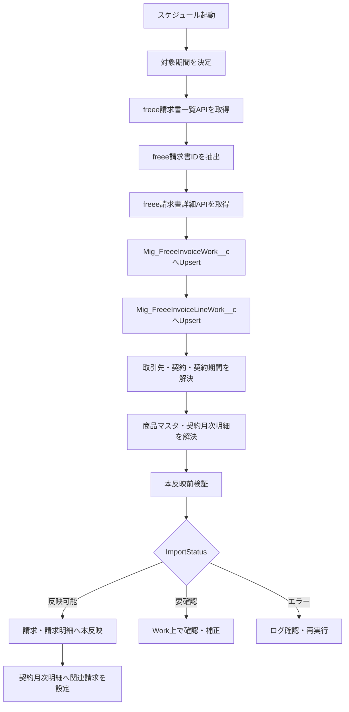

# freee自動送付を前提にした契約請求設計書

作成日: 2026-06-22  
対象: 契約管理、契約期間、契約月次明細、請求、請求明細、freee請求書連携

## 1. 背景

現行設計では、Salesforceで契約・請求を管理し、更新請求バッチで毎月または毎年の請求を作成し、freeeへ請求書を連携する方針としていた。

ただし、freee請求書API上では、請求書の作成・取得・更新・取消は確認できる一方、顧客への請求書送付を実行するAPIは確認できていない。そのため、Salesforceから毎月freee請求書を自動作成しても、顧客への送付はfreee画面での手動作業として残る。

一方、現行業務では、freee側で請求書を作成し、次回以降はfreeeの自動送付設定を利用して顧客へ請求書を送付している。

このため、経理業務の負荷と送付漏れリスクを抑える観点から、初回のみSalesforce起点でfreee請求書を作成し、2回目以降はfreeeの自動作成・自動送付を利用し、Salesforceへ請求実績を取り込む方式を検討する。

## 2. 結論

最適案は、以下の役割分担とする。

| 領域 | 正とするシステム | 理由 |
|---|---|---|
| 契約管理 | Salesforce | 営業・契約管理・更新管理の起点 |
| 契約期間 | Salesforce | 契約単位の有効期間と更新判断の起点 |
| 契約月次明細 | Salesforce | 将来売上、MRR、ARR、売上予定の管理 |
| 初回請求 | Salesforce起点 | 契約作成直後に請求内容を確定するため |
| 2回目以降の請求書作成 | freee | freee自動送付設定を利用するため |
| 顧客への請求書送付 | freee | 現行業務の自動送付を維持するため |
| 入金・決済ステータス | freee | 実際の請求・決済状態の正本 |
| Salesforce請求 | freeeから取り込んだ実績 | 経理レポート、未送付、未入金確認に利用 |

## 3. 推奨業務フロー

### 3.1 契約作成時

1. 営業が取引を受注する。
2. Salesforceで契約管理を作成する。
3. 契約管理に紐づく契約期間を作成する。
4. 契約期間に基づき、契約月次明細を契約期間分作成する。
5. 契約月次明細は、将来売上・MRR・ARRの予定データとして管理する。

### 3.2 初回請求時

1. Salesforceで初回請求を作成する。
2. 初回請求に請求明細を作成する。
3. Salesforceからfreee請求書を作成する。
4. freee請求書には、Salesforceとの紐づけに必要な識別情報を設定する。
5. 経理がfreee上で初回請求書を確認し、顧客へ送付する。
6. 経理がfreee側で次回以降の自動送付設定を行う。

### 3.3 2回目以降の請求

1. freee側で請求書が自動作成される。
2. freee側で顧客へ請求書が自動送付される。
3. Salesforceのfreee請求書取込バッチが、freee請求書を取得する。
4. 取得結果を直接請求へ反映せず、まずWorkオブジェクトへ保存する。
5. Workオブジェクト上で重複チェック、取引先解決、契約管理解決、契約期間解決、商品マスタ解決、契約月次明細解決を行う。
6. 自動解決できたWorkのみ、Salesforceの請求・請求明細へ本反映する。
7. 本反映した請求を、対応する契約月次明細に紐づける。
8. Salesforceで送付ステータス、決済ステータス、入金状況を確認する。

## 4. 契約月次明細と請求書の作成タイミング

### 4.1 基本方針

契約月次明細と請求書は、同じタイミングで作る必要はない。

契約月次明細は、契約期間が確定した時点でSalesforceに先行作成する。これは将来売上・MRR・ARRを見るための予定データである。

請求書は、初回のみSalesforceからfreeeへ作成し、2回目以降はfreee側で自動作成・自動送付されたものをSalesforceに取り込む。これは請求・送付・入金の実績データである。

### 4.2 タイミング整理

| タイミング | 契約月次明細 | 請求書 |
|---|---|---|
| 契約作成時 | 契約期間分を作成 | 初回請求をSalesforceで作成 |
| 初回請求時 | 初回請求対象月と対応付け | Salesforceからfreee請求書を作成 |
| freee自動送付設定後 | 変更なし | freee側で次回以降の請求書を自動作成・自動送付 |
| 毎月取込時 | 対象月次明細に請求を紐づけ | freee請求書をSalesforce請求として取り込む |
| 入金同期時 | 関連請求から送付・決済状態を参照 | freeeの送付・決済ステータスを同期 |

補足:

毎月取込時は、freee請求書を直接 `Invoice__c` / `InvoiceLine__c` に反映しない。必ずWorkオブジェクトへ一時保存し、検証済みデータだけを本反映する。

## 5. 月契約の対応関係

### 5.1 作成タイミング

例:

| 項目 | 値 |
|---|---|
| 契約期間 | 2026-07-01 から 2027-06-30 |
| 請求サイクル | 月払い |

契約作成時に、以下の契約月次明細を作成する。

| 契約年月 | 用途 |
|---|---|
| 2026/07 | 初回請求対象 |
| 2026/08 | freee自動作成請求の取込対象 |
| 2026/09 | freee自動作成請求の取込対象 |
| 2026/10 以降 | 同上 |

### 5.2 対応ルール

月契約では、原則として以下の対応関係とする。

```text
請求書1件 = 契約月次明細1件
```

対応付け条件:

| 条件 | 内容 |
|---|---|
| 契約管理 | freee請求書に含まれる契約識別情報、または取引先と有効契約から判定 |
| 契約期間 | 請求対象日が契約期間内に含まれること |
| 契約年月 | 請求対象年月と契約月次明細の契約年月が一致すること |

## 6. 年契約の対応関係

### 6.1 作成タイミング

例:

| 項目 | 値 |
|---|---|
| 契約期間 | 2026-07-01 から 2027-06-30 |
| 請求サイクル | 年一括 |

契約作成時に、12か月分の契約月次明細を作成する。

| 契約年月 | 用途 |
|---|---|
| 2026/07 から 2027/06 | MRR/ARR、売上予定、月別売上予定 |

初回請求では、年額のfreee請求書を1件作成する。

### 6.2 対応ルール

年契約では、以下の対応関係とする。

```text
請求書1件 = 契約月次明細12件
```

対象期間内の契約月次明細すべてに、同じ請求を関連付ける。

## 7. 請求と契約月次明細の紐づけ方式

### 7.1 最小構成

当面の最小構成は、契約月次明細に関連請求を持たせる方式とする。

```text
契約月次明細.RelatedInvoice__c -> 請求
```

この方式では、月契約は1か月分の契約月次明細に請求を紐づけ、年契約は12か月分の契約月次明細に同一請求を紐づける。

### 7.2 将来拡張構成

将来的に、1つの請求明細が複数月に配賦される、または複数商品・複数契約が1請求書にまとまる場合は、中間オブジェクトを追加する。

```text
請求
  └ 請求明細
      └ 請求明細月次配賦
          └ 契約月次明細
```

ただし、現時点では運用複雑度が上がるため、まずは契約月次明細から関連請求を参照する構成を推奨する。

## 8. freee請求書取込時の紐づけルール

### 8.0 Workオブジェクト経由の原則

freee側から請求書を取り込む場合は、直接 `Invoice__c` / `InvoiceLine__c` を作成・更新しない。

一度、以下のWorkオブジェクトへ投入する。

| 用途 | 既存Workオブジェクト | 利用方針 |
|---|---|---|
| 請求書ヘッダ | `Mig_FreeeInvoiceWork__c` | 通常運用のfreee請求書取込Workとして流用する |
| 請求明細 | `Mig_FreeeInvoiceLineWork__c` | 通常運用のfreee請求明細取込Workとして流用する |
| 明細名と商品マスタの対応 | `Mig_FreeeInvoiceLineProductMap__c` | freee明細名からSalesforce商品マスタを推定するために流用する |

既存の `Mig_` オブジェクトは名称上は移行用だが、保持項目が通常取込にも必要な内容を満たしているため、当面は流用する。

流用する理由:

| 理由 | 内容 |
|---|---|
| 安全性 | freeeデータを即時に本番請求へ反映せず、確認・補正できる |
| 冪等性 | freee請求書IDと外部キーで重複取込を防止できる |
| 参照解決 | 取引先、契約管理、契約期間、契約月次明細、商品マスタの解決結果を保持できる |
| 監査性 | RawJson、検証メッセージ、反映先請求を残せる |
| 既存資産活用 | 移行用に作成済みの取得・検証・本反映ロジックを拡張できる |

注意点:

`Mig_` という接頭辞は移行用途を示すため、長期運用で恒常的に使う場合は、将来的に `FreeeInvoiceImportWork__c` などの通常運用名へリネームまたは新規作成する余地を残す。ただし、利用開始前の早い段階では、既存Workを流用して実装量とリスクを抑える方が現実的である。

### 8.1 優先順位

freee請求書をSalesforceに取り込む際は、以下の優先順位で紐づける。

| 優先度 | 判定項目 | 判定内容 |
|---|---|---|
| 1 | freee請求書ID | 既存のSalesforce請求に同じfreee請求書IDがあれば更新 |
| 2 | Salesforce契約管理IDまたは契約コード | freee請求書のメモ・備考・件名から契約を特定 |
| 3 | 取引先 | freee取引先IDからSalesforce取引先を特定 |
| 4 | 有効契約 | 取引先に紐づく有効な契約管理を特定 |
| 5 | 契約期間 | 請求対象日が含まれる契約期間を特定 |
| 6 | 契約年月 | 請求対象年月に一致する契約月次明細を特定 |

### 8.2 要確認とする条件

以下の場合は、自動反映せず要確認とする。

| 条件 | 理由 |
|---|---|
| 同一取引先に有効契約が複数存在し、契約を一意に特定できない | 誤った契約への紐づけを防ぐため |
| freee請求書に契約識別情報がなく、請求対象期間も判定できない | 契約月次明細との対応が不明なため |
| 同じfreee請求書IDを持つSalesforce請求が複数存在する | 重複データの可能性があるため |
| 請求金額と契約月次明細の予定金額が大きく乖離する | 請求誤りまたは契約変更の可能性があるため |

### 8.3 Workステータス設計

通常取込でも、既存の `ImportStatus__c` を利用する。

| ステータス | 意味 | 次アクション |
|---|---|---|
| 取得済み | freee APIから取得してWorkへ保存済み | 参照解決・商品解決・検証へ進む |
| 要確認 | 自動解決できない、または業務確認が必要 | 経理または管理者がWork上で補正する |
| 反映可能 | 本反映に必要な参照・商品・金額検証が完了 | 請求・請求明細へ本反映する |
| 反映済み | Salesforce請求・請求明細へ反映済み | 以後はfreee請求書IDで更新対象にする |
| 対象外 | 取込対象外と判断したfreee請求書 | 本反映しない |
| エラー | APIまたは本反映処理で失敗 | 原因確認後に再処理する |

### 8.4 通常取込時の本反映ルール

通常運用のfreee請求書取込では、Workから本反映する際に以下を守る。

| ルール | 内容 |
|---|---|
| 重複防止 | `FreeeInvoiceId__c` が同じ請求が既にあれば新規作成せず更新する |
| 反映元保持 | `Invoice__c.MigrationSourceWork__c` にWorkを保持する。当面は既存項目名を利用する |
| 明細反映元保持 | `InvoiceLine__c.MigrationSourceLineWork__c` にWork明細を保持する |
| 参照必須 | 取引先、契約管理、契約期間、対象契約月次明細が解決済みであること |
| 商品必須 | 請求明細にはSalesforceの商品マスタを必ず紐づける |
| 金額検証 | 合計金額、税額、請求明細合計に大きな不整合がないこと |
| 送付・決済反映 | freeeの送付ステータス、決済ステータス、入金額、未入金額を請求へ反映する |
| 契約月次明細反映 | 月契約は対象月1件、年契約は対象期間内の月次明細へ関連請求を設定する |

## 9. freee請求書に設定すべき識別情報

初回請求書をSalesforceからfreeeへ作成する際、可能な限り以下の情報をfreee請求書に設定する。

| freee側項目 | 設定値 | 用途 |
|---|---|---|
| 件名 | 契約名 + 請求対象年月または対象期間 | 経理・顧客向け表示 |
| メモまたは備考 | Salesforce契約管理IDまたは契約コード | 取込時の契約特定 |
| メモまたは備考 | Salesforce契約期間ID | 取込時の契約期間特定 |
| メモまたは備考 | 請求対象年月または対象期間 | 契約月次明細との対応 |

freeeの自動送付・自動作成でこれらの情報が次回以降の請求書に引き継がれるかは、UATで確認する。

## 10. 停止・変更すべき既存機能

この設計に変更する場合、以下の扱いを見直す。

| 機能 | 推奨対応 | 理由 |
|---|---|---|
| Salesforce更新請求バッチ | 原則停止または未使用 | freee自動作成と二重請求になるため |
| 更新時freee請求書自動作成 | 原則停止または未使用 | freee側の自動作成を正とするため |
| freee送付・決済ステータス同期 | 継続 | Salesforce上で実績確認するため |
| freee請求書取込バッチ | 正式機能化 | 2回目以降の請求実績をSalesforceへ反映するため |
| 契約月次明細作成 | 継続 | 将来売上・MRR・ARR管理に必要 |

## 11. レポート方針

### 11.1 営業向け

営業は契約月次明細を中心に確認する。

| レポート | ベース | 目的 |
|---|---|---|
| 将来MRR | 契約月次明細 | 将来の月次売上予定を確認 |
| ARR | 契約月次明細、契約管理 | 年間売上見込みを確認 |
| 契約更新予定 | 契約期間 | 更新対象契約を確認 |
| 解約予定 | 契約管理、契約期間 | 解約予定を確認 |

### 11.2 経理向け

経理は請求を中心に確認する。

| レポート | ベース | 目的 |
|---|---|---|
| 未送付請求 | 請求 | freee送付ステータスが送付待ちの請求を確認 |
| 未入金請求 | 請求 | 決済待ちの請求を確認 |
| freee連携エラー | 請求、連携ログ | 連携失敗を確認 |
| 請求実績 | 請求、請求明細 | 実際に発行された請求を確認 |

### 11.3 契約月次明細で入金状態を見たい場合

契約月次明細では、関連請求から送付ステータス・決済ステータスを参照する。

```text
契約月次明細 -> 関連請求 -> freee送付ステータス
契約月次明細 -> 関連請求 -> freee決済ステータス
```

契約月次明細自身に入金ステータスを重複保持しない。

## 12. 利用開始前に変更するべき理由

この設計変更は、利用開始前に行う方が望ましい。

### 12.1 利用開始前のメリット

| 観点 | メリット |
|---|---|
| データ整合性 | 二重請求や重複請求の発生前に正しい方針へ切り替えられる |
| 経理運用 | 経理担当者に一度の運用説明で済む |
| レポート | 予定データと実績データの役割を最初から分けられる |
| バッチ設計 | 不要な更新請求バッチ運用を始めずに済む |
| UAT | 本番運用前にfreee自動送付との接続を確認できる |

### 12.2 利用開始後に変更する場合のリスク

| 観点 | リスク |
|---|---|
| 請求重複 | Salesforce作成請求とfreee自動作成請求が混在する |
| データ移行 | 既存請求とfreee請求書の再紐づけが必要になる |
| 経理混乱 | どの月からどちらの方式か判断が必要になる |
| レポート不整合 | 請求実績と契約月次明細の対応が崩れる |
| 取消対応 | 誤作成請求の取消・再作成が増える |

## 13. UATで確認すべきこと

| No | 確認内容 | 判定基準 |
|---|---|---|
| 1 | Salesforceから初回freee請求書を作成できる | freee請求書ID、URL、請求書番号がSalesforceに保存される |
| 2 | freeeで自動送付設定できる | 次回以降の送付設定がfreee上で有効になる |
| 3 | freee自動作成請求書に契約識別情報が引き継がれる | メモ・備考・件名に契約識別情報が残る |
| 4 | freee自動作成請求書をSalesforceに取り込める | Salesforce請求・請求明細が作成される |
| 5 | 取り込んだ請求が契約月次明細に紐づく | 対象月の契約月次明細に関連請求が設定される |
| 6 | freee送付ステータスを同期できる | 送付待ち・送付済みがSalesforce請求に反映される |
| 7 | freee決済ステータスを同期できる | 決済待ち・決済済みがSalesforce請求に反映される |
| 8 | 月契約で1請求1月次明細の対応になる | 対象月のみ関連請求が設定される |
| 9 | 年契約で1請求12月次明細の対応になる | 対象期間内の12件に同一請求が設定される |
| 10 | 更新請求バッチが二重作成しない | Salesforce側で不要な更新請求が作成されない |

## 14. 実装影響

### 14.1 追加または強化が必要な機能

| 機能 | 内容 |
|---|---|
| freee請求書取込バッチ | freeeから請求書・請求明細を取得し、Workオブジェクトへ保存する |
| Work検証処理 | Work上で重複、取引先、契約管理、契約期間、契約月次明細、商品マスタ、金額を検証する |
| Work本反映処理 | `反映可能` のWorkのみSalesforce請求・請求明細へ本反映する |
| 請求・契約月次明細紐づけロジック | freee請求書を契約月次明細へ対応付ける |
| 重複防止 | freee請求書IDを一意キーとして扱う |
| 要確認管理 | 自動紐づけできない請求を確認対象として残す |
| レポート調整 | 営業は契約月次明細、経理は請求を中心に見る構成へ整理する |

### 14.1.1 既存Workオブジェクトの流用可否

既存の移行用Workオブジェクトは、通常運用のfreee請求書取込にも流用可能と判断する。

| オブジェクト | 流用判断 | 理由 |
|---|---|---|
| `Mig_FreeeInvoiceWork__c` | 流用可 | freee請求書ID、請求番号、取引先ID、請求日、金額、税額、送付ステータス、決済ステータス、参照解決先、RawJson、反映先請求を保持できる |
| `Mig_FreeeInvoiceLineWork__c` | 流用可 | freee明細ID、明細名、数量、単価、税率、金額、商品マスタ候補、確定商品、反映先請求明細を保持できる |
| `Mig_FreeeInvoiceLineProductMap__c` | 流用可 | freee明細名からSalesforce商品マスタを推定する運用に使える |

ただし、通常運用で恒常利用する場合、画面表示名・マニュアル上の呼称は「freee請求書取込Work」「freee請求明細取込Work」とする。API参照名は当面 `Mig_` のまま利用してよい。

### 14.2 見直しが必要な機能

| 機能 | 見直し内容 |
|---|---|
| ContractRenewalInvoiceBatch | freee自動作成を使う場合は停止または対象外化 |
| 更新時Freee請求書自動作成 | freee側自動作成と重複しないよう停止または制御 |
| 業務マニュアル | 初回請求、freee自動送付設定、毎月取込の手順へ更新 |
| 要件一覧 | 請求作成の正をfreeeへ変更する範囲を反映 |
| 機能一覧 | freee請求書取込、Work検証、Work本反映を正式機能として記載 |

## 15. 詳細設計: 既存移行プログラムの流用

### 15.1 基本方針

freeeから請求書を取り込む通常運用機能は、移行時に作成した `Mig_FreeeInvoice...` 系プログラムを参考にして実装する。

既存プログラムは、以下の処理単位に分かれている。

```text
freee API取得
  -> Work作成/更新
  -> 取引先・契約・契約期間解決
  -> 商品マスタ解決
  -> 検証
  -> 請求・請求明細へ本反映
  -> 契約月次明細へ関連請求を反映
```

この構造は通常運用でもそのまま使えるため、新規にゼロから作り直さず、既存クラスを流用・拡張する。

### 15.2 既存Apexクラスの役割と流用方針

| 既存Apexクラス | 移行時の役割 | 通常運用での流用方針 |
|---|---|---|
| `Mig_FreeeInvoiceFetchBatch` | freee APIから対象期間の請求書一覧を取得し、詳細APIで明細を取得する | 流用する。通常運用では対象期間を「前回取込以降」または「当月/前月」へ変更し、スケジュール実行できるようにする |
| `Mig_FreeeInvoiceWorkService` | freeeレスポンスを `Mig_FreeeInvoiceWork__c` / `Mig_FreeeInvoiceLineWork__c` へUpsertする | 流用する。通常運用でも外部キー、RawJson、送付/決済ステータス、金額をWorkへ保存する |
| `Mig_FreeeInvoiceReferenceResolver` | Workから取引先、契約管理、契約期間を解決する | 流用する。通常運用ではfreee請求書の契約識別情報を優先し、なければ取引先と有効契約で解決する |
| `Mig_FreeeInvoiceProductResolver` | freee明細名から商品マスタ候補を推定し、契約月次明細を解決する | 流用する。通常運用でも商品マスタ未確定は要確認にする |
| `Mig_FreeeInvoiceValidator` | 本反映前に必須参照、商品、金額整合性を検証する | 流用する。通常運用では既存請求更新時の検証も追加する |
| `Mig_FreeeInvoiceFinalizeService` | `反映可能` のWorkから請求・請求明細を作成し、契約月次明細へ関連請求を設定する | 流用する。通常運用では既存請求がある場合の更新ルールを強化する |
| `Mig_FreeeInvoiceMigrationController` | 画面/ボタンから検証・本反映を実行する入口 | 流用または通常運用向けに別名Controllerを追加する |
| `Mig_FreeeInvoiceMigrationTest` | 移行処理のApexテスト | 通常運用向けの差分テストを追加する |

### 15.3 通常運用向けに追加する入口

既存クラス名は `Mig_` のため、通常運用の入口として以下のラッパークラスを追加する案を推奨する。

| 新規クラス案 | 役割 |
|---|---|
| `FreeeInvoiceImportBatch` | 通常運用のスケジュール実行入口。内部で既存の取得・Work化ロジックを呼び出す |
| `FreeeInvoiceImportService` | 対象期間算出、取込単位制御、移行用クラス呼び出し、ログ管理を行う |
| `FreeeInvoiceImportScheduler` | 毎月または毎日夜間のスケジュール登録用 |

実装量を抑える場合は、当面 `Mig_FreeeInvoiceFetchBatch` をそのままスケジュール実行してもよい。ただし、業務上の見え方を考えると、通常運用では `FreeeInvoiceImport...` という名前の入口を持たせ、内部実装で `Mig_` クラスを呼ぶ構成が望ましい。

### 15.4 通常取込バッチの詳細フロー



### 15.5 対象期間の決定ルール

通常運用では、移行時のように3月から6月固定ではなく、以下のどちらかで対象期間を決める。

| 案 | 内容 | 推奨 |
|---|---|---|
| 日次差分方式 | 毎日夜間に、前日から当日までのfreee請求書を取得する | 推奨 |
| 月次再取得方式 | 毎日または毎月、当月と前月分を再取得する | 初期運用では推奨 |

最初は取り漏れ防止のため、以下を推奨する。

```text
通常運用開始直後:
当月 + 前月を毎日夜間に再取得

運用安定後:
前回成功日時以降、または直近数日分を日次取得
```

freee側で請求書が後から変更される可能性があるため、一定期間の再取得を許容する。重複は `ExternalKey__c` と `FreeeInvoiceId__c` で防ぐ。

### 15.6 Work外部キー設計

既存の外部キー設計を通常運用でも利用する。

| Work | 外部キー | 目的 |
|---|---|---|
| `Mig_FreeeInvoiceWork__c` | `freee_invoice:{companyId}:{freeeInvoiceId}` | freee請求書単位の冪等Upsert |
| `Mig_FreeeInvoiceLineWork__c` | `freee_invoice_line:{companyId}:{freeeInvoiceId}:{freeeLineId}` | freee請求明細単位の冪等Upsert |

この設計により、同じfreee請求書を何度取得してもWorkは重複作成されず、最新状態へ更新される。

### 15.7 Workから請求への本反映詳細

`Mig_FreeeInvoiceFinalizeService` の既存方針を通常運用でも使う。

| 処理 | 詳細 |
|---|---|
| 既存請求検索 | `FreeeInvoiceId__c` または `Freee_External_Key__c` で既存請求を検索する |
| 新規作成 | 既存請求がなければ `Invoice__c` を作成する |
| 更新 | 既存請求が1件だけ存在する場合は、freee正の項目を更新する |
| 要確認 | 同じfreee請求書IDの請求が複数ある場合は本反映しない |
| 請求明細 | 既存請求明細と一致できる場合は紐づけ、できない場合は要確認にする |
| 反映元保持 | `MigrationSourceWork__c` / `MigrationSourceLineWork__c` にWork参照を保持する |

通常運用でfreeeを正とする項目:

| Salesforce項目 | 更新元 |
|---|---|
| freee請求書ID | freee |
| freee請求書番号 | freee |
| 請求日 | freee |
| 支払期日 | freee |
| 請求金額 | freee |
| 税額 | freee |
| 入金額 | freee |
| 未入金額 | freee |
| freee送付ステータス | freee |
| freee決済ステータス | freee |
| freee請求書URL | freee請求書IDから生成 |

Salesforceを正とする項目:

| Salesforce項目 | 理由 |
|---|---|
| 契約管理 | 契約の正本はSalesforceのため |
| 契約期間 | 契約期間の正本はSalesforceのため |
| 契約月次明細 | 将来売上・MRR/ARRの正本はSalesforceのため |
| 商品マスタ | freee明細には商品マスタがないため |
| 社内メモ | Salesforce内の業務メモのため |

### 15.8 契約月次明細への関連請求反映

既存の `Mig_FreeeInvoiceFinalizeService` では、本反映後に契約月次明細へ関連請求を設定する処理を持つ。この考え方を通常運用でも利用する。

対応ルール:

| 契約種別 | 反映方法 |
|---|---|
| 月契約 | 対象年月の契約月次明細1件に関連請求を設定する |
| 年契約 | 対象期間内の契約月次明細すべてに同じ関連請求を設定する |

通常運用では、freee請求書に対象期間が明示されない場合がある。その場合は、以下の順で対象期間を推定する。

| 優先度 | 推定方法 |
|---|---|
| 1 | Workの `TargetPeriodStartDate__c` / `TargetPeriodEndDate__c` |
| 2 | freee請求書件名・備考・メモ内の対象年月 |
| 3 | 請求日から対象月を推定 |
| 4 | 契約期間と請求サイクルから推定 |

推定できない場合は `要確認` とし、自動で契約月次明細へ紐づけない。

### 15.9 商品マスタ解決

freee側の請求明細にはSalesforceの商品マスタが直接紐づいていないため、既存の `Mig_FreeeInvoiceProductResolver` を利用する。

解決優先順位:

| 優先度 | 方法 | 自動確定 |
|---|---|---|
| 1 | freee明細名と商品マスタ名の完全一致 | 可 |
| 2 | 正規化後の商品マスタ名一致 | 可 |
| 3 | `Mig_FreeeInvoiceLineProductMap__c` のキーワード一致 | 条件付き可 |
| 4 | 単価一致 | 候補止まり |
| 5 | 明細金額一致 | 候補止まり |

商品マスタが確定できない請求明細は、請求明細へ本反映しない。Work上で経理または管理者が商品マスタを確定してから本反映する。

### 15.10 検証ルール

既存の `Mig_FreeeInvoiceValidator` を通常運用でも利用し、以下を検証する。

| 検証項目 | エラー時の扱い |
|---|---|
| freee請求書IDが存在する | 要確認 |
| Work外部キーが存在する | 要確認 |
| 取引先が解決済み | 要確認 |
| 契約管理が解決済み | 要確認 |
| 契約期間が解決済み | 要確認 |
| 請求明細Workが1件以上存在する | 要確認 |
| 請求明細の商品マスタが確定済み | 要確認 |
| 請求合計と明細合計が一致する | 要確認 |
| 既存請求が複数存在しない | 要確認 |
| 契約月次明細が解決できる | 要確認 |

### 15.11 エラー・要確認運用

通常取込では、失敗したレコードだけを止め、他の請求書取込は継続する。

| 状態 | 運用 |
|---|---|
| APIエラー | バッチログ・連携ログに記録し、次回再実行対象にする |
| 要確認 | Workレコードに検証メッセージを残し、手動補正後に再検証する |
| 商品未確定 | 商品マスタまたは商品マッピングを設定して再検証する |
| 参照未解決 | 取引先のfreee取引先ID、契約管理、契約期間を補正して再検証する |
| 金額不一致 | freee請求書とSalesforce契約内容を確認し、必要に応じて対象外または手動補正する |

### 15.12 スケジュール設計

通常取込は、freee送付・決済ステータス同期と同じく夜間実行を基本とする。

推奨:

| 処理 | 実行タイミング | 備考 |
|---|---|---|
| freee請求書取込 | 毎日 2:00 | 当月+前月分を取得 |
| Work参照解決・商品解決・検証 | 取込バッチのfinish、または2:30 | 取得後に自動実行 |
| Work本反映 | 毎日 3:00 | `反映可能` のみ本反映 |
| freee送付・決済ステータス同期 | 毎日 3:30 | 請求反映後に最新状態を同期 |

初期運用では、本反映は自動ではなく手動ボタンまたは管理者実行にしてもよい。安定後に自動化する。

### 15.13 権限設計

| 権限セット | 必要権限 |
|---|---|
| SAMURAI 経理 | Work参照、要確認Workの確認、商品マスタ確定、本反映実行 |
| SAMURAI 営業 | 原則Work操作不要。請求・契約月次明細の参照のみ |
| システム管理者 | バッチ実行、スケジュール登録、エラー調査、全Work編集 |

### 15.14 テスト設計

既存の `Mig_FreeeInvoiceMigrationTest` に加え、通常運用向けに以下のテストを追加する。

| テスト | 内容 |
|---|---|
| 通常取込_新規請求 | freee請求書Workから新規の請求・請求明細を作成できる |
| 通常取込_既存請求更新 | 同じfreee請求書IDの既存請求を更新し、重複作成しない |
| 通常取込_商品未確定 | 商品マスタ未確定の明細がある場合、要確認になる |
| 通常取込_契約未解決 | 契約管理または契約期間が解決できない場合、要確認になる |
| 通常取込_月契約紐づけ | 月契約で対象月の契約月次明細に関連請求が設定される |
| 通常取込_年契約紐づけ | 年契約で対象期間内の契約月次明細に関連請求が設定される |
| 通常取込_金額不一致 | 請求合計と明細合計が不一致の場合、要確認になる |
| 通常取込_ステータス更新 | freee送付・決済ステータスがSalesforce請求へ反映される |

### 15.15 実装時の優先順位

| 優先度 | 作業 |
|---|---|
| 1 | 既存 `Mig_FreeeInvoiceFetchBatch` を通常運用対象期間で動かせるか確認 |
| 2 | Workに取り込んだ請求が既存のResolver/Validatorで `反映可能` になるか確認 |
| 3 | `Mig_FreeeInvoiceFinalizeService` が既存請求更新と新規作成を正しく分岐するか確認 |
| 4 | 契約月次明細への関連請求反映が月契約・年契約で正しく動くか確認 |
| 5 | 通常運用用のラッパークラス・スケジューラを追加 |
| 6 | 権限セット、リストビュー、マニュアルを通常運用向けに整備 |
| 7 | UATでfreee自動送付設定から作成された請求書を取り込む |

## 16. オブジェクト紐づけ詳細ルール

### 16.1 全体方針

freeeから取り込む請求書は、以下の順番でSalesforceオブジェクトへ紐づける。

```text
freee請求書
  -> Mig_FreeeInvoiceWork__c
  -> Account
  -> Contract__c
  -> ContractPeriod__c
  -> Invoice__c
  -> InvoiceLine__c
  -> ContractLineItem__c
```

freee請求明細は、以下の順番で紐づける。

```text
freee請求明細
  -> Mig_FreeeInvoiceLineWork__c
  -> ProductMaster__c
  -> ContractLineItem__c
  -> InvoiceLine__c
```

直接 `Invoice__c` / `InvoiceLine__c` を作成せず、必ずWorkを経由する。

### 16.2 オブジェクト別紐づけ一覧

| 起点 | 紐づけ先 | 項目 | 紐づけキー | 必須 | 自動解決できない場合 |
|---|---|---|---|---|---|
| freee請求書 | `Mig_FreeeInvoiceWork__c` | `ExternalKey__c` | `freee_invoice:{companyId}:{freeeInvoiceId}` | 必須 | 取込エラー |
| freee請求明細 | `Mig_FreeeInvoiceLineWork__c` | `ExternalKey__c` | `freee_invoice_line:{companyId}:{freeeInvoiceId}:{freeeLineId}` | 必須 | 取込エラー |
| `Mig_FreeeInvoiceWork__c` | `Account` | `ResolvedAccount__c` | `FreeePartnerId__c = Account.Freee_Partner_Id__c` | 必須 | 要確認 |
| `Mig_FreeeInvoiceWork__c` | `Contract__c` | `ResolvedContract__c` | 取引先 + 有効契約 + 対象日 | 必須 | 要確認 |
| `Mig_FreeeInvoiceWork__c` | `ContractPeriod__c` | `ResolvedContractPeriod__c` | 契約管理 + 対象日が契約期間内 | 必須 | 要確認 |
| `Mig_FreeeInvoiceWork__c` | `Invoice__c` | `CreatedInvoice__c` | `FreeeInvoiceId__c` または `ExternalKey__c` | 必須 | 要確認 |
| `Mig_FreeeInvoiceLineWork__c` | `ProductMaster__c` | `ConfirmedProductMaster__c` | 明細名、商品マスタ名、商品マッピング、単価 | 必須 | 要確認 |
| `Mig_FreeeInvoiceLineWork__c` | `ContractLineItem__c` | `ResolvedContractLineItem__c` | 契約期間 + 商品マスタ + 対象年月 | 必須 | 要確認 |
| `Mig_FreeeInvoiceLineWork__c` | `InvoiceLine__c` | `CreatedInvoiceLine__c` | 請求 + 明細外部キー | 必須 | 要確認 |
| `ContractLineItem__c` | `Invoice__c` | `RelatedInvoice__c` | 請求対象期間と契約年月の一致 | 必須 | 要確認 |

### 16.3 freee請求書からWorkへの紐づけ

freee請求書は、`Mig_FreeeInvoiceWork__c` にUpsertする。

| freee項目 | Work項目 | 備考 |
|---|---|---|
| 請求書ID | `FreeeInvoiceId__c` | freee請求書の一意キー |
| 事業所ID + 請求書ID | `ExternalKey__c` | Salesforce側の冪等Upsertキー |
| 請求書番号 | `FreeeInvoiceNumber__c` | 表示・検索用 |
| freee取引先ID | `FreeePartnerId__c` | Account解決に使用 |
| 取引先名 | `PartnerName__c` | 補助的なAccount解決に使用 |
| 請求日 | `BillingDate__c` | 契約期間・契約月次明細解決に使用 |
| 支払期日 | `PaymentDate__c` | 請求へ反映 |
| 件名 | `Subject__c` | 請求名・対象期間推定に使用 |
| 合計金額 | `InvoiceAmount__c` | 金額検証に使用 |
| 税額 | `TaxAmount__c` | freeeヘッダ税額を取得する。ヘッダ税額がない場合は請求明細の税額合計で補完する |
| 入金額 | `PaidAmount__c` | 決済ステータスが決済済みの場合は請求金額を設定する |
| 未入金額 | `UnpaidAmount__c` | 決済ステータスが決済待ちの場合は請求金額を設定する |
| 送付ステータス | `SendStatus__c` | 請求へ反映 |
| 決済ステータス | `PaymentStatus__c` | 請求へ反映 |
| レスポンス全体 | `RawJson__c` | 監査・再解析用 |

紐づけルール:

1. `ExternalKey__c` が一致するWorkがあれば更新する。
2. 一致するWorkがなければ新規作成する。
3. 同じfreee請求書IDでWorkが複数存在する状態は許容しない。

### 16.4 freee請求明細からWork明細への紐づけ

freee請求明細は、`Mig_FreeeInvoiceLineWork__c` にUpsertする。

| freee項目 | Work明細項目 | 備考 |
|---|---|---|
| 請求明細ID | `FreeeLineId__c` | freee明細ID。ない場合は行番号を補完 |
| 事業所ID + 請求書ID + 明細ID | `ExternalKey__c` | 明細の冪等Upsertキー |
| 明細名 | `Description__c` | 商品マスタ解決に使用 |
| 数量 | `Quantity__c` | 請求明細へ反映 |
| 単価 | `UnitPrice__c` | 商品推定・請求明細へ反映 |
| 金額 | `LineAmount__c` | 金額検証に使用 |
| 税率 | `TaxRate__c` | 請求明細へ反映 |
| 税額 | `TaxAmount__c` | 金額検証に使用 |
| レスポンス全体 | `RawJson__c` | 監査・再解析用 |

紐づけルール:

1. 親Workは `InvoiceWork__c` で必ず設定する。
2. `ExternalKey__c` が一致するWork明細があれば更新する。
3. 一致するWork明細がなければ新規作成する。
4. freee明細IDがない場合は、請求書内の行番号を `FreeeLineId__c` として扱う。

### 16.5 Account紐づけルール

`Mig_FreeeInvoiceWork__c` から `Account` を解決し、`ResolvedAccount__c` に設定する。

優先順位:

| 優先度 | 条件 | 結果 |
|---|---|---|
| 1 | `Mig_FreeeInvoiceWork__c.FreeePartnerId__c = Account.Freee_Partner_Id__c` で1件一致 | 自動確定 |
| 2 | `PartnerName__c = Account.Name` で1件一致 | 自動確定 |
| 3 | 複数一致 | 要確認 |
| 4 | 一致なし | 要確認 |

注意:

通常運用では、取引先のfreee取引先ID同期を先に完了させることを前提とする。名称一致は補助扱いであり、原則はfreee取引先IDで紐づける。

### 16.6 Contract__c紐づけルール

`Mig_FreeeInvoiceWork__c` から `Contract__c` を解決し、`ResolvedContract__c` に設定する。

優先順位:

| 優先度 | 条件 | 結果 |
|---|---|---|
| 1 | freee請求書のメモ・備考・件名からSalesforce契約IDまたは契約コードを抽出できる | 自動確定 |
| 2 | `ResolvedAccount__c` に紐づく有効契約が1件、かつ対象日が契約期間内 | 自動確定 |
| 3 | 同一取引先に有効契約が複数あり、対象日で1件に絞れる | 自動確定 |
| 4 | 同一取引先に候補契約が複数残る | 要確認 |
| 5 | 候補契約なし | 要確認 |

有効契約の条件:

```text
Contract__c.Status__c = 'Activated'
かつ
Contract__c.StartDate__c <= 対象日
かつ
Contract__c.EndDate__c が空、または Contract__c.EndDate__c >= 対象日
```

対象日:

| 優先度 | 対象日 |
|---|---|
| 1 | `TargetPeriodStartDate__c` |
| 2 | 件名・備考から抽出した対象年月の月初 |
| 3 | `BillingDate__c` |

### 16.7 ContractPeriod__c紐づけルール

`Mig_FreeeInvoiceWork__c` から `ContractPeriod__c` を解決し、`ResolvedContractPeriod__c` に設定する。

優先順位:

| 優先度 | 条件 | 結果 |
|---|---|---|
| 1 | freee請求書のメモ・備考・件名からSalesforce契約期間IDを抽出できる | 自動確定 |
| 2 | `ResolvedContract__c` に紐づく契約期間のうち対象日を含むものが1件 | 自動確定 |
| 3 | `ResolvedAccount__c` に紐づく契約期間のうち対象日を含むものが1件 | 自動確定 |
| 4 | 候補契約期間が複数 | 要確認 |
| 5 | 候補契約期間なし | 要確認 |

契約期間の一致条件:

```text
ContractPeriod__c.PeriodStartDate__c <= 対象日
かつ
ContractPeriod__c.PeriodEndDate__c >= 対象日
```

### 16.8 Invoice__c紐づけルール

`Mig_FreeeInvoiceWork__c` から `Invoice__c` を作成または更新し、`CreatedInvoice__c` に設定する。

優先順位:

| 優先度 | 条件 | 処理 |
|---|---|---|
| 1 | `Invoice__c.Freee_External_Key__c = Mig_FreeeInvoiceWork__c.ExternalKey__c` で1件一致 | 更新 |
| 2 | `Invoice__c.Freee_Invoice_Id__c = Mig_FreeeInvoiceWork__c.FreeeInvoiceId__c` で1件一致 | 更新 |
| 3 | 一致なし | 新規作成 |
| 4 | 複数一致 | 要確認 |

請求へ反映する主な項目:

| Work項目 | Invoice項目 |
|---|---|
| `ResolvedAccount__c` | `Account__c` |
| `ResolvedContract__c` | `ParentContract__c` |
| `ResolvedContractPeriod__c` | `ContractPeriod__c` |
| `BillingDate__c` | 請求日 |
| `PaymentDate__c` | 支払期日 |
| `Subject__c` | 件名 |
| `InvoiceAmount__c` | 請求金額 |
| `TaxAmount__c` | 税額。freeeヘッダ税額を優先し、未取得時は明細税額合計で補完 |
| `PaidAmount__c` | 入金額。決済済みの場合は請求金額、決済待ちの場合は0 |
| `UnpaidAmount__c` | 未入金額。決済待ちの場合は請求金額、決済済みの場合は0 |
| `FreeeInvoiceId__c` | freee請求書ID |
| `FreeeInvoiceNumber__c` | freee請求書番号 |
| `SendStatus__c` | freee送付ステータス |
| `PaymentStatus__c` | freee決済ステータス |
| `ExternalKey__c` | freee外部キー |
| WorkのID | 移行元/取込元Work参照 |

### 16.9 ProductMaster__c紐づけルール

`Mig_FreeeInvoiceLineWork__c` から `ProductMaster__c` を解決し、`ConfirmedProductMaster__c` に設定する。

優先順位:

| 優先度 | 条件 | 結果 |
|---|---|---|
| 1 | `Description__c = ProductMaster__c.Name` で完全一致 | 自動確定 |
| 2 | 正規化後の明細名と商品名が一致 | 自動確定 |
| 3 | `Mig_FreeeInvoiceLineProductMap__c` のキーワードに一致 | 確度に応じて自動確定または候補 |
| 4 | 単価が商品マスタの月額または年額按分単価と一致 | 候補 |
| 5 | 明細金額が商品マスタの月額または年額按分単価と一致 | 候補 |
| 6 | 一致なし | 要確認 |

自動確定できない場合は、`SuggestedProductMaster__c` に候補を設定し、`ConfirmedProductMaster__c` は空のままにする。`ConfirmedProductMaster__c` が空の明細は本反映しない。

### 16.10 ContractLineItem__c紐づけルール

`Mig_FreeeInvoiceLineWork__c` から `ContractLineItem__c` を解決し、`ResolvedContractLineItem__c` に設定する。

一致条件:

```text
ContractLineItem__c.ContractPeriod__c = Mig_FreeeInvoiceWork__c.ResolvedContractPeriod__c
かつ
ContractLineItem__c.ProductMaster__c = Mig_FreeeInvoiceLineWork__c.ConfirmedProductMaster__c
かつ
ContractLineItem__c.PeriodStartDate__c <= 対象日
かつ
ContractLineItem__c.PeriodEndDate__c >= 対象日
```

優先順位:

| 優先度 | 条件 | 結果 |
|---|---|---|
| 1 | 契約期間 + 商品 + 対象日で1件一致 | 自動確定 |
| 2 | 契約期間 + 商品で1件のみ一致 | 自動確定 |
| 3 | 複数一致 | 要確認 |
| 4 | 一致なし | 要確認 |

### 16.11 InvoiceLine__c紐づけルール

`Mig_FreeeInvoiceLineWork__c` から `InvoiceLine__c` を作成または更新し、`CreatedInvoiceLine__c` に設定する。

優先順位:

| 優先度 | 条件 | 処理 |
|---|---|---|
| 1 | `InvoiceLine__c.Freee_External_Key__c = Mig_FreeeInvoiceLineWork__c.ExternalKey__c` で1件一致 | 更新 |
| 2 | 既存請求に同じ明細名・金額・商品が1件存在 | 紐づけ |
| 3 | 一致なし | 新規作成 |
| 4 | 複数一致 | 要確認 |

請求明細へ反映する主な項目:

| Work明細項目 | InvoiceLine項目 |
|---|---|
| `CreatedInvoice__c` | `Invoice__c` |
| `ConfirmedProductMaster__c` | `ProductMaster__c` |
| `Description__c` | 明細名 |
| `Quantity__c` | 数量 |
| `UnitPrice__c` | 単価 |
| `LineAmount__c` | 明細金額 |
| `TaxRate__c` | 税率 |
| `TaxAmount__c` | 税額 |
| `ExternalKey__c` | freee明細外部キー |
| Work明細のID | 移行元/取込元Work明細参照 |

### 16.12 ContractLineItem__cへの関連請求反映ルール

請求・請求明細の本反映後、対象の契約月次明細に関連請求を設定する。

月契約:

```text
Invoice__c 1件 -> ContractLineItem__c 1件
```

年契約:

```text
Invoice__c 1件 -> ContractLineItem__c 12件
```

反映条件:

| 契約種別 | 条件 | 反映先 |
|---|---|---|
| 月契約 | 請求対象年月 = 契約年月 | 対象月の `ContractLineItem__c.RelatedInvoice__c` |
| 年契約 | 請求対象期間内に契約年月が含まれる | 対象期間内すべての `ContractLineItem__c.RelatedInvoice__c` |

既に別の関連請求が設定されている場合:

| 条件 | 処理 |
|---|---|
| 同じfreee請求書IDの請求 | 更新可 |
| 別の請求が設定済み | 要確認 |
| 関連請求が空 | 設定 |

### 16.13 紐づけ失敗時の共通ルール

以下の場合は本反映せず、Workを `要確認` にする。

| 失敗内容 | 対象 |
|---|---|
| 取引先が特定できない | `Mig_FreeeInvoiceWork__c` |
| 契約管理が特定できない | `Mig_FreeeInvoiceWork__c` |
| 契約期間が特定できない | `Mig_FreeeInvoiceWork__c` |
| 商品マスタが確定できない | `Mig_FreeeInvoiceLineWork__c` |
| 契約月次明細が特定できない | `Mig_FreeeInvoiceLineWork__c` |
| 既存請求が複数一致する | `Mig_FreeeInvoiceWork__c` |
| 既存請求明細が複数一致する | `Mig_FreeeInvoiceLineWork__c` |
| 金額不一致がある | `Mig_FreeeInvoiceWork__c` |

要確認になった場合は、`ValidationMessage__c` または `ResolveMessage__c` に理由を記録する。

## 17. 未確定事項

| No | 論点 | 推奨確認方法 |
|---|---|---|
| 1 | Salesforce/API作成した初回freee請求書から、次回以降のfreee自動作成・自動送付設定が可能か | freee画面で1件UAT |
| 2 | freee自動作成請求書に、初回請求書のメモ・備考・件名が引き継がれるか | freee画面で1件UAT |
| 3 | freee自動作成請求書の請求対象期間をAPIレスポンスから判定できるか | freee API取得結果で確認 |
| 4 | 同一取引先に複数契約がある場合の自動紐づけ精度 | サンプル契約でUAT |

## 18. 実装準備レビュー

### 18.1 判定

本設計書は、実装に着手できる粒度に到達している。

ただし、実装者が迷わず開発・テストできる状態にするため、以下の差分は実装前または実装時に確定・反映する。

### 18.2 実装可能な理由

| 観点 | 状態 |
|---|---|
| 利用オブジェクト | Work、請求、請求明細、契約管理、契約期間、契約月次明細、商品マスタまで明確 |
| 紐づけルール | freee請求書ID、freee取引先ID、契約、契約期間、商品、契約月次明細の順で明確 |
| 既存Apex流用 | `Mig_FreeeInvoiceFetchBatch`、Resolver、Validator、FinalizeServiceを流用可能 |
| 重複防止 | Work外部キー、請求外部キー、freee請求書IDで定義済み |
| 失敗時制御 | 自動反映せずWorkを `要確認` にする方針が明確 |
| テスト観点 | 新規、更新、商品未確定、契約未解決、月契約、年契約、金額不一致を定義済み |

### 18.3 実装前に必ず補強する点

| No | 補強点 | 理由 | 対応方針 |
|---|---|---|---|
| 1 | 年契約の12か月分関連請求反映 | 年一括請求でもMRR確認用の12か月分契約月次明細へ同じ請求を紐づける必要があるため | 実装済み。`ResolvedContractPeriod__c` を基準に対象契約期間内の `ContractLineItem__c` すべてへ `RelatedInvoice__c` を設定する |
| 2 | freee自動作成請求書の対象期間判定 | freeeレスポンスに対象期間が明示されない可能性があるため | 件名・備考・メモ・請求日・契約サイクルから対象期間を推定するロジックを実装する |
| 3 | 通常運用用入口クラス | `Mig_` クラスを直接スケジュール実行すると、運用上「移行機能」に見えるため | `FreeeInvoiceImportBatch` / `FreeeInvoiceImportService` / `FreeeInvoiceImportScheduler` を追加し、内部で既存ロジックを呼ぶ |
| 4 | 本反映の初期運用モード | 初期から完全自動本反映にすると誤紐づけ時の影響が大きい | 初期は「取込・検証まで自動、本反映は手動」。安定後に `反映可能` を自動本反映へ切替 |
| 5 | 既存請求更新時の更新項目 | freee正の項目とSalesforce正の項目を混在更新しないため | freee正項目のみ更新し、契約・商品・社内メモはSalesforce正とする |
| 6 | 権限・画面表示名 | `Mig_` オブジェクトを通常運用で使うため、利用者に移行用と見えない工夫が必要 | タブ・リストビュー・マニュアル上は「freee請求書取込Work」と表記する |
| 7 | リストビュー一括本反映ボタン | 初期運用では本反映を手動実行するため | `反映可能` のWorkを選択し、請求・請求明細へ一括本反映できるボタンを追加する |

### 18.4 既存コードとの差分

| 既存コード | 現状 | 改修要否 |
|---|---|---|
| `Mig_FreeeInvoiceFetchBatch` | 期間指定でfreee請求書一覧・詳細を取得できる | 通常運用用の対象期間算出とスケジュール入口を追加 |
| `Mig_FreeeInvoiceWorkService` | Work/Work明細へUpsertできる | ほぼ流用可。必要に応じてfreee自動作成請求書の項目差分を吸収 |
| `Mig_FreeeInvoiceReferenceResolver` | 取引先、契約、契約期間を解決できる | 契約識別情報がfreeeメモ・備考にある場合の優先解決を追加 |
| `Mig_FreeeInvoiceProductResolver` | 商品マスタ、契約月次明細を解決できる | ほぼ流用可。商品マッピング運用を整備 |
| `Mig_FreeeInvoiceValidator` | 必須参照、商品、金額を検証できる | 契約月次明細の月契約/年契約判定を追加 |
| `Mig_FreeeInvoiceFinalizeService` | 請求・請求明細作成、関連請求更新ができる | 年契約12か月反映は実装済み。既存請求更新項目の制御は通常運用開始前にUATで確認する |

### 18.5 手動本反映ボタン設計

初期運用では、freee請求書をWorkへ取り込み、参照解決・商品解決・検証までを自動化し、請求・請求明細への本反映はリストビューから手動実行できるようにする。

対象オブジェクト:

```text
Mig_FreeeInvoiceWork__c
```

画面上の表示名:

```text
freee請求書取込Work
```

必要なリストビュー:

| リストビュー名 | 条件 | 用途 |
|---|---|---|
| 反映可能freee請求書取込Work | `ImportStatus__c = 反映可能` | 経理または管理者が本反映対象を選択する |
| 要確認freee請求書取込Work | `ImportStatus__c = 要確認` | 商品・契約・金額などの補正対象を確認する |
| エラーfreee請求書取込Work | `ImportStatus__c = エラー` | APIエラー・処理エラーを確認する |
| 反映済みfreee請求書取込Work | `ImportStatus__c = 反映済み` | 反映結果を確認する |

必要なリストビュー一括アクション:

| ボタン/アクション名 | 配置先 | 対象 | 処理 |
|---|---|---|---|
| freee請求書を一括本反映 | `Mig_FreeeInvoiceWork__c` リストビュー | 選択したWork | `Mig_FreeeInvoiceFinalizeService.finalizeByWorkIds(selectedIds)` を実行する |
| freee請求書を再検証 | `Mig_FreeeInvoiceWork__c` リストビュー | 選択したWork、または全未反映Work | Resolver、ProductResolver、Validatorを再実行する |

一括本反映ボタンの実行条件:

| 条件 | 内容 |
|---|---|
| 対象ステータス | `ImportStatus__c = 反映可能` のみ |
| 対象外 | `要確認`、`エラー`、`反映済み`、`対象外` は実行不可 |
| 権限 | SAMURAI 経理、システム管理者のみ |
| 実行単位 | 選択したWorkのみ |
| 結果表示 | 成功件数、要確認件数、エラー件数を画面に表示する |
| 監査 | Workの `CreatedInvoice__c`、`ImportStatus__c`、`ValidationMessage__c` を更新する |

実装方式:

| 方式 | 推奨 | 理由 |
|---|---|---|
| LWCリストビューアクション | 推奨 | 選択レコードIDを受け取り、結果表示もしやすい |
| Auraリストビューアクション | 可 | 既存方針に合わせる場合のみ |
| JavaScriptボタン | 非推奨 | Lightning Experienceでは保守性が低い |
| 画面フロー | 可 | Apex呼び出しと結果表示が単純な場合は選択肢になる |

推奨実装:

```text
LWC: freeeInvoiceWorkBulkFinalize
  -> Apex Controller: FreeeInvoiceImportController.finalizeSelectedWork(List<Id> workIds)
      -> Mig_FreeeInvoiceFinalizeService.finalizeByWorkIds(workIds)
```

本反映前チェック:

1. 選択件数が0件の場合はエラーにする。
2. `反映可能` 以外のWorkが含まれる場合は、そのレコードをスキップし結果に表示する。
3. 選択件数が多い場合はQueueableまたはBatchへ委譲する。
4. 本反映後、成功したWorkは `反映済み`、失敗したWorkは `要確認` または `エラー` にする。

初期運用の推奨:

```text
毎日夜間:
freee請求書取込 -> Work作成 -> 参照解決 -> 商品解決 -> 検証

日中:
経理が「反映可能freee請求書取込Work」リストビューを確認
対象を選択
「freee請求書を一括本反映」を押下
請求・請求明細・契約月次明細への反映結果を確認
```

### 18.6 実装着手の結論

すぐに実装着手してよい。

ただし、最初の実装単位は以下に分ける。

1. 通常運用用の入口クラスとスケジューラを作成する。
2. 既存Work取込、参照解決、商品解決、検証を呼び出す。
3. 本反映は初期状態では手動または管理者実行にする。
4. Workリストビューから選択実行できる一括本反映ボタンを作成する。
5. 年契約の12か月関連請求反映が、月契約・年契約のUATデータで正しく動くことを確認する。
6. UATでfreee自動送付設定から作成された請求書を取り込む。
7. 誤紐づけがないことを確認してから自動本反映へ切り替える。

## 19. 最終判断

顧客への請求書送付まで含めて経理の業務効率を最優先する場合、Salesforceで毎月請求書を作成する方式より、freee自動送付を活かす方式の方が適している。

ただし、この方式では2回目以降の請求書作成の正がfreeeになるため、Salesforceの更新請求バッチを併用しないことが重要である。

利用開始前であれば、請求データの混在がないため、この設計変更は比較的安全に実施できる。利用開始後に変更すると、請求重複、レポート不整合、手動補正が発生しやすいため、可能であれば利用開始前に方針を確定する。
