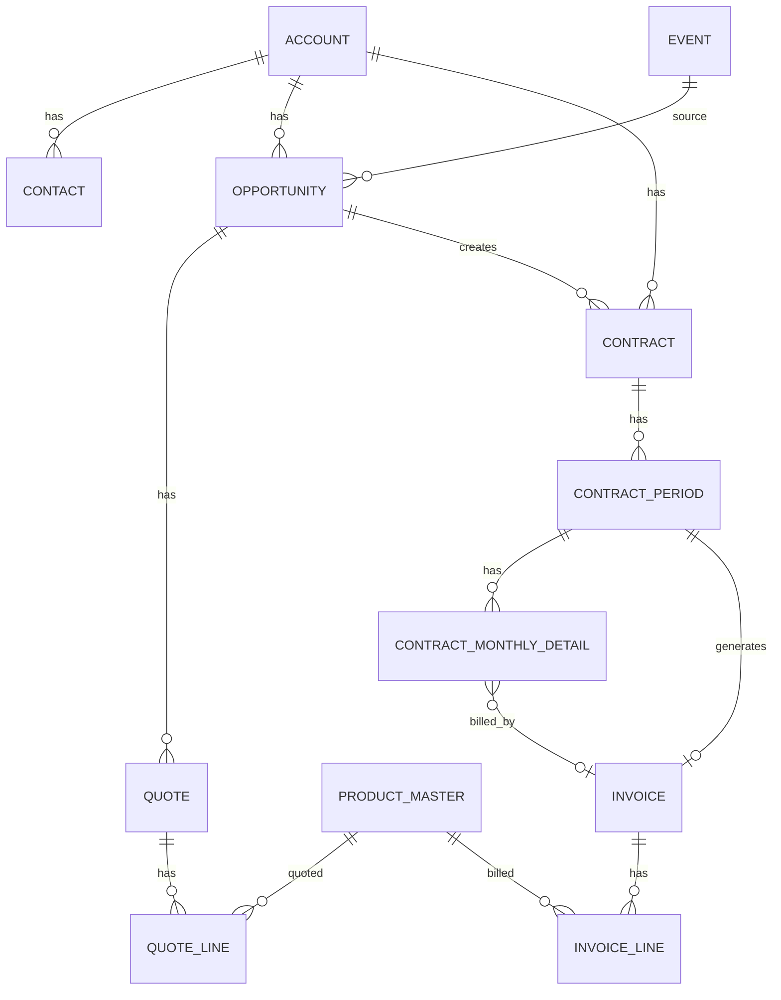

# 契約・請求・Freee連携 要件一覧

## 1. 全体方針

Salesforce上で、契約・請求・売上予定・決済状況を管理する。
Freeeでは請求書作成・送付ステータス確認・決済ステータス確認を行い、Salesforceへ同期する。

設計の中心は契約期間とする。

```text
契約
└ 契約期間
   ├ 契約月次明細
   └ 請求
      └ 請求明細
```

契約期間は、月契約・年契約それぞれの更新単位および請求作成単位として扱う。

## 2. 対象オブジェクト

```text
イベント
└ 取引
   └ 見積
      └ 見積明細
         └ 商品マスタ

取引先
├ 取引先責任者
├ 取引
└ 契約
   └ 契約期間
      ├ 契約月次明細
      └ 請求
         └ 請求明細
            └ 商品マスタ
```

## 3. イベント

- イベントは取引の参照項目として使用する。
- どのイベントから発生した取引かを管理する。
- 契約・請求には基本的に直接紐づけない。
- 必要に応じて、契約へイベント情報をコピーしてレポートに利用する。

## 4. 商品マスタ

商品マスタは、見積明細および請求明細に紐づく。
Freee連携時の商品・品目情報の元データとして使用する。

税率は10%固定とする。
消費税の端数処理は切り上げとする。

想定項目:

```text
商品名
商品コード
商品種別
課金種別
請求タイミング
Freee品目ID
MRR対象フラグ
ARR対象フラグ
請求明細表示区分
年契約用月額料金
年間一括支払い用商品フラグ
年契約月単位商品フラグ
```

推奨する分類:

```text
商品種別:
- 継続費用
- 初期費用
- オプション

請求タイミング:
- 毎月
- 年一括
- 初回のみ
```

初期費用は、商品マスタまたは見積明細の「初回のみ」判定により更新時の請求対象から除外する。

年契約では、商品マスタに以下を用意する。

```text
年間一括支払い分の商品マスタ
年契約の月単位管理用の商品マスタ
```

請求明細では年間一括支払い分の商品マスタを使用し、契約月次明細では年契約の月単位管理用の商品マスタを使用する。

## 5. 契約

契約は継続契約の親オブジェクトとする。

- 取引先に紐づく。
- 元となる取引・見積を参照する。
- 契約には月契約・年契約がある。
- 契約は自動更新する。
- 請求先は常に契約の取引先とする。
- 支払方法が請求書の場合、途中解約による日割り計算はしない。
- 社内承認フローは不要とする。

想定項目:

```text
取引先
元取引
元見積
契約種別: 月契約 / 年契約
契約ステータス
契約開始日
契約終了日
自動更新フラグ
更新停止フラグ
支払方法
イベント情報
年払い請求月区分: 利用開始月 / 利用開始前月
```

## 6. 契約期間

契約期間は契約の更新単位とする。

```text
月契約:
契約期間1件 = 1か月 = 請求1件

年契約:
契約期間1件 = 1年 = 請求1件
```

契約期間を起点に、契約月次明細・請求・請求明細を作成する。

## 7. 契約月次明細

契約月次明細は、月別売上予定、MRR/ARR、レポート用として使用する。

- 年一括請求でも12か月分に按分して作成する。
- 商品別に作成する。
- 初期費用がある場合は初月の契約月次明細として作成する。
- 年額按分時の端数処理は行わない。商品マスタに年契約用の月額料金マスタを持つため、そちらを利用する。
- 関連請求を保持し、契約月次明細レポートから請求の決済ステータスを確認できるようにする。

決済ステータスの正本は請求オブジェクトとし、契約月次明細では関連請求を通じて参照する。

```text
契約月次明細
└ 関連請求
   ├ Freee請求書送付ステータス
   ├ 決済ステータス
   ├ 入金額
   ├ 未入金額
   ├ 入金日
   ├ Freee請求書番号
   └ Freee請求書URL
```

例:

```text
年契約:
契約期間 2026/06/01 - 2027/05/31

契約月次明細:
- 2026年6月 / rendary年間契約
- 2026年6月 / セキュリティオプション
- 2026年6月 / 初期設定費用
- 2026年7月 / rendary年間契約
- 2026年7月 / セキュリティオプション
...
```

契約月次明細レポートは、用途別に以下3種類を利用する。
レポート作成作業はユーザー側で実施する。

```text
契約月次明細(営業):
- MRRグラフを表示する
- すべての過去金額を保持して表示する
- 契約ステータスが解約になっても金額は変更しない
- 解約分は解約レポート側で確認する
- 関連請求の決済ステータス、入金額、未入金額を表示する

契約月次明細(経理):
- 現在有効な契約を確認する
- 過去2か月分のうち決済済みのもののみ表示する
- 関連請求の決済ステータス、入金日、入金額を表示する

契約月次明細(解約):
- 本来獲得できる予定だった契約と金額を確認する
- 関連請求がある場合は決済ステータスも表示する
```

## 8. 請求

請求はSalesforce上の請求管理単位とし、Freee請求書と1対1で対応する。

- Freee連携・送付ステータス確認・決済ステータス確認の正本とする。
- Freee側の金額・支払期日・ステータスが変わった場合、Salesforceへ上書き同期する。
- Freee請求書送付ステータスは `送付待ち / 送付済み` とする。
- 決済ステータスは `決済待ち / 決済済み` とする。
- 送付ステータス・決済ステータスは毎日2:00に同期する。
- 同期対象は決済待ちの請求のみとする。
- Freee請求書IDはSalesforceの請求オブジェクト内で管理する。
- Salesforce請求名とFreee請求書番号は別管理とする。
- 請求書タイトルはSalesforceの請求名を使用する。
- Freee請求書番号はFreee発番とする。

FreeeとSalesforceのステータスマッピング:

| Freee側 | Salesforce請求項目 | Salesforce値 |
| --- | --- | --- |
| 送付待ち | Freee請求書送付ステータス | 送付待ち |
| 送付済み | Freee請求書送付ステータス | 送付済み |
| 決済待ち | 決済ステータス | 決済待ち |
| 決済済み | 決済ステータス | 決済済み |

想定項目:

```text
契約
契約期間
取引先
請求日
支払期日
請求対象期間開始日
請求対象期間終了日
請求金額
Freee請求書ID
Freee請求書番号
Freee請求書URL
Freee連携ステータス
Freee請求書送付ステータス
決済ステータス
入金額
未入金額
最終同期日時
同期エラー内容
取消ステータス
元請求
社内メモ
```

Freee同期時の正:

```text
金額: Freee正
支払期日: Freee正
ステータス: Freee正
社内メモ: Salesforce正
```

編集制御は以下とする。

```text
Freee連携前: 編集可能
Freee連携済み: 業務項目は編集不可、社内メモのみ編集可能
Freee連携エラー: 修正に必要な項目のみ編集可能
取消済み: 編集不可、社内メモのみ編集可能
```

## 9. 請求明細

請求明細は請求に紐づき、商品マスタにも紐づく。
Freee請求書の明細行に対応する。

月契約の場合:

```text
サービスごとに1明細
初期費用がある場合は初期費用を1明細追加
```

年契約の場合:

```text
年間利用料を1明細
初期費用がある場合は初期費用を1明細追加
```

年契約の請求明細名は「契約名 + 年払い費用」とする。

Freee請求書に出す明細名:

```text
各行: 見積明細の名前
請求書タイトル: 請求の名前
```

値引きがある場合は、請求明細上で商品単価に値引き率をかけて計算する。
マイナス明細では表現しない。

## 10. 初回作成フロー

見積があり、取引が受注したら、既存の契約・見積・見積明細・商品マスタの内容を元に、初回の請求関連データを自動作成する。

```text
1. 取引が受注になる
2. 対象の契約を特定する
3. 対象の見積を特定する
4. 見積明細と商品マスタを取得する
5. 契約種別に応じて初回契約期間を作成する
6. 契約期間・見積明細・商品マスタを元に契約月次明細を作成する
7. 契約期間を元に請求を作成する
8. 見積明細・商品マスタ・契約種別を元に請求明細を作成する
9. 請求からFreee請求書を作成する
10. Freee請求書ID・請求書番号・URLを請求に保存する
```

利用する見積:

```text
見積ステータスが Activate の見積を使用する。
Activate見積が複数ある場合はエラーにして手動確認とする。
```

初回契約開始日が月途中の場合:

```text
日割りなし
開始月を1か月分として請求する
契約作成日が契約開始月より後の場合も、当月分から請求する
```

初回請求書は契約作成時に即時作成する。

## 11. 請求書作成タイミング

締め日は毎月10日。
請求書作成日は毎月11日。
請求日は毎月20日とする。
20日が土日の場合は前日とする。
支払期日は翌月末とする。

月契約の場合:

```text
毎月11日に翌月分の請求書を自動作成する。
```

例:

```text
請求書作成日: 2026/06/11
請求日: 2026/06/20
支払期日: 2026/07/31
請求対象期間: 2026/07/01 - 2026/07/31
```

年契約の場合:

```text
次年度契約開始月の前月11日に、次年度分の請求書を自動作成する。
```

年払いの請求日は、基本的には利用開始月の20日とする。
ただし、クライアントによっては利用開始前月の20日とする場合があるため、契約単位で年払い請求月区分を保持する。

例:

```text
現在契約期間: 2026/07/01 - 2027/06/30
次年度契約期間: 2027/07/01 - 2028/06/30
次年度請求書作成日: 2027/06/11
次年度請求日: 2027/07/20 ※利用開始月の場合
次年度請求日: 2027/06/20 ※利用開始前月の場合
次年度支払期日: 請求日の翌月末
```

## 12. Freee連携

```text
請求 → Freee請求書
請求明細 → Freee請求書明細
商品マスタ → Freee品目
```

- Freee請求書は請求レコードから作成する。
- Freee請求書ID・請求書番号・URLをSalesforce請求に保存する。
- Freee請求書作成に失敗した場合、Salesforce請求は作成済みとして残し、Freee連携エラーとして管理する。
- Freee連携エラー時は、画面上にエラーメッセージを表示する。
- Freee連携エラーの内容は、Freee連携ログオブジェクトに格納する。
- Freee連携エラー時の自動リトライ、手動リトライは行わない。
- 請求書送付は現状Freee側で手動送付とする。
- Freee請求書送付ステータスと決済ステータスは毎日2:00にFreeeから取得する。

## 13. Freee連携ログ

Freee連携エラーの履歴を残すため、Freee連携ログオブジェクトを作成する。

主な用途:

```text
Freee請求書作成エラーの記録
Freee送付・決済ステータス同期エラーの記録
Freee請求書取消エラーの記録
```

想定項目:

```text
関連請求
処理種別
ステータス
エラーメッセージ
リクエスト概要
レスポンス概要
実行日時
実行ユーザ
```

## 14. 取消・再作成

請求を取り消す場合:

```text
1. Salesforce請求を取消ステータスにする
2. Freee請求書も取消・キャンセル扱いにする
3. 契約期間・契約月次明細の請求状態を取消済みにする
```

物理削除ではなく、履歴を残す方針とする。

取消後に再作成する場合:

```text
取消済み請求は残す
再作成は新規請求として作る
元請求への参照を持つ
```

自動更新停止はいつでも可能とする。
作成済み請求がある場合は取消対応とする。

## 15. 初期費用

- 初期費用は初回のみ請求する。
- 月契約更新・年契約更新では再請求しない。
- 商品マスタまたは見積明細の「初回のみ」判定により制御する。
- 初期費用がある場合は、初月の契約月次明細としても作成する。

## 16. アップセル

アップセルは発生する。
現状契約を切り替える対応とする。

アップセル時のルール:

```text
基本的には翌月からアップセルを適用する
旧契約を終了する
新契約を作成する
旧契約と新契約を関連付ける
作成済み請求は削除しない
決済待ち請求も削除せず、そのまま残す
アップセル時の請求取消・再作成などの自動処理は行わない
必要な請求調整がある場合は、運用判断で手動対応する
日割りなし
```

## 17. 年契約の更新確認リストビュー

年契約について、契約終了日の2か月前から確認できるリストビューを作成する。

目的:

```text
自動更新・次年度請求書作成前に、更新可否や契約内容を確認する。
```

対象オブジェクト:

```text
契約
```

リストビュー名案:

```text
年契約_更新確認対象
```

抽出条件案:

```text
契約種別 = 年契約
契約ステータス = 有効
契約終了日 <= 今日から2か月後
契約終了日 >= 今日
更新停止フラグ = false
```

表示項目案:

```text
契約名
取引先
契約開始日
契約終了日
契約金額
MRR
ARR
担当者
更新停止フラグ
更新確認ステータス
次回請求書作成予定日
```

更新確認ステータスと自動更新対象:

```text
未確認: 自動更新対象
更新予定: 自動更新対象
更新停止: 自動更新対象外
条件変更あり: 自動更新対象外
確認不要: 自動更新対象外
```

## 18. 通知

基本通知は行わない。
Freee連携エラー、年契約の更新確認対象、決済待ち、送付待ち、請求取消、Activate見積複数エラーは、リストビューまたはレポートで確認する。

## 19. バッチ実行時刻

```text
月契約の翌月分請求書作成: 毎月11日 2:00
年契約の次年度分請求書作成対象確認: 毎月11日 2:00
Freee送付・決済ステータス同期: 毎日 2:00
```

## 20. 既存データ移行

既存契約・既存請求・既存Freee請求書については、今後作成分から新運用の対象とする。
過去分の移行は行わない。

## 21. レポート要件

以下を確認できるようにする。

```text
月別売上予定
入金予定
未請求一覧
決済待ち一覧
MRR / ARR
契約更新予定
解約予定
イベント別売上
イベント別受注
契約月次明細(営業)
契約月次明細(経理)
契約月次明細(解約)
```

## 22. ER図


