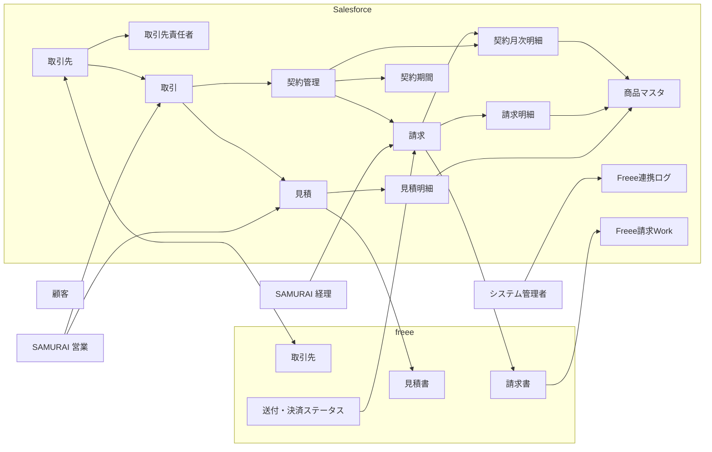
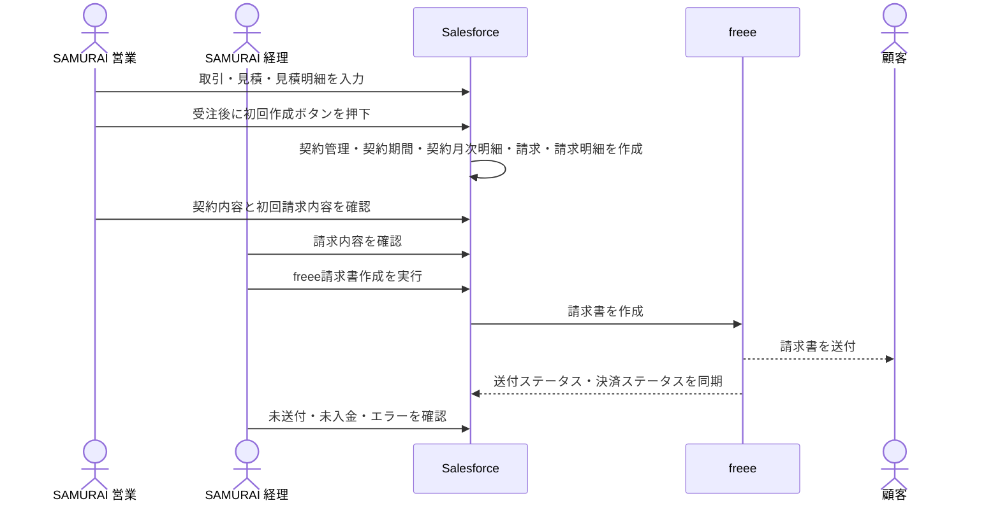
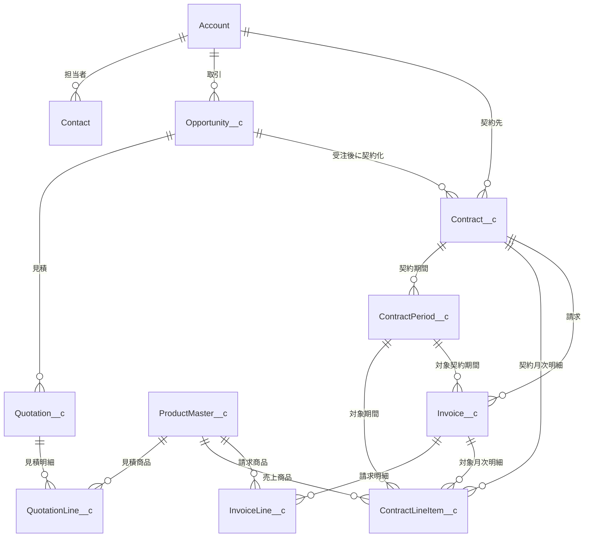
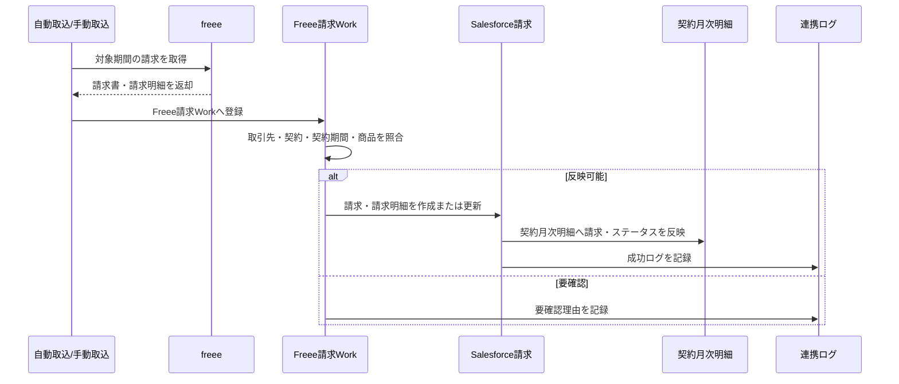
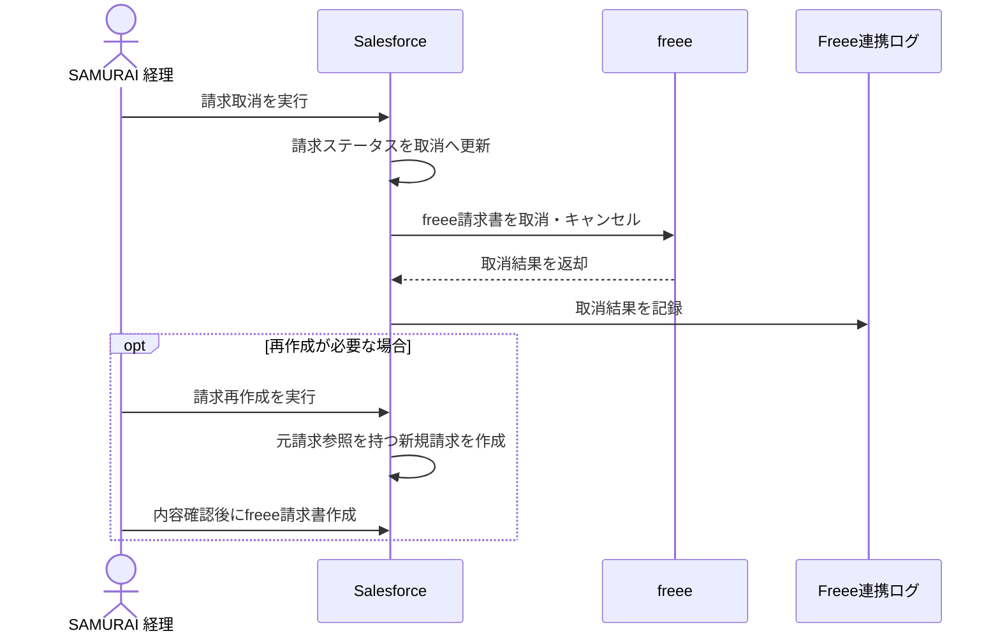
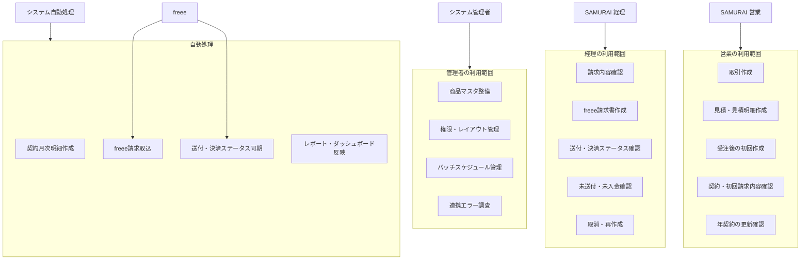

# 契約・請求・Freee連携 業務マニュアル

## 1. このマニュアルの目的

このマニュアルは、Salesforceで契約・請求・売上予定を管理し、Freeeで請求書作成・入金確認を行う業務手順をまとめたものです。

対象者:

```text
SAMURAI 営業
SAMURAI 経理
システム管理者
```

## 2. 業務全体の流れ

| No | 業務 | 主担当 | 補足 |
| --- | --- | --- | --- |
| 1 | イベントから取引が発生する | SAMURAI 営業 | イベント情報を取引に設定 |
| 2 | 取引に見積を作成する | SAMURAI 営業 | 顧客提示内容を作成 |
| 3 | 見積明細に商品を登録する | SAMURAI 営業 | 商品マスタを選択し、数量・単価を入力 |
| 4 | 取引を受注にする | SAMURAI 営業 | Accepted見積が1件だけであることを確認 |
| 5 | 取引画面の初回作成ボタンを押下する | SAMURAI 営業 | 契約・請求関連データを自動作成 |
| 6 | 契約・契約期間・契約月次明細・請求・請求明細が作成される | システム | ボタン処理またはバッチ処理で作成 |
| 7 | 初回請求の内容を確認する | SAMURAI 営業 / SAMURAI 経理 | 営業は契約・商品内容、経理は請求・Freee連携項目を確認 |
| 8 | 初回請求をFreee請求書として作成する | SAMURAI 営業 / SAMURAI 経理 | 請求画面のFreee請求書作成ボタンから実行 |
| 9 | 契約月次明細を自動作成する | システム | MRR/ARR・将来売上用。毎月11日深夜に作成 |
| 10 | 更新請求書をFreee側で自動作成・自動送付する | Freee | 経理がFreee側で自動送付設定を管理 |
| 11 | Freee請求書をSalesforceへ取り込む | システム / SAMURAI 経理 | 夜間取込またはリストビュー手動取込 |
| 12 | Freee請求書送付ステータスと決済ステータスを同期する | システム | 毎日0:10に動的同期を開始。結果確認はSAMURAI 経理 |
| 12 | 月契約・年契約を更新確認する | SAMURAI 営業 | 年契約は終了2か月前から更新確認 |

### 2.1 アクター定義

| アクター | 主な役割 | 主に操作するオブジェクト | 主な操作 |
| --- | --- | --- | --- |
| SAMURAI 営業 | 商談、見積、契約条件、初回作成を担当 | 取引、見積、見積明細、契約管理、契約期間、契約月次明細、請求、請求明細 | 取引作成、見積作成、受注、初回作成、契約更新確認、必要に応じたFreee取引先同期・見積連携・請求書作成 |
| SAMURAI 経理 | 請求、Freee請求書、入金確認を担当 | 請求、請求明細、契約月次明細、Freee連携ログ、取引先 | 請求内容確認、Freee請求書作成、Freee送付、決済ステータス確認、請求取消・再作成、Freee取引先同期 |
| システム管理者 | 設定、権限、バッチ、連携基盤を担当 | 商品マスタ、Freee設定、Freee勘定科目マッピング、権限セット、Apexジョブ | マスタ整備、Freee認証/設定、バッチスケジュール、権限付与、エラー調査 |
| システム | 自動処理を実行 | 契約期間、契約月次明細、請求、請求明細、Freee連携ログ | 初回作成、契約月次明細作成、Freee請求書取込、送付・決済ステータス同期 |

### 2.2 オブジェクト別担当

| オブジェクト | 主担当 | 確認/補助 | 入力・確認の要点 |
| --- | --- | --- | --- |
| 取引 | SAMURAI 営業 | システム管理者 | ステージ、取引先、契約開始日、契約更新、イベント、受注時の初回作成 |
| 見積 | SAMURAI 営業 | SAMURAI 経理 | Accepted見積を1件にする。Freee勘定科目を確認 |
| 見積明細 | SAMURAI 営業 | SAMURAI 経理 | 商品マスタ、明細名、数量、単価、税率を確認 |
| 商品マスタ | システム管理者 | SAMURAI 営業 / SAMURAI 経理 | 商品種別、請求タイミング、標準単価、年契約用月額料金、MRR/ARR対象を整備 |
| 契約管理 | SAMURAI 営業 | SAMURAI 経理 | 契約ステータス、契約期間、支払方法、更新確認ステータス、更新停止を確認 |
| 契約期間 | システム | SAMURAI 営業 / SAMURAI 経理 | 期間開始日、期間終了日、請求作成ステータス、関連請求を確認 |
| 契約月次明細 | システム | SAMURAI 営業 / SAMURAI 経理 | 月別売上予定、MRR/ARR、関連請求、決済ステータスをレポートで確認 |
| 請求 | SAMURAI 経理 | SAMURAI 営業 | 請求日、支払期日、請求対象期間、Freee勘定科目、Freee同期結果を確認 |
| 請求明細 | SAMURAI 経理 | SAMURAI 営業 | 明細名、商品マスタ、数量、単価、税率、税込金額を確認 |
| Freee連携ログ | システム管理者 | SAMURAI 経理 | Freee連携エラー、同期エラー、取消エラーの原因確認 |

## 3. 用語

| 用語 | 意味 |
| --- | --- |
| イベント | 取引の発生元を管理する情報 |
| 取引 | 商談・案件 |
| 見積 | 顧客へ提示する見積 |
| 見積明細 | 見積に含まれる商品・サービス |
| 商品マスタ | 商品、料金、請求タイミング、MRR/ARR集計などの元情報 |
| 契約 | 継続契約の親情報 |
| 契約期間 | 月契約なら1か月、年契約なら1年の契約単位 |
| 契約月次明細 | 月別売上予定・MRR/ARR管理用の明細 |
| 請求 | Salesforce上の請求管理単位。Freee請求書と1対1 |
| 請求明細 | Freee請求書の明細行 |

## 4. 初回契約時の業務手順

### 4.1 SAMURAI 営業の作業

1. 取引を作成する。
2. 必要に応じて、取引にイベントを設定する。
3. 見積を作成する。
4. 見積明細に商品を登録する。
5. 正式な見積のステータスを `Activate` にする。
6. 取引を受注にする。
7. 取引画面の初回作成ボタンを押下する。

注意点:

```text
Activate の見積が複数ある場合、自動作成はエラーになります。
受注前に Activate 見積が1件だけになっていることを確認してください。
```

### 4.2 初回作成ボタンで作成されるもの

取引が受注になった後、担当者が取引画面の初回作成ボタンを押下すると、以下が作成されます。

```text
契約
契約期間
契約月次明細
請求
請求明細
```

自動作成の元情報:

```text
契約
見積
見積明細
商品マスタ
```

### 4.3 初回請求

初回請求は、契約作成時にSalesforce上で即時作成されます。
初回のFreee請求書は自動作成されません。担当者が請求明細・商品などを確認/補正した後、請求画面のFreee請求書作成ボタンから手動で作成します。

月途中開始の場合:

```text
日割り計算はしません。
開始月を1か月分として請求します。
契約作成日が契約開始月より後の場合も、当月分から請求します。
```

初期費用がある場合:

```text
初回請求にのみ含まれます。
更新時には再請求されません。
```

### 4.4 取引のステージ別入力項目

取引は、契約・初回請求作成の起点になります。
特に `受注` にする前に、契約作成に必要な項目と、Accepted の見積がそろっていることを確認してください。

| ステージ | 入力・確認する項目 | 入力内容・確認内容 |
| --- | --- | --- |
| 初回接点 | 取引名 | 案件を識別できる名称 |
| 初回接点 | 取引先 | 請求先になる取引先 |
| 初回接点 | クライアント担当者 | 主担当者が分かる場合に設定 |
| 初回接点 | イベント | イベント起点の取引の場合に設定 |
| 初回接点 | 受注チャネル | 展示会/イベント、HP、広告、紹介など |
| 初回接点 | 次回アクティビティ日、次のステップ | 次に行う営業活動 |
| 商談化 | ヒアリングステータス | 初回打合せ完了など、ヒアリングの進捗 |
| 商談化 | 完了予定日 | 受注または失注を見込む日 |
| 商談化 | 契約更新 | 月契約または年契約の見込み |
| 商談化 | 契約開始日 | 利用開始予定日が分かる場合に設定 |
| 課題ヒアリング | ヒアリングステータス | 課題確認の進捗 |
| 課題ヒアリング | メモ | 課題、要望、懸念点 |
| 課題ヒアリング | 継続予定期間(月) | 契約期間見込みがある場合に設定 |
| 提案 | 提案ステータス | 提案中、見積提示中などの進捗 |
| 提案 | ACV、MRR | 提案金額。見積明細と整合するように更新 |
| 提案 | 契約更新、契約開始日 | 見積・契約条件と整合するように更新 |
| 提案 | 見積、見積明細 | 関連見積を作成し、商品、数量、単価、税率を入力 |
| 交渉 | 提案ステータス | 条件調整中などの進捗 |
| 交渉 | ACV、MRR、契約開始日 | 最終条件に合わせて更新 |
| 交渉 | 次回アクティビティ日、次のステップ | 契約締結までの対応 |
| 承認 | 見積ステータス | 契約・請求作成に使う見積を `Accepted` にする |
| 承認 | Accepted 見積の件数 | 1取引につき Accepted 見積が1件だけであること |
| 承認 | 見積のFreee勘定科目 | 請求書作成時の勘定科目マッピングに使うため確認 |
| 受注 | ステージ | `受注` に変更 |
| 受注 | 取引先、契約開始日、契約更新 | 初回作成ボタン実行前の必須確認 |
| 受注 | Accepted 見積、見積明細、商品マスタ | 契約・請求・請求明細の作成元として確認 |
| 受注 | 初回作成ボタン | 取引画面から契約・契約期間・契約月次明細・請求・請求明細を作成 |
| 失注 | ステージ | `失注` に変更 |
| 失注 | 失注日 | 失注が確定した日 |
| 失注 | 失注理由 | 該当する理由を選択 |
| 失注 | メモ | 補足理由、今後の再提案余地など |

受注時の注意点:

```text
取引先、契約開始日、契約更新は初回作成処理で使用します。
契約更新は「月」または「年」を設定します。
Accepted 見積が0件または複数件の場合、初回作成はエラーになります。
受注にしただけでは契約・請求は作成されません。取引画面の初回作成ボタンを押下してください。
```

## 5. 月契約の運用

月契約は、毎月請求します。

### 5.1 自動作成タイミング

```text
毎月10日: 締め日
毎月11日: 翌月分の請求書を自動作成
毎月20日: 請求日
翌月末: 支払期日
```

20日が土日の場合は、前日が請求日になります。

例:

```text
請求書作成日: 2026/06/11
請求対象期間: 2026/07/01 - 2026/07/31
請求日: 2026/06/20
支払期日: 2026/07/31
```

### 5.2 請求明細

月契約では、サービスごとに請求明細が作成されます。

例:

```text
rendary月額利用料
セキュリティオプション
初期設定費用 ※初回のみ
```

## 6. 年契約の運用

年契約は、年一括で請求します。

### 6.1 自動作成タイミング

次年度契約開始月の前月11日に、次年度分の請求書が自動作成されます。

例:

```text
現在契約期間: 2026/07/01 - 2027/06/30
次年度契約期間: 2027/07/01 - 2028/06/30
次年度請求書作成日: 2027/06/11
次年度請求日: 2027/07/20
次年度支払期日: 請求日の翌月末
```

年払いの請求日は、次年度契約開始月の20日です。
年契約の次年度分の契約月次明細は、次年度契約開始月の前月11日にSalesforceで先行作成されます。
更新請求書は、Freee側の自動作成・自動送付設定に従って作成されます。

### 6.2 請求明細

年契約では、年間利用料を1明細として作成します。
初期費用がある場合は、初回のみ別明細として作成します。

例:

```text
契約名 + 年払い費用
初期設定費用 ※初回のみ
```

### 6.3 契約月次明細

Freee請求書は年一括ですが、Salesforceでは月別売上予定を確認するため、契約月次明細を12か月分作成します。
年契約の月別売上予定は、商品マスタの「年契約用月額料金」を使って作成します。
「年一括請求用商品」「年契約月額按分用商品」は現行運用では使用しないため、商品マスタ画面には表示しません。
契約月次明細には関連請求が設定されるため、契約月次明細レポートから決済ステータスも確認できます。

例:

```text
2026年7月 / rendary年間契約
2026年7月 / セキュリティオプション
2026年8月 / rendary年間契約
2026年8月 / セキュリティオプション
...
```

## 7. 年契約の更新確認

年契約は、契約終了日の2か月前から更新確認対象としてリストビューに表示されます。

使用するリストビュー:

```text
年契約_更新確認対象
```

確認すること:

```text
契約終了日
取引先
契約金額
MRR
ARR
更新停止フラグ
更新確認ステータス
次回請求書作成予定日
```

対応:

```text
更新する場合:
- 更新確認ステータスを更新予定にする
- 更新停止フラグは false のままにする

更新しない場合:
- 更新停止フラグを true にする
- 更新確認ステータスを更新停止にする

条件変更がある場合:
- 更新確認ステータスを条件変更ありにする
- 必要に応じて新しい見積・契約切り替えを行う
```

自動更新対象:

```text
未確認、更新予定: 自動更新対象
更新停止、条件変更あり、確認不要: 自動更新対象外
```

### 7.1 契約管理のステータス別入力項目

契約管理は、契約期間・契約月次明細・請求作成の親になります。
初回作成ボタンで自動作成される項目もありますが、契約条件や更新可否は契約管理上で確認・更新します。

| ステータス | 入力・確認する項目 | 入力内容・確認内容 |
| --- | --- | --- |
| ドラフト | 契約名 | 必要に応じて分かりやすい名称に補正 |
| ドラフト | 取引先 | 請求先。初回作成時は取引から自動設定 |
| ドラフト | 親取引 | 元となった取引 |
| ドラフト | 元見積 | 契約・請求の元になったAccepted見積 |
| ドラフト | 契約更新 | 月契約または年契約。取引から自動設定 |
| ドラフト | 契約開始日、契約終了日 | 開始日は取引から自動設定。終了日は契約更新に応じて算出 |
| ドラフト | 支払方法 | 請求書またはクレジットカード。請求書運用の場合は請求書を選択 |
| ドラフト | 年払い請求月区分 | 年契約の場合に設定。通常は利用開始月 |
| ドラフト | ACV、MRR、ARR | 取引・見積金額と整合するか確認 |
| ドラフト | イベント | 元取引のイベント情報が反映されているか確認 |
| 交渉中 | 契約開始日、契約終了日 | 条件変更があれば更新 |
| 交渉中 | 支払方法、年払い請求月区分 | 顧客との合意内容に合わせて更新 |
| 交渉中 | ACV、MRR、ARR | 金額変更がある場合に更新 |
| 交渉中 | メモ | 交渉内容、条件変更、注意事項 |
| 承認中 | 契約名、取引先、契約期間、金額 | 承認前の最終確認 |
| 承認中 | 支払方法、年払い請求月区分 | 請求条件の最終確認 |
| 署名待ち | クライアント担当者 | 署名・契約確認を行う顧客担当者 |
| 署名待ち | 署名者 | 自社側の署名者 |
| 署名待ち | メモ | 署名依頼日、送付方法などの補足 |
| 有効 | ステータス | 契約開始・締結後に `有効` にする |
| 有効 | クライアント署名日 | 顧客署名日 |
| 有効 | 契約締結日 | 締結日。画面上は参照項目の場合があるため、必要に応じてシステム管理者に確認 |
| 有効 | 更新確認ステータス | 通常は `未確認` または `更新予定` |
| 有効 | 更新停止 | 自動更新する場合はオフ |
| 有効 | 次回請求書作成予定日 | 更新請求の対象確認に使用 |
| 更新予定 | 更新確認ステータス | `更新予定`、`条件変更あり`、`更新停止` のいずれかに更新 |
| 更新予定 | 更新停止 | 次回更新しない場合はオン |
| 更新予定 | メモ | 更新判断、条件変更、顧客確認内容 |
| 更新済 | ステータス | 更新処理後に必要に応じて `更新済` にする |
| 更新済 | 次回請求書作成予定日 | 次の更新請求予定を確認 |
| 契約終了 | 契約終了日 | 契約満了日 |
| 契約終了 | 更新停止 | 自動更新しないためオン |
| 契約終了 | 更新確認ステータス | `確認不要` または `更新停止` |
| 解約 | 契約終了日 | 解約日または最終利用日 |
| 解約 | 更新停止 | オン |
| 解約 | メモ | 解約理由、最終請求の扱い |
| 契約拒否 | ステータス | 承認NGの場合に設定 |
| 契約拒否 | メモ | 拒否理由、差戻し内容 |
| キャンセル | ステータス | 契約成立前に取りやめた場合に設定 |
| キャンセル | メモ | キャンセル理由 |

自動更新に関する入力ルール:

```text
更新確認ステータスが「未確認」または「更新予定」の契約は、自動更新対象です。
更新確認ステータスが「更新停止」「条件変更あり」「確認不要」の契約は、自動更新対象外です。
更新停止をオンにした契約は、自動更新対象外です。
作成済み請求がある場合は削除せず、必要に応じて請求取消で対応します。
```

契約管理で自動作成される関連データ:

```text
契約期間:
- 契約更新が「月」の場合は1か月単位
- 契約更新が「年」の場合は1年単位

契約月次明細:
- 月契約は対象月分
- 年契約は12か月分

請求:
- 月契約は月次請求
- 年契約は年一括請求
```

### 7.2 その他オブジェクトの項目レベル運用

取引・契約管理以外で、項目レベルの入力ルールを持つべきオブジェクトは以下です。
これらは契約・請求・Freee連携の元データまたは確認対象になるため、入力漏れや値の誤りが後続処理に影響します。

#### 見積

見積は、受注後の契約・請求作成に使う正本です。
契約・請求作成に使う見積は、1取引につき1件だけ `Accepted` にします。

| タイミング | 入力・確認する項目 | 入力内容・確認内容 |
| --- | --- | --- |
| 見積作成時 | 取引先 | 取引の取引先と一致していること |
| 見積作成時 | 親取引 | 元となる取引 |
| 見積作成時 | 件名 | 顧客に表示しても分かる見積件名 |
| 見積作成時 | 発行日 | 見積発行日 |
| 見積作成時 | 見積期日 | 見積の有効期限 |
| 見積作成時 | Freee勘定科目 | 請求書作成時の勘定科目マッピングに使う値 |
| 見積確定時 | 見積ステータス | 契約・請求作成に使う見積だけ `Accepted` にする |
| Freee見積連携時 | freee取引先ID | Freee取引先同期済みであること |
| Freee見積連携後 | freee見積書ID、freee見積書番号、見積書URL、Freee同期ステータス | Freee連携結果として自動更新されるため、通常は手入力しない |
| 補足管理 | メモ | 顧客向け補足、社内確認事項 |

#### 見積明細

見積明細は、請求明細・契約月次明細の作成元です。
商品、数量、単価、税率が正しくないと、初回作成後の請求・売上予定もずれます。

| タイミング | 入力・確認する項目 | 入力内容・確認内容 |
| --- | --- | --- |
| 明細作成時 | 親見積書 | 対象の見積 |
| 明細作成時 | 商品マスタ | 請求タイミング、商品種別、MRR/ARR対象の元になる商品 |
| 明細作成時 | 明細名 | Freee見積書・請求書に表示する明細名 |
| 明細作成時 | 数量 | 契約数量。1以上 |
| 明細作成時 | 単価 | 値引き前単価 |
| 明細作成時 | 税率 | 原則10% |
| 明細確認時 | 小計金額 | 数量×単価、または調整後金額 |
| 明細確認時 | 源泉徴収 | 対象商品の場合のみオン |

#### 商品マスタ

商品マスタは、見積明細・請求明細・契約月次明細の判定元です。
商品データ自体は事前に整備し、SAMURAI 営業は原則として正しい商品を選択します。

| タイミング | 入力・確認する項目 | 入力内容・確認内容 |
| --- | --- | --- |
| 商品登録時 | 商品名 | 見積・請求で識別しやすい名称 |
| 商品登録時 | 商品種別 | 継続費用、初期費用、オプション |
| 商品登録時 | 請求タイミング | 毎月、年一括、初回のみ |
| 商品登録時 | 標準単価 | 見積明細・請求明細の基準単価 |
| 年契約商品登録時 | 年契約用月額料金 | 年契約の契約月次明細に使う月別売上予定額 |
| 集計設定時 | MRR対象 | MRRに含める商品だけオン |
| 集計設定時 | ARR対象 | ARRに含める商品だけオン |
| 請求表示設定時 | 請求明細表示区分 | 個別表示、年間利用料に集約など |
| 運用上の注意 | freee品目ID | 現行の見積書・請求書連携では使用しないため、入力不要 |
| 運用上の注意 | 年一括請求用商品、年契約月額按分用商品 | 現行運用では使用しないため、画面非表示 |

#### 請求

請求は、Salesforce上の請求管理単位で、Freee請求書と1対1で対応します。
初回作成や更新バッチで自動作成される項目が多いため、SAMURAI 経理は内容確認とFreee連携結果の確認を中心に行います。

| タイミング | 入力・確認する項目 | 入力内容・確認内容 |
| --- | --- | --- |
| 請求作成後 | 取引先 | 請求先。契約の取引先と一致していること |
| 請求作成後 | 親契約、親取引、契約期間 | 元データとの紐づき |
| 請求作成後 | 件名 | Freee請求書タイトルとして使用 |
| 請求作成後 | 請求日 | 原則20日。土日の場合は前日 |
| 請求作成後 | 支払期日 | 請求日の翌月末 |
| 請求作成後 | 請求対象期間開始日、請求対象期間終了日 | 月契約は対象月、年契約は対象年度 |
| 請求作成後 | Freee勘定科目 | Freee請求書作成時の必須項目 |
| 請求作成後 | 支払方法 | 請求書またはクレジットカード |
| Freee請求書作成前 | 請求金額、税額、税込金額 | 請求明細と合計が合っていること |
| Freee請求書作成前 | freee取引先ID | 取引先がFreee同期済みであること |
| Freee請求書作成後 | freee請求書ID、freee請求書番号、請求書URL | Freee連携結果として自動更新されるため、通常は手入力しない |
| Freee請求書作成後 | Freee同期ステータス、freee同期メッセージ | 連携成功/失敗を確認 |
| 日次同期後 | Freee請求書送付ステータス | 送付待ち、送付済み |
| 日次同期後 | 決済ステータス | 決済待ち、決済済み |
| 日次同期後 | 入金額、未入金額、入金日、最終同期日時 | Freee側の状態が同期されたことを確認 |
| 取消時 | 取消ステータス、元請求 | 取消・再作成時に確認。物理削除はしない |
| 補足管理 | メモ | 社内メモ。Freee同期後もSalesforce正として扱う |

#### 請求明細

請求明細は、Freee請求書の明細行です。
Freee連携前に、明細名・数量・単価・税率・商品マスタを確認します。

| タイミング | 入力・確認する項目 | 入力内容・確認内容 |
| --- | --- | --- |
| 請求明細作成後 | 親請求書 | 対象の請求 |
| 請求明細作成後 | 商品マスタ | 商品別売上、MRR/ARR判定の元 |
| 請求明細作成後 | 元見積明細 | 初回作成元の明細 |
| 請求明細作成後 | 明細名 | Freee請求書に表示する明細名 |
| 請求明細作成後 | 請求明細種別 | 継続費用、初期費用、年間利用料など |
| 請求明細作成後 | 数量、単価、値引率、値引後単価 | 請求金額の元 |
| 請求明細作成後 | 税率、消費税額、税込金額 | 税率10%、端数切り上げであること |
| Freee連携後 | freee明細ID | Freee側明細との紐づき。通常は手入力しない |
| 注意 | Freee勘定科目ID | 現行の請求書連携では請求ヘッダのFreee勘定科目マッピングを使用するため、通常は手入力不要 |

#### 契約期間

契約期間は、月契約・年契約の更新単位です。
通常は初回作成ボタンまたは更新バッチで自動作成されます。

| タイミング | 入力・確認する項目 | 入力内容・確認内容 |
| --- | --- | --- |
| 作成後 | 契約 | 親契約 |
| 作成後 | 契約更新 | 月または年 |
| 作成後 | 期間開始日、期間終了日 | 月契約は1か月、年契約は1年 |
| 作成後 | 初回期間 | 初回作成時の期間はオン |
| 作成後 | 更新回数 | 初回は0、更新ごとに増加 |
| 請求作成後 | 請求作成ステータス | 未作成、作成済、エラー、取消済など |
| 請求作成後 | 関連請求 | 作成された請求 |
| Freee連携後 | Freee連携ステータス | 関連請求のFreee連携結果を確認 |

#### 契約月次明細

契約月次明細は、月別売上予定・MRR/ARR・入金状況確認に使います。
原則として自動作成されるため、手入力ではなくレポートで確認します。

| タイミング | 入力・確認する項目 | 入力内容・確認内容 |
| --- | --- | --- |
| 作成後 | 契約管理、契約期間 | 親契約・対象期間 |
| 作成後 | 対象年月、対象期間開始日、対象期間終了日 | 売上予定の対象月 |
| 作成後 | 商品マスタ、元見積明細 | 商品別の売上予定元 |
| 作成後 | 売上予定額、合計金額 | 月別売上予定額 |
| 作成後 | MRR対象、ARR対象 | レポート集計対象 |
| 作成後 | 初期費用 | 初期費用明細の場合オン |
| 請求作成後 | 関連請求 | 請求・入金状況を辿るため必須。状態確認は関連請求から行う |
| レポート確認時 | 関連請求の送付ステータス、決済ステータス、入金額、未入金額 | 契約月次明細レポートで確認 |

## 8. Freee請求書の送付

初回請求では、担当者がSalesforceの請求画面からFreee請求書を手動作成します。
更新請求では、Salesforce側で請求・請求明細・Freee請求書を作成しません。
契約月次明細は、MRR/ARR・将来売上レポート用として毎月11日深夜にSalesforceで先行作成します。
請求書はFreee側の自動作成・自動送付を正とし、SalesforceはFreee請求書を取り込んで請求・請求明細を作成または更新します。

SAMURAI 経理の作業:

```text
1. Salesforceで請求が作成されていることを確認する
2. 初回請求の場合は、請求明細・商品などを確認/補正する
3. 初回請求の場合は、Salesforceの請求画面からFreee請求書を作成する
4. Freee請求書URLからFreee画面を開く
5. Freee上で請求書内容を確認する
6. Freee上で顧客へ送付する
```

## 9. 送付・決済確認

Freee請求書送付ステータスと決済ステータスは、毎日0:10に動的同期を開始してFreeeからSalesforceへ同期されます。

同期対象:

```text
決済待ちの請求のみ
```

Salesforceで確認するリストビュー:

```text
決済待ち請求
送付待ち請求
```

確認項目:

```text
Freee請求書送付ステータス
決済ステータス
入金額
未入金額
最終同期日時
```

## 10. Freee連携エラー対応

Freee請求書作成に失敗した場合、Salesforceの請求は作成済みとして残ります。
請求のFreee連携ステータスが `連携エラー` になります。
エラーメッセージは画面上に表示され、Freee連携ログにも保存されます。

使用するリストビュー:

```text
Freee連携エラー
```

確認すること:

```text
同期エラー内容
請求のFreee勘定科目、Freee勘定科目マッピング
請求明細の金額
取引先情報
Freee側の状態
```

対応:

```text
1. エラー内容を確認する
2. Freee勘定科目マッピング、取引先、請求明細、請求データの不備を修正する
3. 必要に応じて請求取消・再作成を行う
```

注意点:

```text
Freee連携エラー時の自動リトライ、手動リトライは行いません。
エラーはFreee連携エラーのリストビューとFreee連携ログで確認します。
```

## 11. 請求の取消

請求を誤って作成した場合は、削除ではなく取消を行います。

取消時の処理:

```text
1. 請求画面の「請求取消」アクションを実行する
2. Salesforce請求を取消ステータスにする
3. Freee請求書を取消・キャンセル扱いにする
4. 契約期間の請求作成ステータスを取消済みにする
```

注意点:

```text
請求は物理削除しません。
履歴を残すため、取消ステータスで管理します。
```

## 12. 請求の再作成

取消した請求を再作成する場合は、新しい請求を作成します。

ルール:

```text
取消済み請求は残す
請求画面の「請求再作成」アクションから新規請求として作る
新しい請求には元請求への参照を持たせる
```

## 13. Salesforceでの編集制御

Freee連携済みの請求・請求明細は、Salesforce側では原則編集できません。

編集制御:

```text
Freee連携前:
- 編集可能

Freee連携済み:
- 業務項目は編集不可
- 社内メモのみ編集可能

Freee連携エラー:
- 修正に必要な項目のみ編集可能

取消済み:
- 編集不可
- 社内メモのみ編集可能
```

Freee側を正とする項目:

```text
金額
支払期日
ステータス
```

Salesforce側を正とする項目:

```text
社内メモ
```

## 14. アップセル対応

アップセルが発生した場合は、現状契約を切り替える対応とします。

現時点の方針:

```text
基本的には翌月からアップセルを適用
旧契約を終了
新契約を作成
旧契約と新契約を関連付ける
作成済み請求は削除しない
決済待ち請求も削除せず、そのまま残す
請求取消・再作成などの自動処理は行わない
必要な請求調整がある場合は、運用判断で手動対応する
日割りなし
```

## 15. よく使うリストビュー

| リストビュー | 主な利用者 | 用途 |
| --- | --- | --- |
| 年契約_更新確認対象 | SAMURAI 営業 | 年契約の更新確認 |
| Freee連携エラー | SAMURAI 経理 / システム管理者 | Freee連携失敗の確認 |
| 決済待ち請求 | SAMURAI 経理 | 決済確認 |
| 送付待ち請求 | SAMURAI 経理 | 送付確認 |
| 取消済み請求 | SAMURAI 経理 | 取消履歴確認 |
| Freee未連携請求 | SAMURAI 経理 | 未連携データ確認 |
| 今月請求 | SAMURAI 経理 | 当月請求確認 |
| 請求未作成期間 | SAMURAI 営業 / SAMURAI 経理 | 請求作成漏れ確認 |
| Freee連携ログ | SAMURAI 経理 / システム管理者 | Freee連携エラー履歴確認 |

## 16. よく使うレポート

| レポート | 用途 |
| --- | --- |
| 月別売上予定 | 月別・商品別の売上予定確認 |
| 入金予定 | 支払期日別の入金予定確認 |
| 未請求一覧 | 請求漏れ確認 |
| 決済待ち一覧 | 決済確認 |
| MRR | 月次継続売上確認 |
| ARR | 年間継続売上確認 |
| 契約更新予定 | 更新対象契約確認 |
| 解約予定 | 解約・更新停止契約確認 |
| イベント別受注 | イベント起点の受注確認 |
| イベント別売上 | イベント起点の売上確認 |
| 契約月次明細(営業) | MRRグラフ、過去金額、解約後の金額、関連請求の決済ステータス確認 |
| 契約月次明細(経理) | 現在有効な契約、過去2か月分の決済済み、入金日・入金額確認 |
| 契約月次明細(解約) | 本来獲得予定だった契約と金額、関連請求の決済ステータス確認 |

## 17. 日次業務

SAMURAI 経理:

```text
Freee連携エラーを確認する
Freee未連携請求を確認する
Freee連携ログを確認する
必要に応じて請求取消・再作成を行う
```

SAMURAI 経理:

```text
決済待ち請求を確認する
送付待ち請求を確認する
Freee側の入金状況と差異がないか確認する
```

## 18. freee請求移行Workの効率的な確認

### 18.1 経理担当者が確認する一覧

毎週土曜の取込後、次の営業日までにfreee請求移行Workを確認します。

| ステータス | 対応 |
|---|---|
| 反映可能 | 件数、請求金額合計、対象月を確認し、問題がなければ一括反映する |
| 要確認 | 検証メッセージと契約解決メッセージに記載された項目だけを確認する |
| エラー | 同じ処理を繰り返さず、freee請求書番号とエラーメッセージをシステム管理者へ連絡する |
| 反映済み | 原則として対応不要。請求、請求明細、関連契約が作成されていることを必要時だけ確認する |

### 18.2 自動で処理される内容

次の処理はシステムが行うため、経理担当者による明細ごとの確認は不要です。

- 過去の確定済み請求と明細名・単価・数量・金額が一致する商品の再利用
- 金額がない備考行の請求対象外設定
- 主要商品が1件だけの請求に含まれる値引き・割引・調整行の商品設定
- 再取込でfreeeから削除された未反映明細Workの整理
- 年払い請求の税抜純額を12分割した契約月次明細金額の算出
- 取引先、商品、対象日から一意に決まる契約・契約期間の補完

### 18.3 要確認となった場合

| メッセージの内容 | 確認・修正する項目 |
|---|---|
| 商品候補なし・商品候補複数 | freee明細名、単価、数量を確認し、請求明細移行Workの商品マスタを選択する |
| 取引先未解決・取引先複数 | freee取引先IDを確認し、請求移行Workの取引先を選択する |
| 契約候補複数 | 請求対象の商品と対象日を確認し、正しい契約管理を選択する |
| 契約期間重複 | 契約管理の契約期間関連リストを確認し、期間が重複しないよう修正する |
| 請求対象日なし | freee請求書の請求日または対象期間を確認する |
| 金額不一致 | 税込・税抜、税額、値引き行、調整行を確認する |

修正後は、対象Workを選択して「freee請求書を再検証」を実行します。`反映可能` になったことを確認してから一括反映します。

### 18.4 関連請求の確認

契約月次明細の関連請求は、商品と対象月が一意に一致した場合だけ自動設定されます。候補が複数の場合や、別の請求が設定済みの場合は上書きされません。

年一括請求は12か月すべての契約月次明細へ同じ請求を設定しません。契約期間に紐づく請求の全履歴は、契約期間の請求関連リストまたは請求レポートで確認します。

## 18. 月次業務

毎月11日以降:

```text
毎月11日2:00に月契約の翌月分請求とFreee請求書が作成されていることを確認する
毎月11日2:00に年契約の更新対象分請求とFreee請求書が作成されていることを確認する
Freee連携エラーがないか確認する
```

通知方針:

```text
基本通知は行いません。
Freee連携エラー、年契約更新確認、決済待ち、送付待ち、請求取消などはリストビューまたはレポートで確認します。
```

毎月20日前:

```text
今月請求リストビューを確認する
Freeeで請求書を送付する
```

毎月20日以降:

```text
決済待ち請求を確認する
送付・決済ステータス同期結果を確認する
```

## 19. 注意事項

```text
Activate見積は1取引につき1件にしてください。
初回作成は受注だけでは実行されません。取引画面の初回作成ボタンを押下してください。
初回のFreee請求書は、請求明細・商品などを確認してから手動作成してください。
更新請求のFreee請求書は、Freee側の自動作成・自動送付で作成されます。
Salesforce側の契約月次明細は毎月11日深夜に先行作成され、Freee請求書取込後に関連請求が設定されます。
Freee連携済みの請求・請求明細はSalesforceで編集しないでください。
請求を間違えた場合は削除ではなく取消を行ってください。
初期費用は初回のみ請求されます。
年契約でも契約月次明細は12か月分作成されます。
更新停止したい場合は、更新停止フラグを設定してください。
```
## 20. Freee取引先一括同期

複数の取引先をまとめてFreee取引先へ同期したい場合は、取引先リストビューから一括同期できます。

操作手順:

1. Salesforceで「取引先」タブを開きます。
2. 同期対象の取引先が表示されるリストビューを開きます。
3. 同期したい取引先にチェックを入れます。
4. リストビューのボタンから「Freee取引先一括同期」をクリックします。
5. 同期結果画面で、対象件数、成功、スキップ、失敗を確認します。
6. 失敗がある場合は、結果メッセージを確認して取引先名、Freee設定、権限、Freee側の状態を確認します。

結果の見方:

| 結果 | 意味 | 対応 |
| --- | --- | --- |
| 成功 | Freee取引先IDをSalesforce取引先へ保存しました | 取引先の `Freee_Partner_Id__c` を確認します |
| スキップ | すでにFreee取引先IDが設定済みです | 追加対応は不要です |
| 失敗 | Freee検索・作成、またはSalesforce更新で失敗しました | 表示メッセージを確認し、必要に応じて再実行します |

注意事項:

- 一度に同期できる取引先は最大50件です。
- すでにFreee取引先IDが設定されている取引先は上書きしません。
- 1件が失敗しても、他の取引先の同期は可能な範囲で継続します。
- 営業、経理、システム管理者の権限セットで利用できます。
## 契約期間と請求の確認方法

契約期間に紐づく請求を確認する場合は、契約期間画面の請求関連リストを確認します。

契約期間の `代表請求` は、現在確認すべき請求へすばやく移動するための項目です。契約期間内のすべての請求を表す項目ではありません。取消済み請求や再作成後の請求を含めて確認する場合は、必ず請求関連リストを確認してください。

### 請求を取消・再作成した場合

1. 取消済み請求は履歴として残ります。
2. 再作成した請求は新規請求として作成されます。
3. 契約期間の代表請求は、再作成後の新しい請求に更新されます。
4. 契約月次明細の関連請求も、再作成後の新しい請求に更新されます。
5. 契約月次明細レポートで入金状態を確認する場合は、更新後の関連請求の送付ステータス・決済ステータスを確認します。

### 営業・経理の確認ポイント

営業は、契約期間の代表請求から現在の請求を確認できます。過去に取消・再作成がある場合は、請求関連リストで履歴も確認してください。

経理は、契約期間の請求関連リストで同一契約期間に紐づく請求を確認し、取消済み請求と有効請求を区別してFreee連携・入金状態を確認してください。

## レポートの使い分け

契約月次明細は、将来売上・MRR・ARRを見るための予定データです。請求は、Freee連携・送付・決済・入金を見るための実績データです。レポートを確認するときは、目的に応じてベースにするオブジェクトを分けてください。

| 確認したいこと | 使うレポート | ベース |
| --- | --- | --- |
| 将来の月別売上 | 月別売上予定 | 契約月次明細 |
| MRR | MRR | 契約月次明細 |
| ARR | ARR | 契約月次明細 |
| 商品別・契約別の売上予定 | 契約月次明細(営業) | 契約月次明細 |
| 売上予定に対する請求状態 | 月次売上予定・請求状態一覧 | 契約月次明細 |
| 未送付請求 | 未送付請求一覧 | 請求 |
| 未入金請求 | 未入金請求一覧 | 請求 |
| 入金予定 | 入金予定 | 請求 |
| Freee連携エラー | Freee連携エラー一覧 | 請求 |
| 取消済み請求 | 取消済み請求一覧 | 請求 |

### 営業の見方

営業は、契約月次明細ベースのレポートを確認します。月別売上予定、MRR、ARRは契約月次明細の売上予定金額を見ます。関連請求の送付ステータス・決済ステータスは補助情報として確認できます。

### 経理の見方

経理は、請求ベースのレポートを確認します。未送付、未入金、入金予定、Freee連携エラー、取消済み請求は請求レポートで確認してください。

契約月次明細ベースのレポートで請求金額・入金額・未入金額を合計しないでください。再請求や調整請求などにより、計画データである契約月次明細と実績データである請求は必ずしも1対1になりません。請求金額・入金額・未入金額を集計する場合は、必ず請求ベースのレポートを使います。

### ダッシュボード

営業は `営業用 契約売上ダッシュボード` を確認します。月別売上予定、MRR、ARR、契約更新予定を確認し、詳細を見たい場合は各グラフから契約月次明細または契約更新予定レポートへ移動します。

経理は `経理用 請求管理ダッシュボード` を確認します。未入金請求、未送付請求、入金予定、Freee連携エラー、取消済み請求を確認し、詳細を見たい場合は各グラフから請求ベースのレポートへ移動します。

Home画面には営業用・経理用の2つのダッシュボードを表示します。旧 `契約請求ダッシュボード` は営業・経理の情報が混在するため使用しません。
## 21. freee自動送付運用での更新請求手順

### アクター

| アクター | 担当 |
|---|---|
| 営業 | 契約管理、契約期間、契約月次明細、初回請求の作成確認 |
| 経理 | 初回freee請求書作成、freee自動送付設定、freee請求書取込、本反映、未送付・未入金確認 |
| システム管理者 | バッチスケジュール、権限、freee連携設定、エラー調査 |

### 初回請求

1. 営業が契約管理・契約期間・契約月次明細を確認する。
2. 営業または経理が初回請求・請求明細を確認する。
3. 経理がSalesforceからfreee請求書を作成する。
4. 経理がfreee側で初回請求書を送付する。
5. 経理がfreee側で次回以降の自動作成・自動送付設定を行う。

### 2回目以降の請求

1. freee側で請求書が自動作成・自動送付される。
2. 経理またはシステム管理者がSalesforceの `freee請求書を取込` を実行する。通常運用では毎週土曜2:30の夜間バッチで、前月1日〜当月末のfreee請求書を自動取得する。
3. Salesforceはfreee請求書をWorkへ保存する。
4. 経理がWorkの `ImportStatus__c` を確認する。
5. `要確認` のWorkは、取引先、契約管理、契約期間、商品マスタ、契約月次明細の紐づけを補正する。
6. 経理が `freee請求書を再検証` を実行する。
7. `反映可能` になったWorkを選択し、`freee請求書を一括本反映` を実行する。
8. Salesforceに請求・請求明細が作成または更新され、対象の契約月次明細へ関連請求が設定される。
9. 対象契約の商品カテゴリ、プランカテゴリ、アカウント数が空欄の場合、請求明細名・商品マスタ名・数量から自動補完される。

### 注意事項

- 契約の商品カテゴリ、プランカテゴリ、アカウント数に既存値がある場合、請求明細からは上書きされない。
- 年一括請求で数量が12か月を表す場合、その数量はアカウント数として登録されない。アカウント数が必要な場合は明細名へ「Nアカウント」を記載するか、契約で直接確認する。
- Salesforceで請求・請求明細・Freee請求書まで作成する旧更新請求バッチは使用しない。freee自動作成と二重請求になるため、スケジュール停止状態を維持する。
- 契約月次明細作成バッチは停止しない。MRR/ARR・将来売上レポートのため、毎月11日深夜に先行作成する。
- 契約月次明細作成バッチで作成元となる請求または既存契約月次明細がない契約は、その契約だけスキップされる。他の契約の月次明細作成は継続される。
- freee請求書取込後、対象契約期間内の契約月次明細の関連請求が更新される。年一括請求の場合は12か月分の契約月次明細に同じ請求が設定される。
- freee送付ステータス・決済ステータスの同期バッチは継続する。対象は支払期日が前月1日〜当月末の、freee連携済み・未取消・未決済の請求に限定する。
- 経理レポートはSalesforce請求を実績として確認する。
- 営業レポートは契約月次明細を予定データとして確認する。

## 22. freee取込・入金金額確認手順

### アクター別の確認内容

| アクター | 確認対象 | 確認内容 |
|---|---|---|
| 営業 | 契約月次明細 | MRR、ARR、将来売上、関連請求の有無、送付ステータス、決済ステータス |
| 経理 | freee請求取込Work | 取込結果、取引先・契約管理・契約期間・契約月次明細・商品マスタの紐づけ、反映可否 |
| 経理 | 請求 | 請求金額、税額、入金額、未入金額、送付ステータス、決済ステータス、請求書URL |
| システム管理者 | バッチ | 契約月次明細作成、freee請求取込、freeeステータス同期のスケジュール登録状況 |
| システム管理者 | Work保持期間バッチ | 請求作成済みの反映済みWorkを2か月後に削除するスケジュール登録状況 |

### 経理の日次確認

freee請求書取込バッチの実行後、経理は遅くとも次の営業日までに以下を確認します。Workはfreee請求書をSalesforce請求へ本反映する前の確認用データです。freee側の請求書情報そのものはWork上で書き換えません。

1. `freee請求書取込Work` のリストビューで、`エラー`、`要確認`、`反映可能` の件数を確認する。
2. `エラー` と `要確認` を先に解消し、必要に応じて `freee請求書を再検証` を実行する。
3. `反映可能` のWorkについて、請求書番号・請求日・請求金額・取引先・明細商品を確認する。
4. 問題がなければ対象Workを選択し、`freee請求書を一括本反映` を実行する。
5. 作成されたSalesforce請求で、請求金額、税額、入金額、未入金額、送付ステータス、決済ステータス、請求書URLを確認する。
6. 契約月次明細で、対象月の関連請求、送付ステータス、決済ステータスが確認できることを確認する。
7. 未送付、未入金、取込エラーは経理用レポートまたはダッシュボードで確認する。

### freee請求移行Workのステータス別対応

| 移行ステータス | 意味 | 経理の確認・対応 | 完了条件 |
|---|---|---|---|
| `取得済み` | freeeから取得直後で、検証前の状態 | 通常は再検証の対象。`検証メッセージ` を確認し、必要に応じて再検証する。 | `反映可能`、`要確認`、`対象外` のいずれかになる。 |
| `要確認` | 自動判定だけでは安全に紐づけ先を決められない状態 | `検証メッセージ` と明細Workを確認し、下表の確認項目を補正してから再検証する。 | `反映可能` になる、または正当な理由で `対象外` と判断する。 |
| `反映可能` | 取引先・契約管理・契約期間・商品が確定し、本反映できる状態 | freee請求書番号、請求日、金額、取引先、商品名・数量・単位を確認後、`freee請求書を一括本反映` を実行する。 | `反映済み` となり、`作成済み請求` が設定される。 |
| `反映済み` | Salesforce請求・請求明細の作成または更新が完了した状態 | `作成済み請求` を開き、金額・ステータス・請求書URLと契約月次明細への関連請求設定を確認する。 | 確認完了。Workは2か月後の定期削除対象となる。 |
| `対象外` | Salesforceへ請求を作成しないと判断した状態 | freeeの取消・テスト・重複など、対象外とした理由を確認する。誤判定ならシステム管理者へ連絡する。 | 対象外の理由が明確である。 |
| `エラー` | 取込・検証・本反映の処理が失敗した状態 | `検証メッセージ` とfreee請求書番号を記録し、再実行で解消しない場合はシステム管理者へ連絡する。本反映を繰り返し実行しない。 | エラー原因が解消され、再検証または再取込後に次の状態へ進む。 |

### `要確認` の確認項目

| 確認対象 | 経理が確認する内容 | 対応方法 |
|---|---|---|
| 取引先 | freee取引先ID・取引先名とSalesforce取引先が一致するか | Salesforce取引先のfreee取引先IDを確認する。取引先が未登録の場合は、運用ルールに従い取引先を作成してfreee取引先と同期する。 |
| 契約管理 | 対象取引先に有効な契約管理があるか、対象サービス・請求周期が正しいか | 正しい契約管理を確認する。契約が未登録の場合は、営業または契約管理担当者へ契約作成を依頼する。 |
| 契約期間 | 請求日または対象期間が契約期間に含まれるか | 契約期間の開始日・終了日を確認する。不足している場合は正しい契約期間を作成・補正する。 |
| 請求明細Workの商品 | freee明細の件名、数量、単位、単価、金額と商品マスタが一致するか | 金額だけで商品を決めない。商品名・サービス内容・数量・単位も確認し、該当する商品マスタを確定する。 |
| 重複請求 | 同じfreee請求書番号またはfreee請求書IDのSalesforce請求が存在しないか | 既に作成済みなら本反映しない。重複や不明点はシステム管理者へ連絡する。 |
| 契約月次明細 | 対象月の契約月次明細があるか | 本反映後に関連請求が設定される対象月の契約月次明細を確認する。不足時は営業またはシステム管理者へ連絡する。 |

**注意:** Workの取引先・契約・商品を推測だけで変更せず、freee請求書と契約内容を根拠に確認してください。特に、同額の商品が複数ある場合は、金額一致だけで本反映しません。

### 金額項目の見方

| 項目 | 見方 |
|---|---|
| 請求金額 | freee請求書から取得した請求総額 |
| 税額 | freee請求書ヘッダーの税額。取得できない場合は明細税額の合計 |
| 入金額 | 決済ステータスが「決済済み」の場合に請求金額と同額になる |
| 未入金額 | 決済ステータスが「決済待ち」の場合に請求金額と同額になる |

契約月次明細はMRR/ARR・将来売上確認用の予定データです。請求金額、入金額、未入金額の合計確認は、契約月次明細レポートではなく請求ベースのレポートで行います。

### システム管理者のリリース後確認

1. リリース後、以下のバッチがスケジュール登録されていることを確認する。

| バッチ | 予定 |
|---|---|
| `ContractMonthlyLineBatch` | 毎月11日 1:30 |
| `FreeeInvoiceImportScheduler` | 毎週土曜 2:30 |
| `FreeeInvoiceStatusSyncBatch` | 毎日 0:10開始 |
| `Mig_FreeeInvoiceWorkRetentionBatch` | 毎月1日 3:00 |

2. `ContractRenewalInvoiceBatch` がスケジュール登録されていないことを確認する。
3. 既存データの税額・入金額・未入金額を補正する必要がある場合のみ、`scripts/apex/backfill-freee-invoice-amounts.apex` を一度だけ実行する。
4. 補正後、請求とfreee請求取込Workの入金額・未入金額が決済ステータスと一致していることを確認する。

freee請求書取込は、freee API上限を圧迫しないように通常運用では前月1日〜当月末のみを取得します。過去分の取り込み漏れや例外対応が必要な場合は、手動取込で対象期間を指定して実行します。

freee送付・決済ステータス同期は毎日0:10に開始し、20件ずつ2分間隔で対象がなくなるまで継続します。通常対象は支払期日が前月1日〜当月末の未決済請求です。Freee連携ステータスが`Failed`の請求は過去期間でも再試行対象です。

freee API上限に達した場合は後続処理を止め、APIレスポンスのリセット時刻以降に自動再開します。夜間の上限は1,000件で、超過分は翌日に繰り越され、Freee連携ログに警告が記録されます。経理担当者による通常時の再実行操作は不要です。

### freee請求移行Workの保持期間

- `反映済み` かつ `作成済み請求` が設定されたWorkは、作成日時から2か月後の毎月1日3:00に削除されます。
- `要確認`、`エラー`、`反映可能`、`取得済み` のWorkは削除されません。経理は必要な確認・本反映を完了してください。
- 削除されるのはWorkと明細Workだけです。Salesforce請求、請求明細、契約管理、契約期間、契約月次明細は残ります。

### 月次明細が作成されない契約の確認

契約月次明細作成バッチは、不備契約があっても全体停止しません。対象契約に請求または既存契約月次明細がない場合、その契約だけ月次明細作成をスキップします。

システム管理者または営業は、月次明細が作成されない契約について以下を確認します。

1. 契約管理が `Activated` であること。
2. 契約更新区分が `月` または `年` であること。
3. 契約開始日が入力されていること。
4. 契約に紐づく請求、または初回の契約月次明細が存在すること。

作成元がない場合は、契約内容を確認し、初回請求または初回契約月次明細を補正してから次回バッチまたは手動処理で再確認します。
## 23. 業務全体構成図・利用者図

この章では、契約・請求・freee連携業務を図で確認する。日常業務では、Salesforceで契約・請求・売上予定を確認し、freeeで請求書送付と決済状況を確認する。

### 全体構成図



### 通常業務フロー図



### オブジェクト関連図



### freee請求取込・ステータス同期フロー図



### 請求取消・再作成フロー図



### 利用者図



## Freee請求取込時に契約管理がない場合

### 担当者

| 作業 | 担当 |
|---|---|
| 商品共通ルールの初期登録・変更 | システム管理者 |
| 取引先別例外ルールの登録・確認 | SAMURAI 経理 / システム管理者 |
| 商品マスタ・権限・エラー調査 | システム管理者 |
| 自動作成された契約内容の確認 | SAMURAI 営業 / SAMURAI 経理 |

### システムの判定

1. freee取引先IDでSalesforce取引先を特定します。
2. 取引先が持つ有効な契約管理から、請求明細で確定したすべての商品を持ち、請求対象日を含む契約を検索します。
3. 契約が1件だけ見つかった場合は既存契約を使用し、対象の契約期間へ請求を紐づけます。複数見つかった場合は新しい契約を作成せず `要確認` にします。
4. 契約だけが一意に見つかり、対象月の契約期間がない場合は、契約期間と契約月次明細を補完します。
5. 契約がない場合は、取引先別例外ルールを先に確認します。
6. 一致する取引先別例外ルールがなければ、商品共通ルールを確認します。
7. 有効かつ自動作成を許可したルールが1件だけ一致した場合に、対象取引先専用の契約・契約期間・契約月次明細を作成します。
8. freeeから請求対象期間を取得できない月払い・単発請求は、請求日の属する月を対象期間として扱います。
9. ルールがない、同一優先度で複数一致する、商品または請求日が不明な場合は `要確認` になります。

### Freee請求契約ルールの登録

SAMURAIアプリから `Freee請求契約ルール` タブを開き、以下を入力します。

| 項目 | 入力内容 |
|---|---|
| ルール名 | 共通ルールは商品名・請求区分、例外ルールは取引先名も分かる名称 |
| 取引先（個別ルールのみ） | 通常は空欄。特定取引先だけ処理を変える場合に設定 |
| Freee取引先ID | 共通ルールでは空欄。取引先別例外ルールで必要な場合だけ設定 |
| 商品マスタ | 請求明細に割り当てる商品 |
| 請求件名キーワード | 同一取引先に複数契約がある場合の識別語 |
| 請求区分 | 月払い、年払い、単発 |
| 契約管理 | 取引先別例外ルールで既存契約へ紐づける場合に設定。共通ルールでは設定不可 |
| 自動作成契約名 | 契約を自動作成する場合の契約名。未入力時は自動生成 |
| 契約開始日・契約終了日 | 契約条件が確定している場合に入力 |
| 有効 | ルールを利用する場合にチェック |
| 契約自動作成を許可 | 共通ルールでは必須。例外ルールでは契約がない場合に自動作成してよいときだけチェック |

### 経理担当者の対応手順

#### 1. 事前: Freee請求契約ルールの登録・維持

1. 新商品または新しい請求パターンを導入するときだけ、商品単位の共通ルールを1件登録する。取引先ごとの登録は行わない。
2. 共通ルールでは取引先、Freee取引先ID、契約管理を空欄にし、商品マスタ、請求件名キーワード、請求区分を設定する。
3. 共通ルールでは `契約自動作成を許可` を設定し、同じ商品・件名キーワードで有効な共通ルールが複数ないことを確認して `有効` にする。
4. 特定取引先だけ既存契約への固定紐づけや異なる請求区分が必要な場合に限り、取引先別例外ルールを登録する。
5. 取引先別例外ルールが一致する場合は共通ルールより優先されるため、例外終了時は無効化する。

#### 2. 毎週: freee請求取込Workの確認

1. 毎週土曜のfreee請求取込後、次の営業日までに `エラー`、`要確認`、`反映可能` のWork件数を確認する。
2. `要確認` は、`検証メッセージ` と `契約解決メッセージ` を確認し、取引先、契約管理、契約期間、対象月の契約月次明細、商品マスタを照合する。
3. 商品は金額だけで確定しない。freee明細の件名、サービス内容、数量、単位、単価も商品マスタと照合する。
4. 補正後に `freee請求書を再検証` を実行し、`反映可能` になることを確認する。

#### 3. 本反映と反映後確認

1. `反映可能` のWorkについて、freee請求書番号、請求日、請求金額、取引先、明細商品・数量・単位を確認する。
2. 問題がなければ対象Workを選択し、`freee請求書を一括本反映` を実行する。
3. `反映済み` になり `作成済み請求` が設定されたことを確認する。
4. 作成済みのSalesforce請求で、請求金額、税額、入金額、未入金額、送付ステータス、決済ステータス、請求書URLを確認する。
5. 対象月の契約月次明細に関連請求、送付ステータス、決済ステータスが反映されていることを確認する。

#### 4. 例外時の対応

| 状態 | 経理の対応 |
|---|---|
| `エラー` | 検証メッセージとfreee請求書番号を確認する。再取込・再検証で解消しない場合は、同じ本反映を繰り返さずシステム管理者へ連絡する。 |
| `対象外` | freeeで取消済み、テスト、重複など、対象外とした理由を確認する。誤判定または理由不明の場合はシステム管理者へ連絡する。 |
| 契約・契約期間が不足 | 契約内容を確認し、営業または契約管理担当者へ契約管理・契約期間の作成または補正を依頼する。 |
| 商品が未確定 | 商品マスタを確認する。新商品が必要な場合は、システム管理者へ商品マスタの追加を依頼する。 |

#### 5. Work保持期間の確認

- `反映済み` かつ `作成済み請求` が設定されたWorkは、2か月経過後の毎月1日3:00に削除される。
- 削除前に、Salesforce請求・請求明細・契約月次明細の紐づけと金額・ステータスが正しいことを確認する。
- `要確認`、`エラー`、`反映可能`、`取得済み` のWorkは自動削除されないため、未解消Workを定期的に解消する。

### 注意事項

- 取引先名だけでは取引先・契約管理を自動作成しません。
- 通常は商品ごとの共通ルールだけを管理し、取引先別ルールは例外時に限定します。
- 同一優先度で同じ条件の有効ルールを複数登録すると `要確認` になります。
- 同じ取引先・商品・対象日に一致する有効契約が複数ある場合も `要確認` となり、新しい契約は自動作成されません。
- 請求対象期間がない月払い・単発請求は、請求月の月初から月末を対象期間として自動補完します。
- 共通ルールから作成される契約は取引先ごとに分離され、共通ルールの契約管理項目には保存されません。
- 商品マスタが確定していない請求は自動作成されません。
- 年払いは商品マスタの年契約月額按分料金が必要です。
- 単発契約は更新停止となり、MRR・ARRの対象外です。
- 自動作成された継続契約は請求管理元がFreeeとなり、Salesforceの更新請求バッチ対象外です。

### Work画面の確認項目

| 契約解決処理 | 意味 |
|---|---|
| 既存契約紐付け | 既存契約を使用 |
| 契約期間補完 | 既存契約に不足していた期間・月次明細を作成 |
| 継続契約自動作成 | 承認済みルールから継続契約一式を作成 |
| 単発契約自動作成 | 更新停止・MRR対象外の単発契約一式を作成 |
| 要確認 | 自動確定条件を満たしていない |

`契約解決メッセージ` に自動処理結果または停止理由が表示されます。`要確認` の場合は、取引先、商品マスタ、請求対象期間、Freee請求契約ルールの重複を確認してから再検証します。
