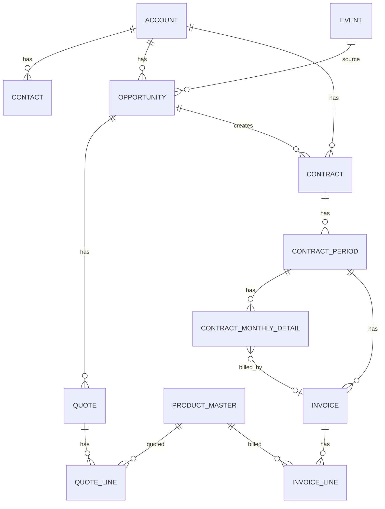
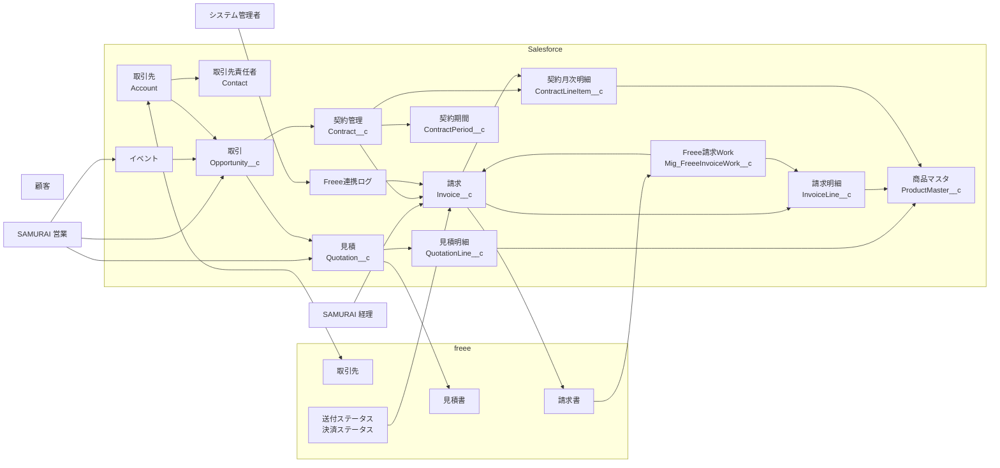
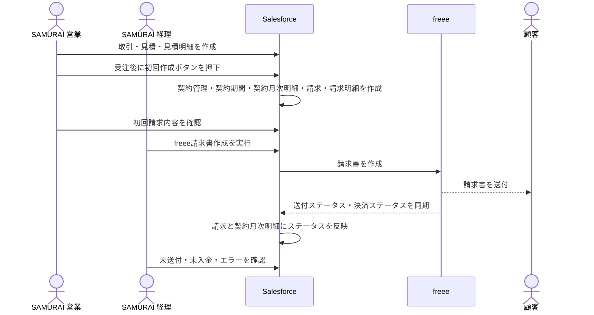
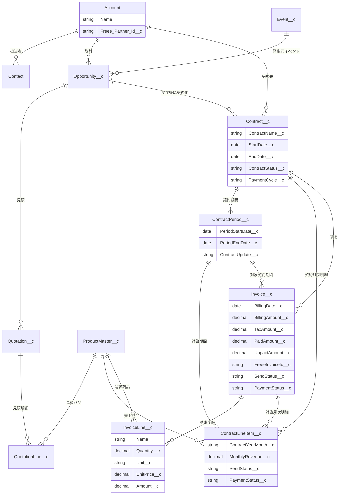
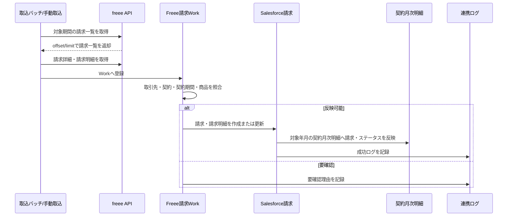
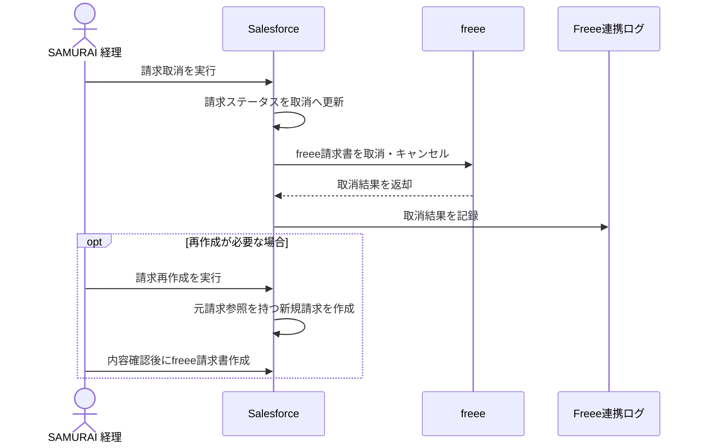
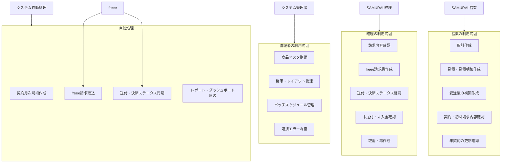

# 契約・請求・Freee連携 要件一覧

## 1. 全体方針

Salesforce上で、契約・請求・売上予定・決済状況を管理する。
Freeeでは請求書作成・送付ステータス確認・決済ステータス確認を行い、Salesforceへ同期する。

設計の中心は契約期間とする。

```text
契約
└ 契約期間
   ├ 契約月次明細
   └ 請求
      └ 請求明細
```

契約期間は、月契約・年契約それぞれの更新単位および請求作成単位として扱う。

## 2. 対象オブジェクト

```text
イベント
└ 取引
   └ 見積
      └ 見積明細
         └ 商品マスタ

取引先
├ 取引先責任者
├ 取引
└ 契約
   └ 契約期間
      ├ 契約月次明細
      └ 請求
         └ 請求明細
            └ 商品マスタ
```

## 3. イベント

- イベントは取引の参照項目として使用する。
- どのイベントから発生した取引かを管理する。
- 契約・請求には基本的に直接紐づけない。
- 必要に応じて、契約へイベント情報をコピーしてレポートに利用する。

## 4. 商品マスタ

商品マスタは、見積明細および請求明細に紐づく。
見積明細・請求明細・契約月次明細の作成元として使用する。
現行のFreee見積書・請求書連携では、商品マスタのFreee品目IDは送信しない。

税率は10%固定とする。
消費税の端数処理は切り上げとする。

想定項目:

```text
商品名
商品コード
商品種別
課金種別
請求タイミング
MRR対象フラグ
ARR対象フラグ
請求明細表示区分
年契約用月額料金
年間一括支払い用商品フラグ
年契約月単位商品フラグ
```

推奨する分類:

```text
商品種別:
- 継続費用
- 初期費用
- オプション

請求タイミング:
- 毎月
- 年一括
- 初回のみ
```

初期費用は、商品マスタまたは見積明細の「初回のみ」判定により更新時の請求対象から除外する。

年契約では、商品マスタに以下を用意する。

```text
年契約用の請求商品
年契約用月額料金
```

請求明細では見積明細の商品マスタを使用し、契約月次明細の月別売上予定額は商品マスタの年契約用月額料金を使用する。
「年一括請求用商品」「年契約月額按分用商品」の相互参照項目は現行運用では使用しないため、商品マスタ画面には表示しない。

## 5. 契約

契約は継続契約の親オブジェクトとする。

- 取引先に紐づく。
- 元となる取引・見積を参照する。
- 契約には月契約・年契約がある。
- 契約は自動更新する。
- 請求先は常に契約の取引先とする。
- 支払方法が請求書の場合、途中解約による日割り計算はしない。
- 社内承認フローは不要とする。

想定項目:

```text
取引先
元取引
元見積
契約種別: 月契約 / 年契約
契約ステータス
契約開始日
契約終了日
更新停止フラグ
支払方法
イベント情報
```

## 6. 契約期間

契約期間は契約の更新単位とする。

```text
月契約:
契約期間1件 = 1か月 = 請求1件

年契約:
契約期間1件 = 1年 = 請求1件
```

契約期間を起点に、契約月次明細・請求・請求明細を作成する。

## 7. 契約月次明細

契約月次明細は、月別売上予定、MRR/ARR、レポート用として使用する。

- 年一括請求でも12か月分に按分して作成する。
- 商品別に作成する。
- 初期費用がある場合は初月の契約月次明細として作成する。
- 年額按分時の端数処理は行わない。商品マスタに年契約用の月額料金マスタを持つため、そちらを利用する。
- 関連請求を保持し、契約月次明細レポートから請求の決済ステータスを確認できるようにする。

決済ステータスの正本は請求オブジェクトとし、契約月次明細では関連請求を通じて参照する。

```text
契約月次明細
└ 関連請求
   ├ Freee請求書送付ステータス
   ├ 決済ステータス
   ├ 入金額
   ├ 未入金額
   ├ 入金日
   ├ Freee請求書番号
   └ Freee請求書URL
```

例:

```text
年契約:
契約期間 2026/06/01 - 2027/05/31

契約月次明細:
- 2026年6月 / rendary年間契約
- 2026年6月 / セキュリティオプション
- 2026年6月 / 初期設定費用
- 2026年7月 / rendary年間契約
- 2026年7月 / セキュリティオプション
...
```

契約月次明細レポートは、用途別に以下3種類を利用する。
レポート作成作業はユーザー側で実施する。

```text
契約月次明細(営業):
- MRRグラフを表示する
- すべての過去金額を保持して表示する
- 契約ステータスが解約になっても金額は変更しない
- 解約分は解約レポート側で確認する
- 関連請求の決済ステータス、入金額、未入金額を表示する

契約月次明細(経理):
- 現在有効な契約を確認する
- 過去2か月分のうち決済済みのもののみ表示する
- 関連請求の決済ステータス、入金日、入金額を表示する

契約月次明細(解約):
- 本来獲得できる予定だった契約と金額を確認する
- 関連請求がある場合は決済ステータスも表示する
```

## 8. 請求

請求はSalesforce上の請求管理単位とし、Freee請求書と1対1で対応する。

- Freee連携・送付ステータス確認・決済ステータス確認の正本とする。
- Freee側の金額・支払期日・ステータスが変わった場合、Salesforceへ上書き同期する。
- Freee請求書送付ステータスは `送付待ち / 送付済み` とする。
- 決済ステータスは `決済待ち / 決済済み` とする。
- 送付ステータス・決済ステータスは毎日0:10に動的同期を開始する。
- 同期対象は決済待ちの請求のみとする。
- Freee請求書IDはSalesforceの請求オブジェクト内で管理する。
- Salesforce請求名とFreee請求書番号は別管理とする。
- 請求書タイトルはSalesforceの請求名を使用する。
- Freee請求書番号はFreee発番とする。

FreeeとSalesforceのステータスマッピング:

| Freee側 | Salesforce請求項目 | Salesforce値 |
| --- | --- | --- |
| 送付待ち | Freee請求書送付ステータス | 送付待ち |
| 送付済み | Freee請求書送付ステータス | 送付済み |
| 決済待ち | 決済ステータス | 決済待ち |
| 決済済み | 決済ステータス | 決済済み |

想定項目:

```text
契約
契約期間
取引先
請求日
支払期日
請求対象期間開始日
請求対象期間終了日
請求金額
Freee請求書ID
Freee請求書番号
Freee請求書URL
Freee連携ステータス
Freee請求書送付ステータス
決済ステータス
入金額
未入金額
最終同期日時
同期エラー内容
取消ステータス
元請求
社内メモ
```

Freee同期時の正:

```text
金額: Freee正
支払期日: Freee正
ステータス: Freee正
社内メモ: Salesforce正
```

編集制御は以下とする。

```text
Freee連携前: 編集可能
Freee連携済み: 業務項目は編集不可、社内メモのみ編集可能
Freee連携エラー: 修正に必要な項目のみ編集可能
取消済み: 編集不可、社内メモのみ編集可能
```

## 9. 請求明細

請求明細は請求に紐づき、商品マスタにも紐づく。
Freee請求書の明細行に対応する。

月契約の場合:

```text
サービスごとに1明細
初期費用がある場合は初期費用を1明細追加
```

年契約の場合:

```text
年間利用料を1明細
初期費用がある場合は初期費用を1明細追加
```

年契約の請求明細名は「契約名 + 年払い費用」とする。

Freee請求書に出す明細名:

```text
各行: 見積明細の名前
請求書タイトル: 請求の名前
```

値引きがある場合は、請求明細上で商品単価に値引き率をかけて計算する。
マイナス明細では表現しない。

## 10. 初回作成フロー

見積があり、取引が受注した後、担当者が取引画面のボタンを押下すると、既存の契約・見積・見積明細・商品マスタの内容を元に、初回の請求関連データを自動作成する。

```text
1. 取引が受注になる
2. 担当者が取引画面の初回作成ボタンを押下する
3. 対象の契約を特定する
4. 対象の見積を特定する
5. 見積明細と商品マスタを取得する
6. 契約種別に応じて初回契約期間を作成する
7. 契約期間・見積明細・商品マスタを元に契約月次明細を作成する
8. 契約期間を元に請求を作成する
9. 見積明細・商品マスタ・契約種別を元に請求明細を作成する
10. 担当者が請求・請求明細・商品情報を確認/補正する
11. 担当者が請求画面のボタンからFreee請求書を手動作成する
12. Freee請求書ID・請求書番号・URLを請求に保存する
```

利用する見積:

```text
見積ステータスが Activate の見積を使用する。
Activate見積が複数ある場合はエラーにして手動確認とする。
```

初回契約開始日が月途中の場合:

```text
日割りなし
開始月を1か月分として請求する
契約作成日が契約開始月より後の場合も、当月分から請求する
```

初回請求は契約作成時にSalesforce上で即時作成する。
初回のFreee請求書は、請求明細・商品などを担当者が確認/補正した後、請求画面のボタンから手動作成する。

## 11. 請求書作成タイミング

締め日は毎月10日。
請求書作成日は毎月11日。
請求日は毎月20日とする。
20日が土日の場合は前日とする。
支払期日は翌月末とする。

月契約の場合:

```text
毎月11日に翌月分の請求書を自動作成する。
```

例:

```text
請求書作成日: 2026/06/11
請求日: 2026/06/20
支払期日: 2026/07/31
請求対象期間: 2026/07/01 - 2026/07/31
```

年契約の場合:

```text
次年度契約開始月の前月11日に、次年度分の請求書を自動作成する。
```

年払いの請求日は、次年度契約開始月の20日とする。
年契約更新時の請求書作成日は、次年度契約開始月の前月11日とする。

例:

```text
現在契約期間: 2026/07/01 - 2027/06/30
次年度契約期間: 2027/07/01 - 2028/06/30
次年度請求書作成日: 2027/06/11
次年度請求日: 2027/07/20
次年度支払期日: 請求日の翌月末
```

## 12. Freee連携

```text
請求 → Freee請求書
請求明細 → Freee請求書明細
商品マスタ → 請求明細名・金額・集計判定の元情報
```

- Freee請求書は請求レコードから作成する。
- 初回作成時は、契約・契約期間・契約月次明細・請求・請求明細をSalesforce上に作成するところまでを自動化する。
- 初回のFreee請求書作成は、請求明細・商品などを担当者が確認/補正した後、画面ボタンから手動で実行する。
- 更新分のFreee請求書作成は、更新バッチで契約期間・請求・請求明細を作成した後、自動でFreee請求書作成処理を実行する。
- 更新対象判定は契約を起点に行い、作成済み契約期間の重複を確認して二重作成を防止する。
- 月契約は毎月11日に翌月開始の契約期間を作成対象とする。
- 年契約は次年度契約開始月の前月11日に次年度契約期間を作成対象とする。
- 更新停止フラグがtrueの契約、取消済み/終了済みの契約、同一期間の契約期間が作成済みの契約は更新対象外とする。
- Freee請求書ID・請求書番号・URLをSalesforce請求に保存する。
- Freee請求書作成に失敗した場合、Salesforce請求は作成済みとして残し、Freee連携エラーとして管理する。
- 現行実装では、請求書連携時にFreee勘定科目マッピングの `account_item_id` を送信する。商品マスタのFreee品目IDは必須ではない。
- 現行実装では、見積書連携時も商品マスタのFreee品目IDは送信しない。
- Freee連携エラー時は、画面上にエラーメッセージを表示する。
- Freee連携エラーの内容は、Freee連携ログオブジェクトに格納する。
- Freee連携エラー時の自動リトライ、手動リトライは行わない。
- 請求書送付は現状Freee側で手動送付とする。
- Freee請求書送付ステータスと決済ステータスは毎日0:10に動的同期を開始してFreeeから取得する。

## 13. Freee連携ログ

Freee連携エラーの履歴を残すため、Freee連携ログオブジェクトを作成する。

主な用途:

```text
Freee請求書作成エラーの記録
Freee送付・決済ステータス同期エラーの記録
Freee請求書取消エラーの記録
```

想定項目:

```text
関連請求
処理種別
ステータス
エラーメッセージ
リクエスト概要
レスポンス概要
実行日時
実行ユーザ
```

## 14. 取消・再作成

請求を取り消す場合:

```text
1. Salesforce請求を取消ステータスにする
2. Freee請求書も取消・キャンセル扱いにする
3. 契約期間の請求作成ステータスを取消済みにする
```

物理削除ではなく、履歴を残す方針とする。

取消後に再作成する場合:

```text
取消済み請求は残す
再作成は新規請求として作る
元請求への参照を持つ
```

自動更新停止はいつでも可能とする。
作成済み請求がある場合は取消対応とする。

## 15. 初期費用

- 初期費用は初回のみ請求する。
- 月契約更新・年契約更新では再請求しない。
- 商品マスタまたは見積明細の「初回のみ」判定により制御する。
- 初期費用がある場合は、初月の契約月次明細としても作成する。

## 16. アップセル

アップセルは発生する。
現状契約を切り替える対応とする。

アップセル時のルール:

```text
基本的には翌月からアップセルを適用する
旧契約を終了する
新契約を作成する
旧契約と新契約を関連付ける
作成済み請求は削除しない
決済待ち請求も削除せず、そのまま残す
アップセル時の請求取消・再作成などの自動処理は行わない
必要な請求調整がある場合は、運用判断で手動対応する
日割りなし
```

## 17. 年契約の更新確認リストビュー

年契約について、契約終了日の2か月前から確認できるリストビューを作成する。

目的:

```text
自動更新・次年度請求書作成前に、更新可否や契約内容を確認する。
```

対象オブジェクト:

```text
契約
```

リストビュー名案:

```text
年契約_更新確認対象
```

抽出条件案:

```text
契約種別 = 年契約
契約ステータス = 有効
契約終了日 <= 今日から2か月後
契約終了日 >= 今日
更新停止フラグ = false
```

表示項目案:

```text
契約名
取引先
契約開始日
契約終了日
契約金額
MRR
ARR
担当者
更新停止フラグ
更新確認ステータス
次回請求書作成予定日
```

更新確認ステータスと自動更新対象:

```text
未確認: 自動更新対象
更新予定: 自動更新対象
更新停止: 自動更新対象外
条件変更あり: 自動更新対象外
確認不要: 自動更新対象外
```

## 18. 通知

基本通知は行わない。
Freee連携エラー、年契約の更新確認対象、決済待ち、送付待ち、請求取消、Activate見積複数エラーは、リストビューまたはレポートで確認する。

## 19. バッチ実行時刻

```text
契約月次明細作成: 毎月11日 1:30
freee請求書取込: 毎週土曜 2:30
Freee送付・決済ステータス同期: 毎日 0:10開始、20件ずつ2分間隔で対象終了まで継続
旧更新請求バッチ: 通常運用では停止
```

dev1では以下のスケジュールを登録済みとする。

```text
ContractMonthlyLineBatch: 毎月11日 1:30
FreeeInvoiceImportScheduler: 毎週土曜 2:30
FreeeInvoiceStatusSyncBatch: 毎日 0:10
```

`ContractMonthlyLineBatch` は、MRR/ARR・将来売上レポート用の契約月次明細を先に作成するため継続する。
`ContractRenewalInvoiceBatch` は、Salesforce側で請求・請求明細・Freee請求書まで作成する旧更新請求バッチであり、freee側の自動作成・自動送付と二重請求になるため通常運用ではスケジュール停止する。
`FreeeInvoiceImportScheduler` は、freee API上限を圧迫しないように毎週土曜2:30に前月1日〜当月末のみを取得する。
`FreeeInvoiceStatusSyncBatch` は毎日0:10に動的同期を開始する。支払期日が前月1日〜当月末のfreee連携済み・未取消・未決済の請求、および過去期間を含むFreee連携失敗請求を対象とする。
対象は最大1,000件までを処理開始時に確定し、20件ずつ2分間隔で対象がなくなるまで継続する。freee APIから429が返った場合は後続の呼出しを停止し、レスポンスのリセット時刻または制限期間から待機時間を算出して自動再開する。
同一処理の待機ジョブまたは実行中Queueableが存在する場合は重複起動しない。1,000件を超える残件は翌日の処理へ繰り越し、Freee連携ログへ警告を記録する。

## 20. 既存データ移行

既存契約・既存請求・既存Freee請求書については、今後作成分から新運用の対象とする。
過去分の移行は行わない。

## 21. レポート要件

以下を確認できるようにする。

```text
月別売上予定
入金予定
未請求一覧
決済待ち一覧
MRR / ARR
契約更新予定
解約予定
イベント別売上
イベント別受注
契約月次明細(営業)
契約月次明細(経理)
契約月次明細(解約)
```

## 22. ER図


## 23. Freee取引先一括同期

取引先レコード単位のFreee取引先同期に加えて、取引先リストビューで選択した複数の取引先を一括でFreee取引先同期できるようにする。

要件:

- 取引先リストビューで複数レコードを選択し、「Freee取引先一括同期」ボタンから実行できること。
- Salesforce取引先名でFreee取引先を検索し、完全一致するFreee取引先があればそのIDをSalesforce取引先へ保存すること。
- Freee側に該当取引先が存在しない場合はFreee取引先を作成し、作成されたFreee取引先IDをSalesforce取引先へ保存すること。
- すでに `Account.Freee_Partner_Id__c` が設定済みの取引先は作成・更新せずスキップすること。
- 一括処理はレコード単位で成功・スキップ・失敗を判定し、1件の失敗で全件を中断しないこと。
- 実行後、対象件数・成功件数・スキップ件数・失敗件数・各レコードの結果メッセージを画面に表示すること。
- 同期対象は最大50件/回とし、50件を超える選択時はエラーにすること。
- 利用者は取引先の参照・更新権限、Freee設定の参照権限、Visualforceページ/Apexクラスアクセスを持つこと。
## 契約期間と請求の関連方針

契約期間に紐づく請求の正本は、請求オブジェクトの `ContractPeriod__c` とする。

通常運用では、月契約は契約期間1件に対して請求1件、年契約は契約期間1件に対して請求1件を作成する。ただし、請求取消後の再作成、手動の追加請求、将来の調整請求により、同一契約期間に複数の請求が紐づく可能性がある。

そのため、契約期間から請求を確認する場合は、契約期間画面の請求関連リストを正として確認する。契約期間の `RelatedInvoice__c` は、全請求を表す項目ではなく、代表請求または最新有効請求へのショートカットとして扱う。

請求を再作成した場合は、新規請求を作成し、取消済み請求は履歴として残す。再作成後、契約期間の代表請求と契約月次明細の関連請求は、新しく作成された請求へ更新する。

## レポート設計方針

契約月次明細は、将来売上、MRR、ARR、商品別・契約別の売上予定を管理する計画データとする。請求は、Salesforce上で作成された請求書、Freee請求書連携、送付ステータス、決済ステータス、入金額、未入金額を管理する実績データとする。

営業向けレポートは契約月次明細を主オブジェクトとし、将来売上・MRR・ARRを確認できること。経理向けレポートは請求を主オブジェクトとし、未送付、未入金、Freee連携エラー、入金予定、取消済み請求を確認できること。

契約月次明細から関連請求を参照できるレポートタイプを用意し、売上予定に対する請求作成状況・送付ステータス・決済ステータス・入金日を確認できること。ただし、契約月次明細ベースのレポートでは請求金額・入金額・未入金額を合計しない。年一括請求では複数の契約月次明細が同一請求を参照するため、請求金額・入金額・未入金額の集計は請求ベースのレポートで行う。

必要なレポートタイプ:

| レポートタイプ | 主オブジェクト | 用途 |
| --- | --- | --- |
| 契約月次明細レポート | 契約月次明細 | 将来売上、MRR、ARR、関連請求の状態確認 |
| 請求レポート | 請求 | 未送付、未入金、入金予定、Freee連携、取消管理 |
| 契約期間請求レポート | 契約期間 | 未請求期間、契約期間単位の請求確認 |

必要なレポート:

| 利用者 | レポート | 主オブジェクト | 主な確認内容 |
| --- | --- | --- | --- |
| 営業 | 月別売上予定 | 契約月次明細 | 月別・商品別・契約別の売上予定 |
| 営業 | MRR | 契約月次明細 | MRR対象商品の月次継続売上 |
| 営業 | ARR | 契約月次明細 | ARR対象商品の年間継続売上 |
| 営業 | 契約月次明細(営業) | 契約月次明細 | 売上予定、関連請求、送付ステータス、決済ステータス |
| 経理 | 未送付請求一覧 | 請求 | Freee送付ステータスが送付待ちの請求 |
| 経理 | 未入金請求一覧 | 請求 | 決済ステータスが決済待ちの請求 |
| 経理 | 入金予定 | 請求 | 支払期日、未入金額、決済ステータス |
| 経理 | Freee連携エラー一覧 | 請求 | Freee連携ステータスがFailedの請求 |
| 経理 | 取消済み請求一覧 | 請求 | 取消済み請求と元請求・再作成請求の確認 |
| 管理 | 月次売上予定・請求状態一覧 | 契約月次明細 | 売上予定と請求作成・送付・決済状態の突合 |

必要なダッシュボード:

| 利用者 | ダッシュボード | 目的 | 構成 |
| --- | --- | --- | --- |
| 営業 | 営業用 契約売上ダッシュボード | 将来売上、MRR、ARR、契約更新予定を確認する | 契約月次明細ベースのグラフレポートを使用 |
| 経理 | 経理用 請求管理ダッシュボード | 未入金、未送付、入金予定、Freee連携エラー、取消済み請求を確認する | 請求ベースのグラフレポートを使用 |

ダッシュボード用グラフレポートは、表形式で確認する業務レポートとは分けて作成する。表形式の業務レポートを複雑にしないため、ダッシュボードでは `【グラフ】` で始まる専用レポートを利用する。

旧 `契約請求ダッシュボード` は営業・経理の用途が混在するため利用しない。営業用・経理用の2つのダッシュボードへ分割する。
## 24. freee自動送付を前提にした更新請求運用

2026-06-22時点の見直しにより、更新請求の正はSalesforce更新請求バッチではなくfreee側の自動作成・自動送付とする。

- 初回請求はSalesforceで請求・請求明細を作成し、Salesforceからfreee請求書を作成する。
- 2回目以降の請求書はfreee側で自動作成・自動送付する。
- Salesforceはfreee請求書をAPIで取得し、いったん `Mig_FreeeInvoiceWork__c` / `Mig_FreeeInvoiceLineWork__c` に保存する。
- Work上で取引先、契約管理、契約期間、契約月次明細、商品マスタを解決し、`反映可能` のWorkだけを `Invoice__c` / `InvoiceLine__c` に本反映する。
- 本反映後、対象の契約月次明細 `ContractLineItem__c.RelatedInvoice__c` に請求を紐づける。
- MRR/ARR・将来売上レポート用に、Salesforceは毎月11日深夜に `ContractMonthlyLineBatch` で契約月次明細を先行作成する。
- 年契約の次年度分契約月次明細は、次年度契約開始月の前月11日に12か月分を先行作成する。
- Salesforceで請求・請求明細・freee請求書まで作成する旧更新請求バッチ `ContractRenewalInvoiceBatch` は、freee自動作成と二重請求になるためスケジュール停止する。
- freee請求書が作成された後、Salesforceはfreee請求書を取り込み、対象契約期間内の契約月次明細 `ContractLineItem__c.RelatedInvoice__c` を更新する。
- `FreeeInvoiceStatusSyncBatch` は、freeeの送付ステータス・決済ステータスをSalesforceへ反映するため継続する。

通常運用での手動取込として、`Mig_FreeeInvoiceWork__c` のリストビューから `freee請求書を取込` を実行できるようにする。取込後はWorkを確認し、必要に応じて再検証し、`反映可能` のWorkをリストビュー一括本反映する。

## 25. freee請求取込・入金金額管理要件

本節は、freee請求取込、入金ステータス同期、契約月次明細の最新運用ルールであり、旧更新請求バッチを前提にした記載より優先する。

### バッチ運用

| バッチ | 利用方針 | 実行タイミング | 役割 |
|---|---|---:|---|
| `ContractMonthlyLineBatch` | 継続利用 | 毎月11日 1:30 | MRR/ARR・将来売上確認用の契約月次明細を先行作成する |
| `FreeeInvoiceImportScheduler` | 継続利用 | 毎週土曜 2:30 | 前月1日〜当月末のfreee請求書をWorkへ取り込み、検証・反映対象にする |
| `FreeeInvoiceStatusSyncBatch` | 継続利用 | 毎日 0:10開始 | 支払期日が前月1日〜当月末のSalesforce請求と過去のFailed請求について、送付ステータス、決済ステータス、金額系項目をfreee情報で更新する |
| `Mig_FreeeInvoiceWorkRetentionBatch` | 継続利用 | 毎月1日 3:00 | 請求作成済みで、Work作成日時から2か月を超えたfreee請求移行Workを削除する |
| `ContractRenewalInvoiceBatch` | 停止 | なし | Salesforce起点で更新請求・freee請求書を作成する旧方式のため、通常運用ではスケジュール登録しない |

### 金額項目の算出ルール

freee請求取込Work、およびSalesforce請求への日次同期では、以下のルールで金額項目を管理する。

| 項目 | 算出・取得ルール |
|---|---|
| 請求金額 | freee請求書の請求金額を保持する |
| 税額 | freee請求書ヘッダーの税額を優先し、取得できない場合はfreee請求明細の税額合計を利用する |
| 入金額 | 決済ステータスが「決済済み」の場合は請求金額、決済待ちの場合は0 |
| 未入金額 | 決済ステータスが「決済待ち」の場合は請求金額、決済済みの場合は0 |

### 契約月次明細との関係

- 契約月次明細は売上予定、MRR、ARRを確認する計画データとして作成する。
- 請求はfreee請求書の実績データとして作成・更新する。
- freee請求書がSalesforceへ反映された後、対象の契約月次明細には関連請求を紐づける。
- 契約月次明細レポートでは、関連請求の送付ステータス、決済ステータス、入金日を確認できるようにする。
- 請求金額、入金額、未入金額の集計は請求ベースのレポートで行う。契約月次明細ベースで集計すると、年一括請求で同一請求が複数月に重複表示されるため。
- 契約月次明細作成バッチでは、請求または既存契約月次明細などの作成元情報がない契約はスキップする。1件の不備契約でバッチ全体を停止させず、作成可能な契約の月次明細作成を継続する。

### 既存データ補正

本要件反映前に作成済みの請求・freee請求取込Workについて、入金額・未入金額が最新ルールと一致しない場合は、リリース後に一度だけ補正を実行する。

- 実行スクリプト: `scripts/apex/backfill-freee-invoice-amounts.apex`
- 対象: `Invoice__c`、`Mig_FreeeInvoiceWork__c`
- 補正内容: 決済ステータスと請求金額をもとに入金額・未入金額を再計算する。税額が未設定の場合は、請求明細またはWork明細の税額合計から補完する
- 実行前提: 本番実行前にSandboxまたはdev1で件数と補正結果を確認する

### freee請求移行Workのデータ保持

- 本反映でSalesforce請求を作成または紐付けできたWorkは、Work作成日時から2か月保持する。
- 削除対象は `移行ステータス = 反映済み` かつ `作成済み請求` が設定済みのWorkだけとする。
- `要確認`、`取得済み`、`反映可能`、`エラー`、および作成済み請求がないWorkは削除しない。
- 親Workを削除すると、主従関係にあるfreee請求明細移行Workも連動削除される。Salesforce請求・請求明細・契約・契約月次明細は削除しない。
## 26. 全体構成図・業務フロー図

この章では、既存の契約・請求・Freee連携業務における全体構成、業務フロー、オブジェクト関連、取消・再作成、利用者別の関係を図で整理する。

### 全体構成図

Salesforceを契約管理、請求管理、月次売上予定、レポートの正とし、freeeを請求書作成、送付、決済ステータス確認の正とする。



### 業務フロー図

初回契約はSalesforceで契約・請求を作成し、請求書作成はfreeeへ連携する。更新請求はfreee側の自動送付運用を優先し、Salesforceはfreee請求を取り込んで請求・契約月次明細へ反映する。



### オブジェクト関連図

契約月次明細は将来売上、MRR/ARR、月別売上予定を表す。請求は実際に発行・回収対象となる請求実績を表す。請求と契約月次明細は対象年月・契約・金額・商品をもとに関連付ける。



### freee請求取込・ステータス同期フロー図

freeeから取得した請求はいったんWorkオブジェクトへ投入し、契約管理、契約期間、商品マスタ、請求明細との紐づけを検証したうえでSalesforce請求へ反映する。



### 取消・再作成フロー図

Salesforce請求を取消した場合、作成済み請求は履歴として残し、必要に応じて新規請求として再作成する。freee側は削除ではなく取消・キャンセル扱いとする。



### 利用者図



## 26. freee請求取込時の契約自動補完要件

### 26.1 基本方針

freee請求書を取り込む際は、取引先に契約管理がないことだけを理由に、無条件で契約管理を作成しない。

商品マスタ、請求件名、請求区分が一意に確定し、経理またはシステム管理者が有効化した商品共通の `FreeeInvoiceContractRule__c` が1件だけ一致する場合に、契約管理、契約期間、契約月次明細を自動作成する。通常運用では取引先ごとのルール登録を要求しない。

特定取引先だけ異なる契約または請求方法を適用する場合は、取引先別例外ルールを登録する。取引先別例外ルールと商品共通ルールの両方が一致した場合は、取引先別例外ルールを優先する。

### 26.2 解決優先順位

| 優先度 | 条件 | 処理 |
|---|---|---|
| 1 | freee取引先IDで取引先が1件一致 | 既存取引先を採用 |
| 2 | 取引先、確定商品、対象日を含む有効契約が1件一致 | 既存契約へ紐づけ、対象の契約期間を使用または補完 |
| 3 | 契約が1件一致し、対象契約期間のみ存在しない | 契約期間・契約月次明細を補完 |
| 4 | 取引先別例外ルールが1件一致し、既存契約が設定済み | 例外ルールの契約へ紐づけ、必要な期間を補完 |
| 5 | 取引先別例外ルールが1件一致し、自動作成許可あり | 例外ルールから契約・期間・月次明細を自動作成 |
| 6 | 取引先別例外ルールがなく、商品共通ルールが1件一致 | 対象取引先専用の契約・期間・月次明細を自動作成 |
| 7 | 候補なし、同一優先度で候補複数、商品未確定、対象期間不明 | `要確認` とし自動作成しない |

取引先名だけの一致で取引先または契約管理を新規作成してはならない。

同一取引先に有効契約が複数ある場合は、請求明細で確定したすべての商品を持ち、かつ請求対象日を含む契約だけを候補とする。候補が1件ならその契約を使用し、複数なら契約を新規作成せず `要確認` とする。

freeeから請求対象期間を取得できない場合、月払い・単発請求は請求日の属する月を対象期間とする。請求日も取得できない場合は自動作成せず `要確認` とする。

商品共通ルールから作成する契約は、同じルールを利用する場合でも取引先ごとに分離する。共通ルール自体に取引先、Freee取引先ID、既存契約を設定してはならない。

### 26.3 継続契約

- 契約区分を `継続契約` とする。
- 請求管理元を `Freee` とする。
- 作成元を `Freee請求取込` とする。
- Freee取込自動作成をtrueとする。
- freee側で更新請求を管理するため、更新停止をtrueとする。
- Salesforce更新請求バッチの対象外とする。
- 月払いは対象月の契約期間・契約月次明細を作成する。
- 年払いは商品マスタの年契約月額按分料金を使って契約月次明細を作成する。料金未設定時は `要確認` とする。

### 26.4 単発契約

- 契約区分を `単発契約` とする。
- 更新停止をtrueとする。
- MRR対象・ARR対象をfalseとする。
- 請求対象期間だけの契約期間・契約月次明細を作成する。
- 契約更新・更新請求バッチの対象外とする。

### 26.5 重複防止

- 同一のFreee請求契約ルールから契約管理を複数作成しない。
- 契約作成後は、ルールの契約管理参照へ作成済み契約を保存する。
- 同一契約・同一開始日・同一終了日の契約期間を複数作成しない。
- 同一契約期間・同一商品マスタの契約月次明細を複数作成しない。
- 同じfreee請求書IDの請求・請求明細を重複作成しない既存要件を継続する。

### 26.6 Workで保持する結果

`Mig_FreeeInvoiceWork__c` に契約解決処理と契約解決メッセージを保持し、既存契約紐付け、契約期間補完、継続契約自動作成、単発契約自動作成、要確認を画面で判別できるようにする。
