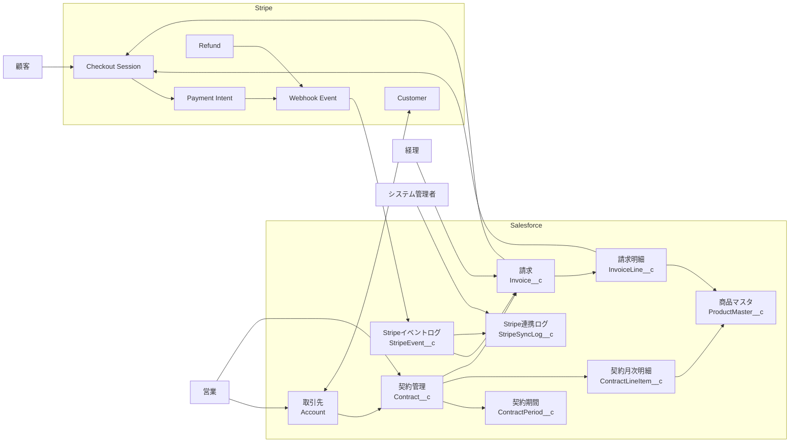
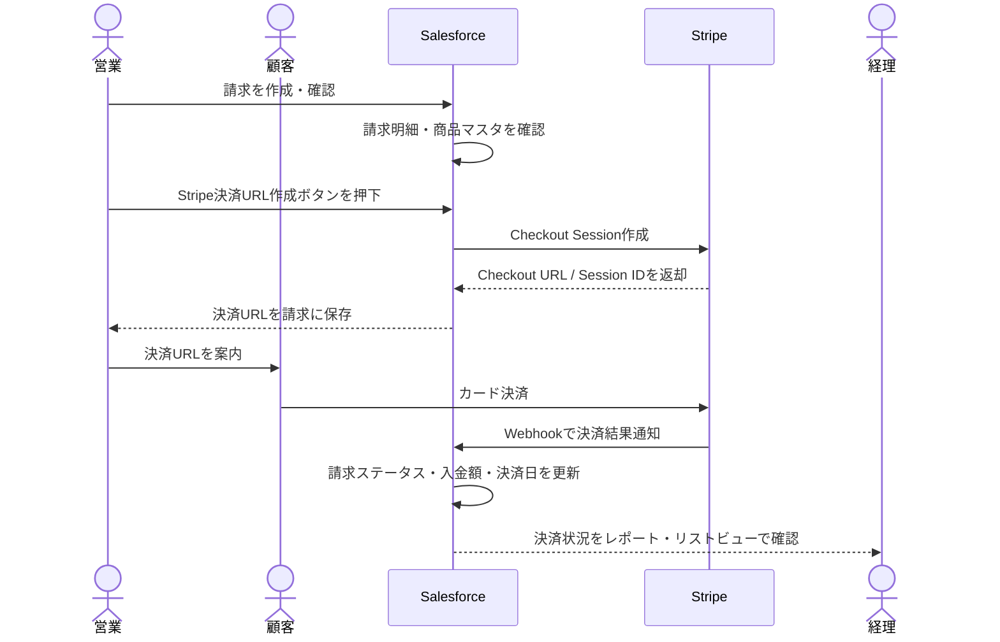
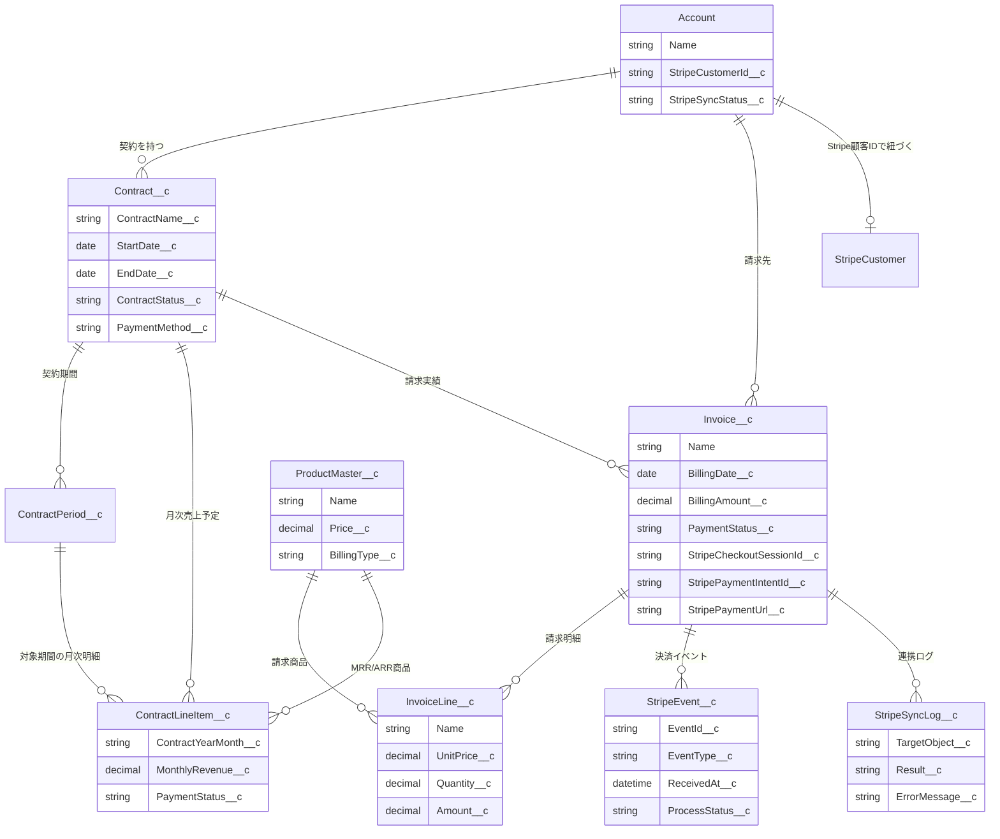
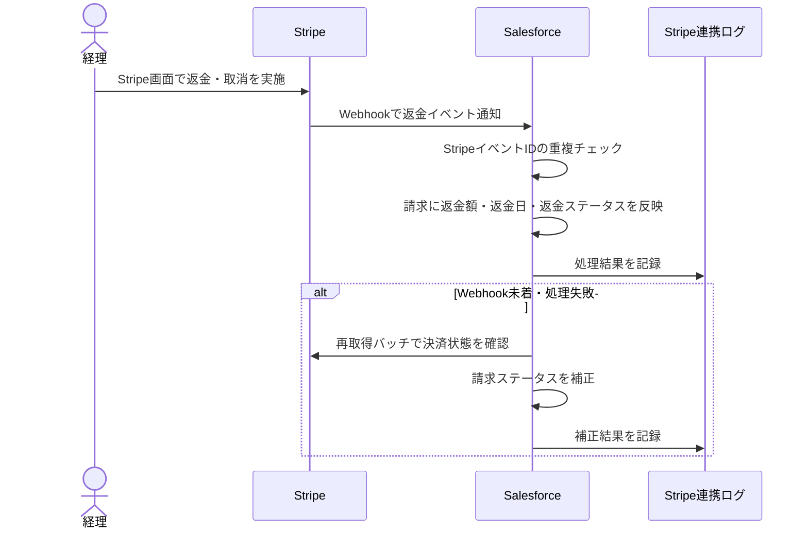
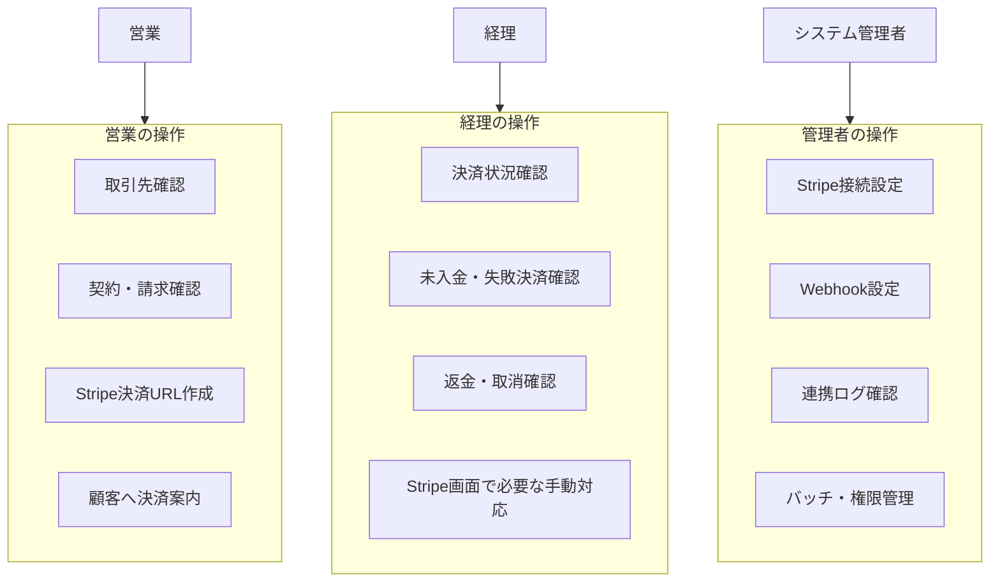

# Salesforce × Stripe連携 構成図

## 1. 全体構成図

Salesforceを契約・請求・請求明細・MRR/ARRの正とし、Stripeを決済実行と決済結果通知の正とする構成です。

## 2. 決済フロー図

Salesforceで請求を作成し、Stripe Checkout URLを顧客へ案内します。決済結果はStripe WebhookでSalesforceへ反映します。

## 3. Salesforceオブジェクト関連図

既存の契約請求基盤を活用し、Stripe連携に必要なID・URL・ステータスを既存オブジェクトへ追加します。

## 4. 返金・取消フロー図

初期スコープでは返金・取消の実行はStripe画面で行い、SalesforceへはWebhookまたは再取得バッチで結果を同期します。

## 5. 役割別利用範囲

営業は決済URL発行と顧客案内、経理は決済状況・未入金・返金確認、システム管理者は接続設定とログ監視を担当します。

