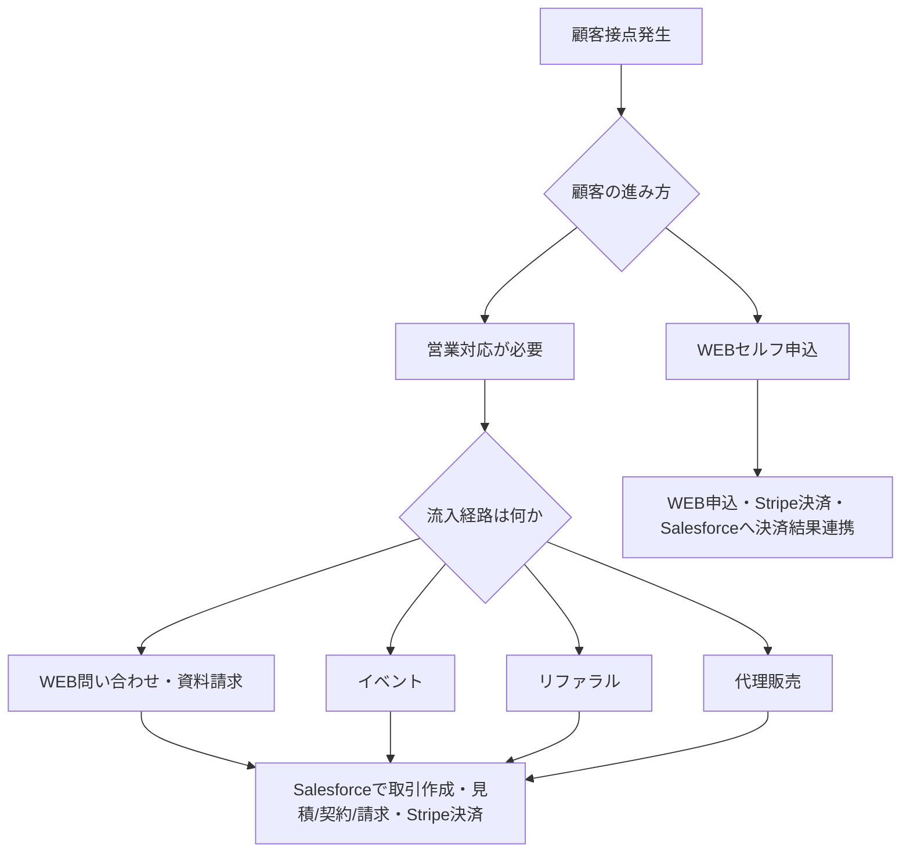
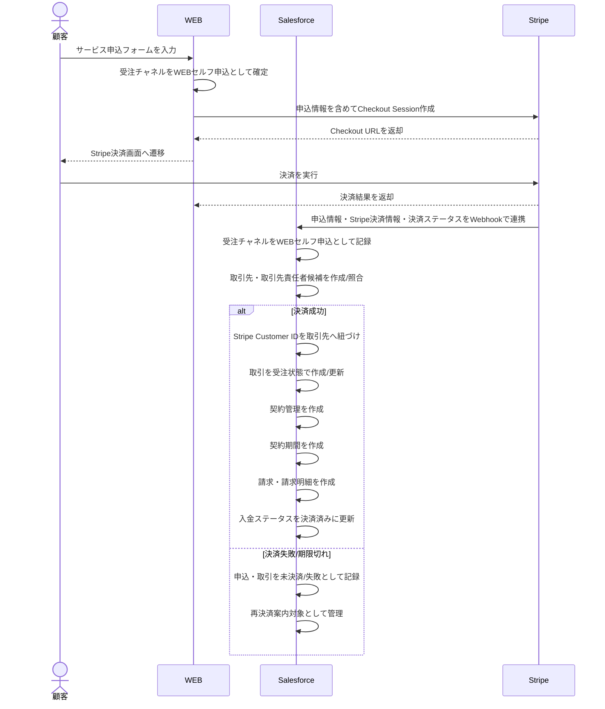
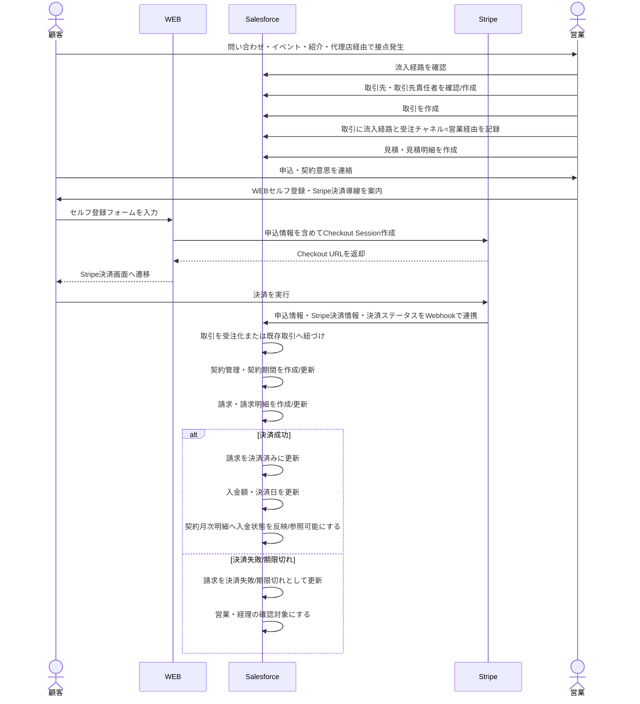

# Stripe連携 業務フロー

## 1. 目的

Stripe連携における顧客流入経路・受注チャネル別の業務フローを整理する。

業務フローは、最初に顧客の流入経路を確認し、その後に受注チャネルを判定して処理を分岐させる。

対象チャネルは以下の2パターンを中心に整理する。

| パターン | 受注チャネル | 概要 |
|---|---|---|
| パターン1 | WEBセルフ申込 | 顧客がWEB上で自ら申し込み、Stripeで決済する |
| パターン2 | 営業経由 | 営業がSalesforceで取引・見積・契約・請求を作成し、Stripeで決済する |

## 2. 登場システム・登場人物

| 区分 | 役割 |
|---|---|
| 顧客 | 申込、決済、契約開始の主体 |
| WEB | 申込フォーム、サービス申込画面、決済導線 |
| Salesforce | 取引先、取引、見積、契約、請求、入金状況、MRR/ARR管理 |
| Stripe | 決済URL、Checkout、Payment、Customer、Webhook、決済結果管理 |

## 3. 顧客流入経路と受注チャネルの考え方

顧客接点が発生したら、最初に顧客の流入経路を確認する。

その後、セルフ申込として顧客がWEB上で決済まで進むのか、営業が介在して取引・見積・契約・請求を作成するのかを判定する。

Salesforce上では、営業が入る場合は取引に流入経路を保持し、受注後の契約・請求・レポートで参照できるようにする。

### 3.1 顧客流入経路

営業が入る場合の流入経路は以下とする。

| 流入経路 | 説明 | Salesforceで持つべき情報 |
|---|---|---|
| WEB問い合わせ・資料請求 | WEBフォーム、問い合わせ、資料請求から営業対応に進む | 流入経路、フォーム種別、問い合わせ日、問い合わせ内容 |
| イベント | セミナー、展示会、イベント参加者から営業対応に進む | 流入経路、イベント参照、参加日、対応担当 |
| リファラル | 既存顧客、パートナー、知人紹介等から営業対応に進む | 流入経路、紹介元、紹介者、初回接点日 |
| 代理販売 | 代理店・販売パートナー経由で営業対応に進む | 流入経路、代理店、案件元、手数料・契約条件の確認要否 |

### 3.2 受注チャネル

| チャネル | Salesforceで持つべき情報 |
|---|---|
| WEBセルフ申込 | 受注チャネル = WEBセルフ、申込フォームID、Stripe Customer ID、Stripe Payment ID、Stripe Checkout Session ID |
| 営業経由 | 受注チャネル = 営業、流入経路、営業担当、取引、見積、契約、請求、Stripe Checkout Session ID |

### 3.3 全体分岐フロー

### 3.4 流入経路・受注チャネル別の起点

| 区分 | 最初の起点 | 最初に記録する場所 | その後の主フロー |
|---|---|---|---|
| WEBセルフ申込 | 顧客がWEBフォームを送信しStripeで決済 | WEB申込データ / Stripe決済情報 / Salesforce取引 | WEBセルフ申込フロー |
| WEB問い合わせ・資料請求 | 顧客が問い合わせ・資料請求フォームを送信 | Salesforce取引、またはリード/問い合わせデータ | 営業経由フロー |
| イベント | イベント参加・問い合わせ | Salesforce取引のイベント参照 | 営業経由フロー |
| リファラル | 紹介元から顧客情報を受領 | Salesforce取引、紹介元情報 | 営業経由フロー |
| 代理販売 | 代理店・販売パートナーから案件情報を受領 | Salesforce取引、代理店情報 | 営業経由フロー |

## 4. パターン1: セルフで顧客が申し込む

### 4.1 業務概要

顧客がWEB上で申し込み、WEBからStripe決済画面へ遷移して決済する。

決済完了後、Stripe Webhookを起点に、申込情報・決済情報・決済ステータスをSalesforceへ連携し、顧客・契約・請求情報を作成または更新する。

このパターンでは、受注チャネルは `WEBセルフ申込` として扱う。

### 4.2 フロー図

### 4.3 Salesforceで作成・更新する主なデータ

| オブジェクト | 作成/更新 | 内容 |
|---|---|---|
| 取引先 | 作成/更新 | Stripe Customerと紐づける |
| 取引先責任者 | 作成/更新 | 申込者情報を保持 |
| 取引 | 作成/更新 | 受注チャネル = WEBセルフ申込 |
| 契約管理 | 作成 | 決済成功後に契約化 |
| 契約期間 | 作成 | 初回契約期間 |
| 契約月次明細 | 作成 | MRR/ARR管理用 |
| 請求 | 作成 | Stripe決済と紐づける |
| 請求明細 | 作成 | 申込プラン・商品情報 |
| Stripe連携ログ | 作成 | WEB/Stripeから受け取った決済結果・Webhook処理結果 |

### 4.4 確認ポイント

| 論点 | 確認事項 |
|---|---|
| 受注チャネル確定タイミング | WEBフォーム送信時点で `WEBセルフ申込` として確定してよいか |
| StripeとSalesforceの連携タイミング | 原則、Stripe決済後にStripeから申込情報・決済情報・決済ステータスを連携する |
| 取引作成タイミング | 原則、決済成功時に作成する。決済失敗時は申込ログまたは未決済データとして残す |
| 契約作成タイミング | 決済成功後でよいか |
| 決済失敗時の扱い | 取引を残すか、申込ログだけにするか |
| 商品・価格 | WEB側の商品IDとSalesforce商品マスタの対応 |
| 受注チャネル | `WEBセルフ申込` としてSalesforceへ保持する |
| 決済ステータス連携 | Stripe Webhookを主とし、Stripe Event ID等で冪等性を担保する |

## 5. パターン2: 取引を営業が作って決済をStripeで行う場合

### 5.1 業務概要

営業がSalesforceで取引を作成し、必要に応じて見積・契約条件を整理する。

決済方法がStripeの場合、営業はSalesforce請求からStripe決済URLを作成せず、顧客へWEBセルフ登録・Stripe決済導線を案内する。

顧客がWEBセルフ登録からStripeで決済すると、4.2のセルフ申込フローと同様に、Stripe WebhookでSalesforceへ申込情報・決済情報・決済ステータスを連携する。

このパターンでは、受注チャネルは `営業経由` として扱う。

営業が入る前段の流入経路として、`WEB問い合わせ・資料請求`、`イベント`、`リファラル`、`代理販売` のいずれかを取引に保持する。

### 5.2 フロー図

### 5.3 Salesforceで作成・更新する主なデータ

| オブジェクト | 作成/更新 | 内容 |
|---|---|---|
| 取引先 | 作成/更新 | 顧客企業 |
| 取引先責任者 | 作成/更新 | 顧客担当者 |
| 取引 | 作成/更新 | 営業が作成。流入経路と受注チャネルを保持 |
| 見積 | 作成 | 営業が提案内容を作成 |
| 見積明細 | 作成 | 商品・単価・数量 |
| 契約管理 | 作成 | 受注後に作成 |
| 契約期間 | 作成 | 契約期間単位 |
| 契約月次明細 | 作成 | 将来売上・MRR/ARR管理 |
| 請求 | 作成/更新 | Stripe決済後にSalesforceへ作成/更新 |
| 請求明細 | 作成/更新 | Stripe決済後にSalesforceへ作成/更新 |

### 5.4 確認ポイント

| 論点 | 確認事項 |
|---|---|
| 流入経路確定タイミング | 取引作成時に必ず流入経路を入力するか |
| 受注チャネル確定タイミング | 取引作成時に受注チャネルを `営業経由` として設定するか |
| セルフ登録導線の案内者 | 営業が案内するか、経理が案内するか |
| 既存取引との紐づけ | WEBセルフ登録時にSalesforce取引ID、見積ID、営業担当等をStripe metadataへ渡すか |
| 流入経路 | WEB問い合わせ・資料請求、イベント、リファラル、代理販売をどう入力・管理するか |
| イベント参照 | 流入経路がイベントの場合、Event__cを必須にするか |
| 決済前の契約作成 | 決済前に契約を作るか、決済後に有効化するか |
| 決済失敗時 | 契約・請求をどう残すか |
| freeeとの関係 | Stripe決済とfreee請求書の役割分担 |

## 6. 流入経路・受注チャネル起点で見たパターン比較

| 観点 | パターン1 WEBセルフ申込 | パターン2 営業経由 |
|---|---|---|
| 最初に決まるもの | 受注チャネル = WEBセルフ申込 | 流入経路 = WEB問い合わせ・資料請求 / イベント / リファラル / 代理販売 |
| 起点 | 顧客のWEB申込・決済 | 顧客接点発生後の営業対応 |
| 流入経路の記録タイミング | 原則不要。必要ならWEBセルフとして記録 | Salesforce取引作成時点 |
| 受注チャネルの記録タイミング | WEB申込受付時点 | Salesforce取引作成時点 |
| 取引作成 | 決済成功後にWEB/Stripe情報から自動作成 | 営業が手動作成 |
| 見積 | 原則不要、または自動作成 | 営業が作成 |
| 契約作成 | 決済成功後に自動作成候補 | 受注後にSalesforceで作成 |
| 請求作成 | 決済成功後に自動作成候補 | Stripe決済成功後に自動作成/更新候補 |
| 決済URL作成 | WEBから作成 | WEBセルフ登録導線から作成 |
| 顧客案内 | WEB画面で遷移 | 営業がWEBセルフ登録導線を案内 |
| 主なリスク | 申込データとSalesforce作成タイミング | 流入経路、営業作成データ、Stripe決済の整合性 |

## 7. 流入経路・受注チャネル管理の要件

Salesforceでは、原則として取引に流入経路と受注チャネルを保持する。

契約・請求・レポートでは、取引に保持した流入経路と受注チャネルを参照または引き継いで利用する。

これにより、契約後・請求後でも、どのチャネルから発生した売上かを追跡できる。

| 項目 | 値の候補 | 説明 |
|---|---|---|
| 受注チャネル | `Web Self` | 顧客がWEBから直接申込・決済 |
| 受注チャネル | `Sales Assisted` | 営業が介在して商談化・提案・受注 |
| 流入経路 | `Web Inquiry / Document Request` | WEB問い合わせ・資料請求から営業対応 |
| 流入経路 | `Event` | イベント参加・セミナー等から営業対応 |
| 流入経路 | `Referral` | 紹介から営業対応 |
| 流入経路 | `Reseller` | 代理店・販売パートナーから営業対応 |

### 7.1 流入経路・受注チャネルを持つ推奨オブジェクト

| オブジェクト | 推奨 | 理由 |
|---|---|---|
| 取引 | 必須 | 流入経路と受注チャネルを保持する業務起点 |
| 契約管理 | 任意/参照 | 取引から引き継ぐ。契約単位で分析したい場合に保持 |
| 請求 | 任意/参照 | 入金・売上を流入経路/チャネル別に見たい場合に保持 |
| 取引先 | 原則不要 | 取引先は複数チャネルから受注する可能性がある |

## 8. 要件として確認すべきこと

| No | 確認事項 |
|---:|---|
| 1 | 営業が入る場合の流入経路は `WEB問い合わせ・資料請求`、`イベント`、`リファラル`、`代理販売` の4種類でよいか |
| 2 | 流入経路は取引作成時に必須入力にするか |
| 3 | 受注チャネルは `WEBセルフ申込` と `営業経由` の2分類でよいか |
| 4 | WEBセルフ申込を初期リリースに含めるか |
| 5 | StripeからSalesforceへ申込情報・決済情報・決済ステータスを送るタイミング |
| 6 | WEBセルフ申込時に取引・契約・請求をどのタイミングで作るか |
| 7 | Stripe決済成功前にSalesforce契約を作るか |
| 8 | 決済失敗・期限切れ時にSalesforce上へ何を残すか |
| 9 | 流入経路・受注チャネルは契約・請求にも引き継ぐか |
| 10 | 流入経路がイベントの場合、Event__cを必須にするか |
| 11 | 営業経由でStripe決済を使う場合、顧客へ案内するWEBセルフ登録導線はどのURL・パラメータにするか |
| 12 | Stripe決済後、freee請求書を作成する必要があるか |
| 13 | WEB側の商品・プランとSalesforce商品マスタの対応方法 |
