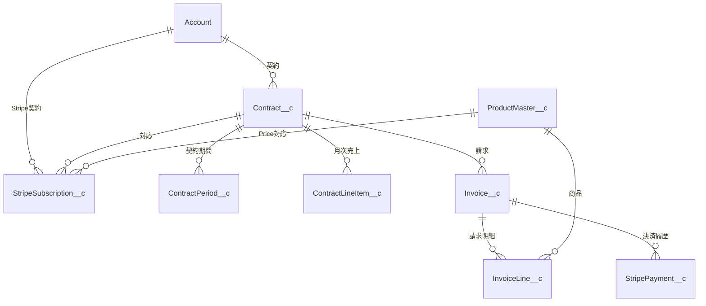

# Stripe CSV Salesforce投入 オブジェクトマッピング

## 1. 目的

Stripeから出力したCSVをSalesforceへ安全に投入するため、項目マッピングに先立って、StripeデータとSalesforceオブジェクトの対応関係を定義する。

Salesforceを取引・契約・請求・売上予定の正とし、Stripeをサブスクリプションの実行状態、決済結果、返金結果の正とする。

## 2. 基本方針

- 外部データを業務オブジェクトへ直接Insertしない。
- 初回移行ではStripe移行Workへ投入し、名寄せ、商品特定、金額整合性を検証してから本オブジェクトへ反映する。
- Stripe IDは外部IDかつ一意項目として保持し、再投入時の重複作成を防止する。
- Customer、Subscription、Invoice、Paymentは別エンティティとして管理する。
- Stripeのカード番号等の決済機微情報はSalesforceへ保存しない。
- 取引先責任者は氏名を特定できる場合のみ作成する。Customer Emailだけでは自動作成しない。

## 3. 全体マッピング

| # | Stripeデータ | 入力ファイル・API | 移行Work | Salesforce本オブジェクト | 主な用途 | 判定 |
|---|---|---|---|---|---|---|
| 1 | Customer | `customers.csv` | `Mig_StripeCustomerWork__c` | 取引先 `Account` | 顧客名寄せ、Stripe Customer ID保持 | 対象 |
| 2 | Customer担当者 | Customerまたは申込フォーム | `Mig_StripeCustomerWork__c` | 取引先責任者 `Contact` | 契約担当者、請求連絡先 | 条件付き |
| 3 | Subscription | `subscriptions.csv` | `Mig_StripeSubscriptionWork__c` | 契約管理 `Contract__c` | 継続契約、契約状態、請求周期 | 対象 |
| 4 | Subscription期間 | `subscriptions.csv` | `Mig_StripeSubscriptionWork__c` | 契約期間 `ContractPeriod__c` | 対象期間、更新周期 | 対象 |
| 5 | 月次売上予定 | Subscription・Invoice Line | 検証済みSubscription Work | 契約月次明細 `ContractLineItem__c` | MRR、将来売上 | 対象 |
| 6 | Product / Price | 追加CSVまたはStripe API | `Mig_StripeProductWork__c` | 商品マスタ `ProductMaster__c` | Stripe Price IDと商品マスタの対応 | 追加データ必須 |
| 7 | Invoice | 追加CSVまたはStripe API | `Mig_StripeInvoiceWork__c` | 請求 `Invoice__c` | 請求実績、決済対象 | 追加データ必須 |
| 8 | Invoice Line | 追加CSVまたはStripe API | `Mig_StripeInvoiceLineWork__c` | 請求明細 `InvoiceLine__c` | 商品、数量、単価、税額 | 追加データ必須 |
| 9 | Charge / Transaction | `transactions.csv` | `Mig_StripePaymentWork__c` | Stripe決済 `StripePayment__c` | 決済試行、入金、返金履歴 | 対象 |
| 10 | セルフ申込取引 | 申込フォーム・metadata | `Mig_StripeSubscriptionWork__c` | 取引 `Opportunity__c` | 受注チャネル、商談管理 | 条件付き |
| 11 | Webhook Event | Stripe Webhook | なし | `StripeEvent__c` | 冪等性、再処理管理 | 運用連携で対象 |
| 12 | 連携ログ | API・Webhook処理 | なし | `StripeSyncLog__c` | 成功・失敗・エラー追跡 | 運用連携で対象 |

## 3.1 オブジェクトマッピング・Stripe抽出可否

2026年8月5日時点の添付CSV、Salesforce prodメタデータ、Stripe公式仕様を基準とする。

| # | Salesforce対象オブジェクト | Stripe元オブジェクト／データ | Stripe Dashboard CSV | Stripe API | 添付CSVに存在 | オブジェクトマッピング | 判定・条件 |
|---|---|---|---|---|---|---|---|
| 1 | 取引先 `Account` | Customer | 可能 | 可能 | `customers.csv` | 可能 | `customer.id`をAccountの外部IDへ保持する項目追加が必要 |
| 2 | 取引先責任者 `Contact` | Customer、申込フォームの担当者 | 一部可能 | 可能 | メールのみ存在 | 条件付き | Customerは会社担当者の氏名を必ず保持しないため、氏名がない場合は自動作成不可 |
| 3 | 商品マスタ `ProductMaster__c` | Product + Price | Dashboardで個別管理可能。標準CSV出力を前提にしない | 可能 | Price IDのみ存在 | 条件付き | Products APIとPrices APIでProduct名、Price ID、単価、通貨、周期を取得する |
| 4 | 取引 `Opportunity__c` | Checkout／Subscription metadata、WEB申込情報 | 標準CSVだけでは不足 | 可能 | orgId、plan metadataは空 | 条件付き | 受注チャネル、流入経路、営業担当等はStripe標準項目にない。WEBまたはmetadataが必要 |
| 5 | 契約管理 `Contract__c` | Subscription | 可能 | 可能 | `subscriptions.csv` | 可能 | 1 Stripe Subscription = 1 Salesforce契約を基本とし、Subscription ID外部IDが必要 |
| 6 | 契約期間 `ContractPeriod__c` | Subscription Current Period | 可能 | 可能 | 開始・終了あり | 条件付き | 現在期間のみ作成可能。終了日時は排他的境界として日付変換する |
| 7 | 契約月次明細 `ContractLineItem__c` | Subscription Item + Price + Product | 現行Subscription CSVだけでは不足 | 可能 | Price ID、数量、金額のみ | 条件付き | 商品マスタ確定後に作成可能。複数Subscription ItemはAPI取得が必要 |
| 8 | 請求 `Invoice__c` | Invoice | 可能 | 可能 | TransactionにInvoice IDのみ | 条件付き | StripeのInvoicesページからCSV出力可能。Stripe Invoice ID外部IDが必要 |
| 9 | 請求明細 `InvoiceLine__c` | Invoice Line Item | 親請求CSVだけでは完全取得を保証できない | 可能 | なし | APIなら可能 | `GET /v1/invoices/{id}/lines`を全ページ取得する |
| 10 | Stripe決済 `StripePayment__c` | Charge／Transaction、Payment Intent | Transaction CSV可能 | 可能 | `transactions.csv` | 新規オブジェクト作成後に可能 | Charge ID外部ID、Invoice参照、金額、返金額、決済状態を保持する |
| 11 | Stripeイベント `StripeEvent__c` | Event | Dashboard CSV移行の対象外 | Events API／Webhook | なし | CSV移行対象外 | 運用開始後のWebhook冪等性管理に使用する |
| 12 | Stripe連携ログ `StripeSyncLog__c` | Salesforce側の処理結果 | Stripeから抽出しない | 該当なし | なし | Stripeデータのマッピング対象外 | SalesforceでAPI・Webhook処理時に生成する |

### 判定の要約

| 区分 | 対象 |
|---|---|
| 添付CSVだけで元キーを取得できる | Account、Contract、ContractPeriod、StripePayment候補 |
| 追加のStripe CSVで対応可能 | Invoice |
| Stripe API取得が必要 | Product、Price、Subscription Item、Invoice Line Item、Payment Intent |
| Stripe標準データだけでは不足 | Contact、Opportunity |
| Salesforce側で新規開発が必要 | Stripe外部ID項目、StripePayment、各移行Work、名寄せ・検証処理 |

### Stripeデータ抽出方法

| Stripeデータ | 推奨抽出方法 | 主な取得項目 |
|---|---|---|
| Customer | Customers画面のExport | Customer ID、名称、メール、住所、metadata |
| Subscription | Subscriptions画面のExport。複数ItemはAPIで補完 | Subscription ID、Customer ID、Status、開始日、現在期間、Price ID、Quantity |
| Transaction | Transactions画面のExport | Charge ID、Customer ID、Invoice ID、金額、返金額、状態、日時 |
| Invoice | Invoices画面のExport | Invoice ID、Customer ID、Subscription ID、請求日、期日、金額、税額、状態 |
| Invoice Line Item | Invoice Lines API | Line ID、Invoice ID、Price ID、Product ID、Description、Quantity、単価、金額、税、対象期間 |
| Product | Products API | Product ID、名称、説明、Active、metadata |
| Price | Prices API | Price ID、Product ID、単価、通貨、Recurring Interval、Active |
| Payment Intent | Payment Intents API | Payment Intent ID、Customer ID、Invoice／Charge関係、金額、状態 |

Stripe公式資料：

- Customers CSV Export: https://docs.stripe.com/billing/customer
- Transactions Export: https://docs.stripe.com/dashboard/basics
- Invoices CSV Export: https://docs.stripe.com/invoicing/dashboard/manage-invoices
- Product / Price API: https://docs.stripe.com/products-prices/manage-prices
- Invoice Line Items API: https://docs.stripe.com/api/invoices/invoice_lines

## 3.2 Stripeデータ全量・CSV取得可否・代替対応

凡例：

- `可能`：Stripe Dashboardまたは添付実績でCSV出力を確認できる。
- `一部`：概要・集計値・単一項目は取れるが、Salesforce投入に必要な詳細を完全には取得できない。
- `困難`：標準Dashboard CSVを前提にできない。API、Sigma、手動対応表等が必要。
- `不要`：今回の月次CSV最小案ではSalesforceへ投入しない。

| 分類 | Stripeデータ／オブジェクト | Salesforce用途・対象 | 今回の必要性 | CSV取得 | CSVで不足する内容 | CSVで取得できない場合の対応 | 最小案の扱い |
|---|---|---|---|---|---|---|---|
| 顧客 | Customer | Account | 必須 | 可能 | Salesforce Account ID、担当者氏名が空の場合がある | `customer.id`で名寄せ。Account ID metadataがなければ完全一致・手動確認 | 毎月CSV |
| 顧客 | Customer metadata | Account・Opportunityの直接特定 | 推奨 | 一部 | Export列にmetadataが含まれない場合がある | CSV Export時にmetadata列を選択、またはCustomers API | 取得できれば利用 |
| 顧客 | Customerの担当者 | Contact | 条件付き | 一部 | Stripe CustomerのName・Emailが会社情報か担当者情報か区別できない | WEB申込データ、別管理表、手動確認 | 自動作成しない |
| 顧客 | 住所・請求先情報 | Account住所 | 推奨 | 可能 | 部署名、建物名、請求先担当者等 | Customer APIまたは手動補完 | CSV値を候補利用 |
| 商品 | Product | ProductMaster__c | 必須 | 困難 | Product ID、名称、説明、Active、metadata | Products API、商品数が少なければStripe画面から手動対応表 | 初回・変更時のみ |
| 商品 | Price | ProductMaster__c | 必須 | 困難 | Price ID、Product ID、単価、通貨、課金周期、Active | Prices API、商品数が少なければ手動対応表 | 初回・変更時のみ |
| 商品 | Tax Code・Tax Behavior | 商品マスタ・税処理 | 条件付き | 一部 | 商品／Price単位の税設定 | Products／Prices API | 税利用時のみ取得 |
| 契約 | Subscription | Contract__c | 必須 | 可能 | 複数Subscription Item、詳細な割引・税設定 | Subscriptions APIで補完 | 毎月CSV |
| 契約 | Subscription Item | ContractLineItem__c | 必須 | 一部 | 複数商品時の全Price、数量、Item ID | Subscription Items APIまたはSubscription APIのitems全ページ | 単一商品はCSV、複数商品はAPI |
| 契約 | Subscription Status | Contract__c.Status__c | 必須 | 可能 | StripeとSalesforceの状態値が異なる | 状態変換表で変換 | 毎月CSV |
| 契約 | Current Period | ContractPeriod__c | 必須 | 可能 | 過去期間全履歴は取れない | Invoice履歴またはSubscription Schedule APIから復元 | 現在期間をCSV投入 |
| 契約 | Trial | Contract__c・MRR判定 | 条件付き | 一部 | Trial開始・終了、移行状態 | Subscriptions API | Trial利用時のみ |
| 契約 | Cancel情報 | Contract終了・解約予定 | 必須 | 一部 | cancel_at、canceled_at、cancel_at_period_end、理由 | Subscriptions API。CSVに列があればCSV優先 | CSV列確認、なければAPI |
| 契約 | Subscription Schedule | 将来のプラン変更 | 条件付き | 困難 | Phase、将来Price、開始終了、変更予約 | Subscription Schedules API | 初期対象外、利用時のみAPI |
| 契約 | Coupon・Promotion Code | 契約金額・請求明細 | 条件付き | 一部 | 割引ID、期間、対象商品、金額 | Subscription／Invoice／Discount API | 該当請求を例外扱い |
| 契約 | Metered Usage | 従量課金 | 条件付き | 一部 | 利用量イベントと集計根拠 | Meter Events API、Usage CSV／Stripeレポート | 初期対象外 |
| 請求 | Invoice | Invoice__c | 必須 | 可能 | 一部の展開オブジェクト、全明細 | Invoice APIで補完 | 毎月CSV |
| 請求 | Invoice Line Item | InvoiceLine__c | 必須 | 困難 | 全明細、Price、Product、数量、単価、税、期間、日割り | `GET /v1/invoices/{id}/lines`をページング取得 | 単純請求はSubscriptionから生成、複雑請求はAPI |
| 請求 | 請求税額合計 | Invoice__c.TaxAmount__c | 必須 | 可能または一部 | 税率別・明細別の内訳 | Invoice API、Invoice Lines API | 合計はCSV、内訳はAPI |
| 請求 | 請求割引合計 | Invoice金額・明細 | 条件付き | 一部 | 明細別割引、クーポン関係 | Invoice／Invoice Lines API | 該当時はAPIまたは要確認 |
| 請求 | Credit Note | 取消・減額・返金調整 | 条件付き | 一部 | Credit Note ID、理由、明細 | Credit Notes APIまたはStripeレポート | 発生時のみ補完 |
| 決済 | Transaction／Charge | Invoiceの最新決済状態 | 必須 | 可能 | Payment Intentとの詳細関係、複数試行履歴 | Charge APIまたはPayment Intent API | 毎月CSV |
| 決済 | Payment Intent | 決済追跡・再試行 | 条件付き | 困難 | Payment Intent ID、失敗理由、試行履歴 | Payment Intents API | 最新状態だけなら取得不要 |
| 決済 | Refund | 返金額・返金状態 | 条件付き | 一部 | Refund ID、理由、複数返金の内訳 | Refunds API。総返金額だけならTransaction CSV | 初期は総返金額のみ |
| 決済 | Dispute | チャージバック管理 | 条件付き | 可能 | 個別証跡・詳細状態が不足する場合がある | Disputes APIまたはDisputes CSV／Sigma | 初期対象外、発生時のみ |
| 決済 | Balance Transaction | 手数料・純入金額 | 条件付き | 可能 | Chargeとの詳細関係や未確定情報 | Balance Summary Itemized CSVまたはBalance Transactions API | 会計照合時のみ |
| 決済 | Fee・Fee Tax | 手数料管理 | 条件付き | 可能 | 税区分・詳細内訳 | Transaction CSV、Balanceレポート | Salesforce契約管理には原則不要 |
| 決済 | Payout | Stripeから銀行への入金 | 条件付き | 可能 | Invoiceとの直接対応 | Payout Reconciliation CSV、Balanceレポート | Salesforce請求管理には初期不要 |
| 決済 | Payment Method | カード等の支払手段 | 不要 | 一部 | カード詳細 | Payment Methods API | セキュリティ上Salesforceへ保存しない |
| 申込 | Checkout Session | WEB申込・決済導線 | 条件付き | 困難 | Session ID、metadata、Subscription、Payment Intent関係 | Checkout Sessions API | CSV移行では不要、将来連携時に対象 |
| 申込 | WEB申込情報 | Opportunity・Contact | 必須の場合あり | Stripe標準CSV外 | 流入経路、受注チャネル、営業担当、担当者氏名 | WEB側CSV、申込DB、Stripe metadata | 別データとして取得 |
| 監査 | Event | Webhook冪等性 | 不要 | 困難 | Event payload | Events API／Webhook | 月次CSV案では不要 |
| 監査 | Stripe APIログ | 障害調査 | 不要 | 困難 | APIリクエスト・レスポンス履歴 | Stripe Workbench／ログ、Salesforce連携ログ | 自動連携時に追加 |

### データ取得の最終方針

| 取得区分 | 対象データ | 実施頻度 |
|---|---|---|
| Stripe標準CSV | Customer、Subscription、Invoice、Transaction | 毎月 |
| 初回対応表または限定API | Product、Price | 初回・商品変更時 |
| 条件付きAPI | Subscription Item、Invoice Line、Discount、Tax、Refund詳細 | CSVだけで金額・商品を再現できない場合 |
| 別システムデータ | Contact氏名、受注チャネル、流入経路、営業担当 | 必要時 |
| 今回取得しない | Event、Webhookログ、Payment Method、Payout詳細 | 初期対象外 |

### CSVだけで自動反映できる条件

次の条件をすべて満たすレコードはCSVだけで反映できる。

1. Customer IDが取得できる。
2. Subscription ID、Price ID、数量、金額、周期、状態が取得できる。
3. Price IDが商品マスタ対応表に一意一致する。
4. Subscription Itemが1種類である。
5. 日割り、割引、追加課金、複数税率、返金調整がない。
6. Subscription単価×数量とInvoice金額が一致する。
7. Invoice IDとTransactionのInvoice IDが一致する。

条件を満たさないレコードは自動反映せず、Invoice Lines API等の補完対象または要確認とする。

## 3.3 Salesforce投入要否判断

### 判定基準

| 判定 | 意味 |
|---|---|
| 必須 | Salesforceで取引先、契約、MRR、請求、入金を正しく管理するために保存が必要 |
| 必須（生成可） | Stripeの元データ取得は必要だが、条件を満たせば別CSVからSalesforce投入値を生成可能 |
| 条件付き | 該当業務・該当レコードがある場合のみ保存する |
| 任意 | 監査や調査には有用だが、月次業務を成立させる必須条件ではない |
| 不要 | StripeまたはFreeeで管理し、今回Salesforceへ投入しない |

| 分類 | Stripeデータ | Salesforce投入要否 | Salesforce格納先 | 判断理由・投入条件 |
|---|---|---|---|---|
| 顧客 | Customer ID | 必須 | Account.StripeCustomerId__c | 顧客名寄せ、参照関係、Upsertの一意キー |
| 顧客 | Customer Name | 必須 | Account.Name | 取引先表示・名寄せ |
| 顧客 | Customer Email | 条件付き | Accountの請求先メール候補、または名寄せWork | 担当者メールと断定できないためContactへ自動投入しない |
| 顧客 | Customer Address | 条件付き | Account請求先住所 | Salesforceで請求先住所を利用する場合のみ |
| 顧客 | Customer metadataのSalesforce ID | 推奨 | 名寄せ・既存参照 | あれば最優先で利用。なくてもCustomer ID対応表で代替可能 |
| 顧客 | 担当者氏名 | 条件付き | Contact | WEB申込等で本人氏名を確認できる場合のみ |
| 商品 | Product ID | 必須 | ProductMaster__c.StripeProductId__c候補 | Priceの親商品特定、商品変更時の追跡 |
| 商品 | Product Name | 必須 | ProductMaster__c.Nameまたは対応表 | Salesforce商品マスタの特定・表示 |
| 商品 | Price ID | 必須 | ProductMaster__c.StripePriceId__c | 契約・請求明細から商品を一意に特定 |
| 商品 | Unit Amount | 必須 | ProductMaster__c.UnitPrice__c、明細単価 | 金額照合 |
| 商品 | Currency | 必須 | 商品対応表、契約・請求 | 円以外の誤投入防止。JPY固定でも検証値として必要 |
| 商品 | Recurring Interval | 必須 | ContractUpdate__c等へ変換 | 月契約・年契約の判定 |
| 商品 | Product説明・画像 | 不要 | なし | Salesforce契約請求管理には不要 |
| 契約 | Subscription ID | 必須 | Contract__c.StripeSubscriptionId__c | 契約Upsertと重複防止 |
| 契約 | Customer ID | 必須 | Contract__c.Account__cへ変換 | 契約と取引先の参照関係 |
| 契約 | Subscription Status | 必須 | Contract__c.Status__c | 有効・解約・停止の管理 |
| 契約 | Start Date | 必須 | Contract__c.StartDate__c | 契約開始、MRR開始月 |
| 契約 | Current Period Start／End | 必須 | ContractPeriod__c | 現在契約期間・更新管理 |
| 契約 | Subscription Item | 必須 | ContractLineItem__c | 契約商品、数量、MRRの根拠 |
| 契約 | Quantity | 必須 | Contract__c.AccountCount__c、月次明細 | アカウント数・金額計算 |
| 契約 | Cancel At／Canceled At | 条件付き | Contract__c.EndDate__c、解約予定 | 解約済み・解約予約がある場合に必須 |
| 契約 | Trial Start／End | 条件付き | 契約のTrial項目候補 | TrialをMRR・請求対象外にする場合 |
| 契約 | Subscription Schedule | 条件付き | 将来契約変更情報 | 将来のプラン変更予約をSalesforceで管理する場合 |
| 契約 | Coupon・Discount | 条件付き | 契約または請求明細 | 割引が存在するレコードでは金額再現に必須 |
| 契約 | Metered Usage | 条件付き | 契約月次明細・請求明細 | 従量課金を利用する場合に必須 |
| 請求 | Invoice ID | 必須 | Invoice__c.StripeInvoiceId__c | 請求Upsert、決済との紐づけ |
| 請求 | Customer ID | 必須 | Invoice__c.Account__cへ変換 | 請求先の参照関係 |
| 請求 | Subscription ID | 必須 | Invoice__c.ParentContract__cへ変換 | 契約と請求の参照関係 |
| 請求 | Invoice Date | 必須 | Invoice__c.Billing_Date__c | 請求月・売上実績 |
| 請求 | Due Date | 条件付き | Invoice__c.Payment_Date__c | Stripeで期日管理する請求の場合 |
| 請求 | Invoice Status | 必須 | 請求状態候補 | Draft、Open、Paid、Void等の管理 |
| 請求 | Amount Due／Total | 必須 | Invoice__c.InvoiceAmount__c等 | 請求金額・入金照合 |
| 請求 | Tax Amount | 必須 | Invoice__c.TaxAmount__c | Salesforce請求金額の再現 |
| 請求 | Invoice Line ID | 必須 | InvoiceLine__c.StripeInvoiceLineId__c候補 | 明細Upsert・重複防止 |
| 請求 | Invoice Line詳細 | 必須（生成可） | InvoiceLine__c | 単純な1商品請求はSubscriptionから生成可能。複雑請求はAPI必須 |
| 請求 | Credit Note | 条件付き | 取消・減額情報 | Credit Noteがある請求のみ |
| 決済 | Transaction／Charge ID | 任意 | Invoice__c.StripeChargeId__c | 最新決済の調査用。Invoice IDがあれば業務は成立 |
| 決済 | Payment Status | 必須 | Invoice__c.PaymentStatus__c | 未入金・入金済み管理 |
| 決済 | Paid Amount | 必須 | Invoice__c.PaidAmount__c | 入金額管理 |
| 決済 | Paid Date | 必須 | Invoice__c.PaymentReceivedDate__c | 入金日管理 |
| 決済 | Unpaid Amount | 必須（生成可） | Invoice__c.UnpaidAmount__c | Invoice金額－入金額から計算可能 |
| 決済 | Payment Intent ID | 任意 | StripePaymentIntentId候補 | 月次で最新状態だけ管理する場合は不要 |
| 決済 | Refund Amount | 条件付き | Invoiceの返金額項目候補 | 返金が発生した請求では必須 |
| 決済 | Refund ID・Reason | 任意 | 返金履歴オブジェクト候補 | 詳細監査が必要な場合のみ |
| 決済 | Dispute | 条件付き | 紛争状態項目候補 | チャージバックをSalesforceで管理する場合 |
| 会計 | Balance Transaction・Fee | 不要 | なし | Stripe／Freeeの会計照合で管理する |
| 会計 | Payout | 不要 | なし | 銀行入金・会計管理であり契約請求管理の対象外 |
| セキュリティ | Payment Method・カード情報 | 不要 | なし | Salesforceに保存しない |
| 申込 | Checkout Session | 不要（CSV移行） | なし | 将来のリアルタイム連携時のみ対象 |
| 申込 | 流入経路・受注チャネル | 条件付き | Opportunity__c | Stripe標準データではないためWEB／営業入力から取得 |
| 監査 | Event・Webhook payload | 不要（CSV移行） | なし | Webhookを利用しないため不要 |
| 監査 | APIログ | 不要（CSV移行） | なし | Data Loaderの成功・エラーCSVを証跡とする |

### Salesforceへ投入する最小データセット

月次CSV最小案でSalesforceへ投入するデータは次の通りとする。

1. Account：Stripe Customer ID、取引先名、必要に応じて住所・メール。
2. ProductMaster：Stripe Product ID、Price ID、商品名、単価、通貨、課金周期。
3. Contract：Stripe Subscription ID、Account、状態、開始日、月／年、数量、請求管理元Stripe。
4. ContractPeriod：対象期間開始日・終了日。
5. ContractLineItem：商品マスタ、数量、MRR、対象年月。
6. Invoice：Stripe Invoice ID、Account、Contract、請求日、期日、金額、税額、状態。
7. InvoiceLine：商品マスタ、数量、単価、金額、税額、対象期間。
8. Invoice決済項目：決済状態、入金額、未入金額、入金日。

## 3.4 指定5項目による最終マッピング表

| Salesforceのオブジェクト | Stripeのオブジェクト | CSV出力可否 | Salesforce投入要否 | 対応可能手段 |
|---|---|---|---|---|
| 取引先 `Account` | Customer | 可能 | 必須 | Customers CSVを`StripeCustomerId__c`でData Loader Upsert |
| 取引先責任者 `Contact` | Customer、Customer metadata | 一部可能 | 条件付き | 担当者氏名・メールが確認できる場合のみ投入。WEB申込CSVまたは手動確認で補完 |
| 商品マスタ `ProductMaster__c` | Product | 標準CSV出力を前提にできない | 必須 | Products API、または商品数が少なければStripe画面から初回対応表を作成 |
| 商品マスタ `ProductMaster__c` | Price | 標準CSV出力を前提にできない | 必須 | Prices API、または初回対応表で`StripePriceId__c`・単価・周期を登録 |
| 取引 `Opportunity__c` | Checkout Session、metadata | 標準CSVでは不足 | 条件付き | WEB申込CSV、Stripe metadata、既存取引との手動紐づけ |
| 契約管理 `Contract__c` | Subscription | 可能 | 必須 | Subscriptions CSVを`StripeSubscriptionId__c`でUpsert。状態・周期を変換 |
| 契約管理 `Contract__c` | Subscription Schedule | 困難 | 条件付き | 将来プラン変更を管理する場合のみSubscription Schedules API |
| 契約期間 `ContractPeriod__c` | Subscription Current Period | 可能 | 必須 | Current Period Start／Endから作成。UTCをJSTに変換し終了境界を調整 |
| 契約月次明細 `ContractLineItem__c` | Subscription Item | 一部可能 | 必須 | 単一商品はSubscription CSVから生成。複数商品はSubscription Items API |
| 契約月次明細 `ContractLineItem__c` | Meter Event／Usage | 一部可能 | 条件付き | 従量課金利用時のみUsage CSV、Meter Events APIで取得 |
| 請求 `Invoice__c` | Invoice | 可能 | 必須 | Invoices CSVを`StripeInvoiceId__c`でUpsert |
| 請求 `Invoice__c` | Discount／Coupon | 一部可能 | 条件付き | 割引がある請求はInvoice APIで補完し金額照合 |
| 請求 `Invoice__c` | Credit Note | 一部可能 | 条件付き | 取消・減額がある場合のみCredit Notes APIまたはレポートで補完 |
| 請求明細 `InvoiceLine__c` | Invoice Line Item | 標準Invoice CSVでは不足 | 必須 | 単純請求はSubscriptionから生成。複雑請求はInvoice Lines APIを全ページ取得 |
| 請求 `Invoice__c`の決済項目 | Transaction／Charge | 可能 | 必須 | Transactions CSVから決済状態・入金額・入金日をInvoiceへUpdate |
| 請求 `Invoice__c`の決済項目 | Payment Intent | 標準CSVでは不足 | 任意 | 最新決済状態だけなら不要。詳細追跡時のみPayment Intents API |
| 請求 `Invoice__c`の返金項目 | Refund | 一部可能 | 条件付き | 総返金額はTransaction CSV、Refund ID・理由・内訳はRefunds API |
| 請求 `Invoice__c`の紛争項目候補 | Dispute | 可能 | 条件付き | Salesforceで管理する場合のみDisputes CSVまたはDisputes API |
| 新規`StripePayment__c`候補 | Charge、Payment Intent、Refund | 一部可能 | 初期は不要 | 最新状態をInvoiceへ保持。複数決済・返金履歴が必要になったら追加 |
| Salesforceへ投入しない | Balance Transaction、Fee | 可能 | 不要 | Stripe BalanceレポートまたはFreeeで会計照合 |
| Salesforceへ投入しない | Payout | 可能 | 不要 | Stripe Payoutレポート・銀行・Freeeで管理 |
| Salesforceへ投入しない | Payment Method | 一部可能 | 不要 | カード等の機微情報はSalesforceへ保存しない |
| Salesforceへ投入しない | Event、Webhook payload | 困難 | 月次CSV案では不要 | 将来リアルタイム連携を実装する場合のみEvents API／Webhookを利用 |

## 4. CSV別マッピング

### 4.1 customers.csv

| Stripeキー | Salesforce | 用途 |
|---|---|---|
| `id` | `Account.StripeCustomerId__c` | 外部ID、一意キー |
| `Name` | `Account.Name` | 取引先名候補 |
| `Email` | 名寄せ用項目 | 取引先候補検索。Contact自動作成には使用しない |
| 住所 | Account住所項目 | 請求先住所候補 |
| Total Spend等 | 原則移行Workのみ | 照合・監査用。契約・請求金額の正にはしない |

取引先の自動一致順序は次の通りとする。

1. Stripe Customer ID
2. Stripe metadataに保持したSalesforce Account ID
3. メールアドレスの完全一致が1件
4. 会社名・住所の完全一致が1件
5. 上記以外は要確認

### 4.2 subscriptions.csv

| Stripeキー | Salesforce | 用途 |
|---|---|---|
| `id` | ContractのStripe Subscription ID | 外部ID、一意キー |
| `Customer ID` | `Contract__c.Account__c` | Customer Workを介して取引先へ変換 |
| `Plan` | 商品マスタ | 値はPrice ID。商品名ではない |
| `Quantity` | 契約数量・アカウント数 | 商品単価との計算に使用 |
| `Interval` | 契約更新・請求周期 | `month`、`year`等を変換 |
| `Amount` | 契約単価 | JPYでは円単位 |
| `Status` | 契約ステータス | Stripe状態からSalesforce状態へ変換 |
| `Start Date (UTC)` | 契約開始日時 | Salesforce Date/DateTimeへ変換 |
| `Current Period Start/End` | 契約期間 | `ContractPeriod__c`作成に使用 |

Subscriptionは契約管理へ対応させる。ただし、1つのSalesforce契約に複数のStripe Subscriptionが紐づく可能性がある場合は、`StripeSubscription__c`を独立した子オブジェクトとして保持する。

### 4.3 transactions.csv

| Stripeキー | Salesforce | 用途 |
|---|---|---|
| `id` | `StripePayment__c.StripeChargeId__c` | 外部ID、一意キー |
| `Customer ID` | Account参照 | Customer Workを介して変換 |
| `Invoice ID` | Invoice参照 | Stripe Invoice IDでSalesforce請求へ変換 |
| `Amount` | 決済金額 | 入金額 |
| `Amount Refunded` | 返金額 | 返金状態・返金額 |
| `Status` | 決済ステータス | 決済済み、失敗等 |
| `Created date (UTC)` | 決済日時 | ISO 8601 UTCへ変換 |
| `Fee` | Stripe手数料 | 必要な場合のみ保持 |
| `Taxes On Fee` | 手数料税額 | 必要な場合のみ保持 |

Transactionは請求そのものではなく、請求に対する決済履歴として扱う。1請求に複数回の決済試行や返金が発生するため、`Invoice__c`へ直接上書きせず、`StripePayment__c`を子として保持する。

## 5. オブジェクト関連



## 6. 現在の3ファイルで投入可能な範囲

| 対象 | 可否 | 理由 |
|---|---|---|
| 取引先候補・Stripe Customer ID | 可能 | Customer ID、名称、メール、住所あり |
| Subscription Work | 可能 | Subscription ID、Customer ID、Price ID、周期、金額あり |
| 契約管理 | 条件付き | 取引先と商品マスタが確定すれば作成可能 |
| 契約期間 | 条件付き | Current Periodのみ作成可能 |
| 契約月次明細 | 条件付き | 商品マスタと売上対象月ルールの確定が必要 |
| Stripe決済履歴 | 可能 | Charge ID、Invoice ID、金額、状態あり |
| Salesforce請求 | 不可 | Stripe Invoice本体の情報が不足 |
| Salesforce請求明細 | 不可 | Invoice Line、商品、税、数量の情報が不足 |

## 7. 追加取得が必要なStripeデータ

1. Product一覧
2. Price一覧
3. Invoice一覧
4. Invoice Line Item一覧
5. Payment Intent ID
6. SubscriptionとInvoiceの直接関係
7. Salesforce Account ID、Opportunity ID等のStripe metadata

## 8. 次工程

1. 本オブジェクト方式と移行Work方式を確定する。
2. 新規オブジェクトと外部ID項目を確定する。
3. Stripe Product / PriceとSalesforce商品マスタの対応表を作成する。
4. CSV列とSalesforce API項目の項目単位マッピングを作成する。
5. 名寄せ・重複・金額検証ルールを定義する。
6. Sandboxで少数データを投入し、件数・金額・参照関係を照合する。

## 9. 月1回投入向け最小開発案

### 9.1 推奨方針

月1回程度の運用では、Webhook、Salesforce ApexによるStripe API常時連携、多数の移行Workオブジェクトは初期対象外とする。

次の構成を推奨する。

```text
Stripe Dashboardから月次CSV出力
  ↓
Excel変換・検証テンプレート
  ↓
Data Loader Upsert
  ↓
Salesforceで件数・金額・エラー確認
```

### 9.2 最小追加項目

| オブジェクト | 追加・変更 | 用途 |
|---|---|---|
| Account | `StripeCustomerId__c`：外部ID、一意 | Customerの重複防止・Upsert |
| Contract__c | `StripeSubscriptionId__c`：外部ID、一意 | Subscriptionの重複防止・Upsert |
| ProductMaster__c | `StripePriceId__c`：外部ID、一意 | Price IDから商品マスタを特定 |
| Invoice__c | `StripeInvoiceId__c`：外部ID、一意 | Invoiceの重複防止・Upsert |
| Invoice__c | `StripeChargeId__c`：テキスト | 最新決済の追跡。複数決済履歴を管理しない前提 |
| Contract__c.BillingControlSource__c | 選択値`Stripe`を追加 | Salesforce更新請求・Freee自動作成の対象外にする |
| Contract__c.CreationSource__c | 選択値`StripeImport`を追加 | CSV移行データを識別する |

既存の`ContractRenewalInvoiceBatch`は`BillingControlSource__c`が空または`Salesforce`の契約だけを対象とするため、`Stripe`を設定した契約は現行のFreee更新請求から除外できる。契約月次明細バッチは継続し、MRR管理は維持する。

### 9.3 初期対象外

| 対象外 | 理由 |
|---|---|
| StripePayment__c | 月次スナップショットで最新決済状態だけ管理する場合はInvoice既存項目で代替可能 |
| StripeEvent__c | Webhookを実装しないため不要 |
| StripeSyncLog__c | API自動連携を実装しないため不要。Data Loader成功・エラーCSVを証跡とする |
| Stripe移行Work群 | Excel検証テンプレートとData Loader Upsertで代替する |
| Salesforce Apex API連携 | 月1回のため費用対効果が低い |
| Contact自動作成 | Stripe Customer CSVでは担当者氏名を確定できない |
| Opportunity自動作成 | 受注チャネル、営業担当、流入経路が不足するため既存取引との手動紐づけを基本とする |

### 9.4 月次抽出データ

| データ | 頻度 | 用途 |
|---|---|---|
| Customers CSV | 月次 | 新規CustomerとAccountの名寄せ |
| Subscriptions CSV | 月次 | 契約の新規・継続・解約・数量変更 |
| Invoices CSV | 月次 | 請求金額、請求日、支払期日、請求状態 |
| Transactions CSV | 月次 | 決済済み、入金額、入金日、返金額 |
| Product / Price対応表 | 初回作成、商品変更時のみ | Price IDと商品マスタの対応 |

### 9.5 Data Loader投入順序

1. 商品マスタを`StripePriceId__c`でUpsertする。通常は初回と商品変更時のみ。
2. 取引先を`StripeCustomerId__c`でUpsertする。
3. 契約管理を`StripeSubscriptionId__c`でUpsertする。
4. 新規契約について契約期間と初回契約月次明細を投入する。
5. 請求を`StripeInvoiceId__c`でUpsertする。
6. Transactions CSVを使って請求の決済ステータス、入金額、入金日をUpdateする。
7. Data Loader成功・エラーCSVとSalesforce集計を照合する。

契約管理は`BillingControlSource__c=Stripe`、`Payment__c=CreditCard`、`ContractNature__c=Recurring`を設定する。

### 9.6 請求明細の扱い

最小案では、次の条件を満たすSubscription請求だけ、SubscriptionのPrice ID・Quantity・Amountから請求明細を生成する。

- Subscription Itemが1種類
- 日割り・割引・クーポン・追加課金・返金調整がない
- `単価 × 数量`とInvoice金額が一致する
- Price IDが商品マスタに一意一致する

条件を満たさない請求は自動変換せず、例外一覧に出す。例外が多い場合だけ、Invoice Lines APIを取得する小規模ツールを追加開発する。

### 9.7 安全対策

- Insertではなく外部IDUpsertを使用する。
- 本番投入前に対象レコードをバックアップする。
- 取引先名・メールの曖昧一致は自動更新しない。
- 商品未確定、金額不一致、複数候補はエラーCSVへ分離する。
- 件数だけでなくCustomer別・Invoice別の金額合計を照合する。
- UTC日時を日本時間へ変換してからDate項目を作成する。
- Data Loader成功・エラーCSVと入力CSVを月別フォルダで保存する。

### 9.8 概算工数

| 作業 | 概算時間 |
|---|---:|
| 外部ID・選択リスト・権限・レイアウト | 4～6時間 |
| Excel変換・検証テンプレート | 6～8時間 |
| Data Loader CSV・マッピング・手順書 | 4～6時間 |
| Sandbox試験・異常系・照合 | 6～8時間 |
| 合計 | 20～28時間 |

Invoice Lines API取得ツールまで含める場合は、追加で8～16時間を見込む。
