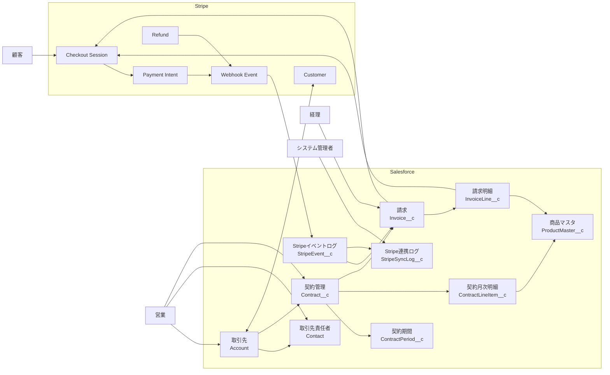
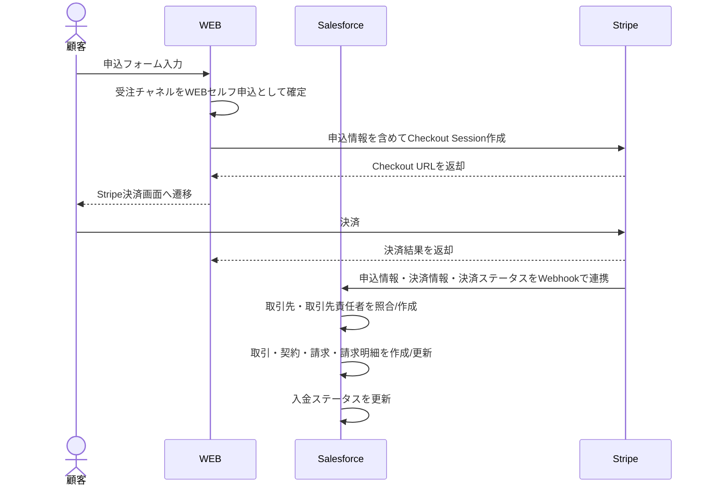
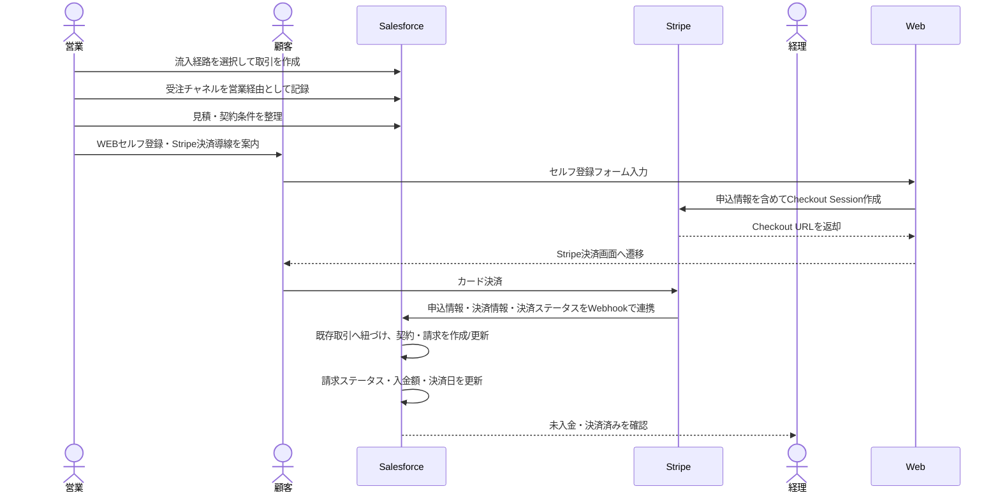
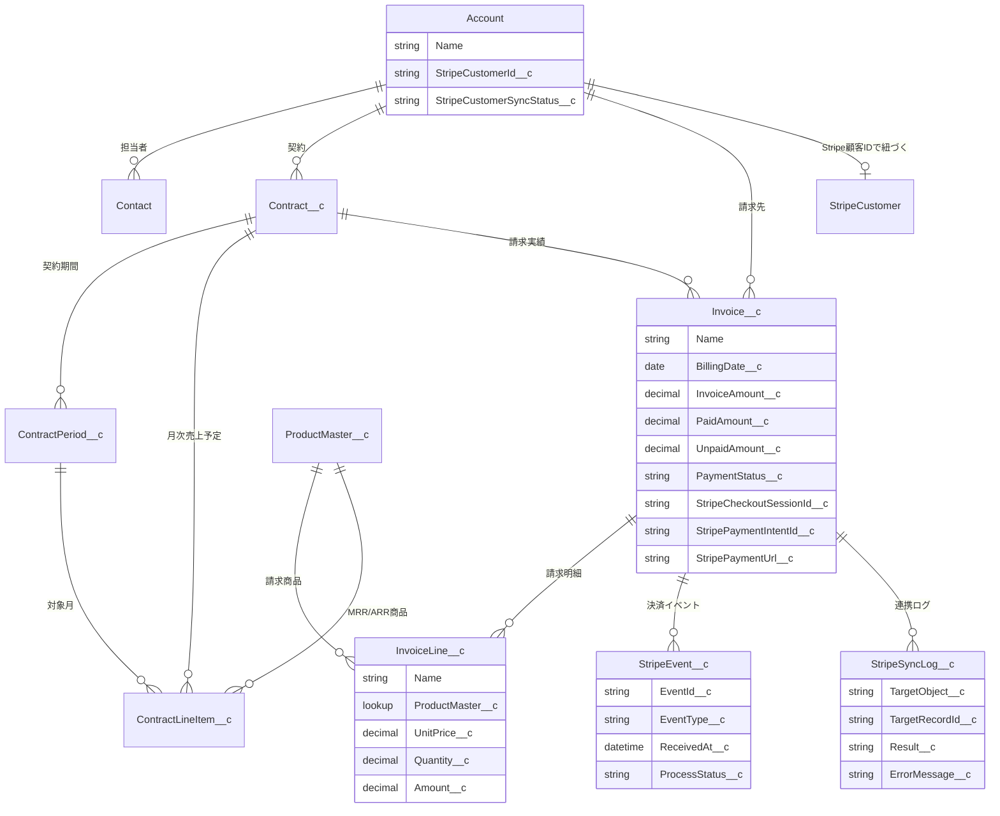
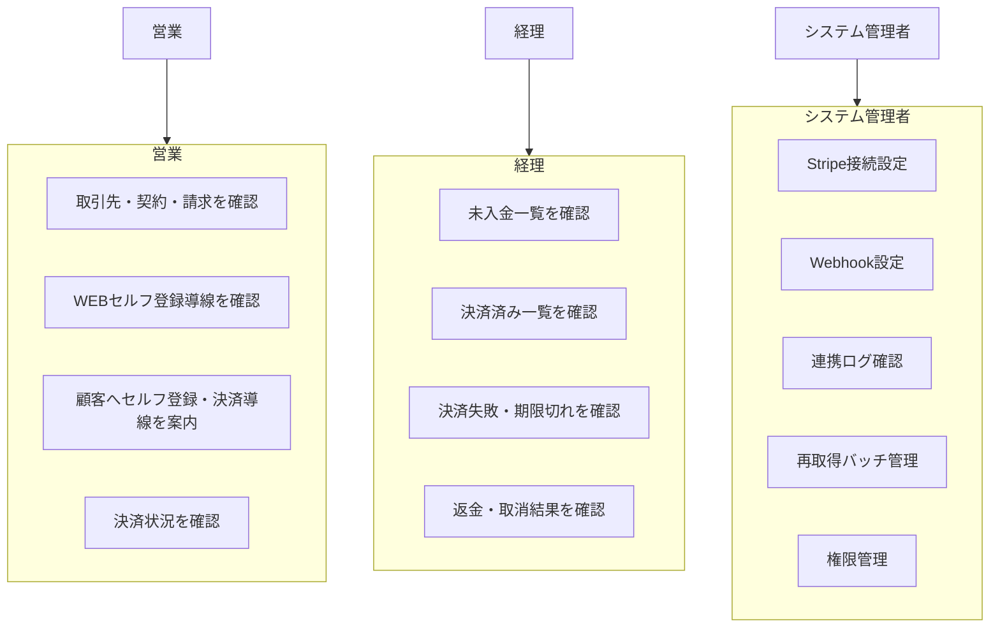

# Salesforce × Stripe連携 要件一覧

## 1. 目的

Salesforce上で管理している契約・請求情報を起点に、Stripe決済を利用できるようにする。

Salesforceは契約、請求、請求明細、売上予定、MRR/ARR管理の正とし、Stripeは決済実行、決済成否、返金・取消結果の正として扱う。

## 2. 前提

| 区分 | 内容 |
|---|---|
| 対象システム | Salesforce、Stripe |
| Salesforce側の既存基盤 | 取引先、取引、見積、見積明細、契約管理、契約期間、契約月次明細、請求、請求明細、商品マスタ |
| Stripe側の主な利用機能 | Customer、Checkout Session、Payment Intent、Refund、Webhook |
| 主な利用者 | 営業、経理、システム管理者 |
| 基本方針 | Salesforceで請求を作成し、Stripeで決済し、決済結果をSalesforceへ反映する |
| 対象外方針 | 初期スコープではStripeを契約・請求マスタの正にはしない |

## 3. 全体構成図

## 4. 業務フロー図

### 4.1 WEBセルフ申込

### 4.2 営業経由

## 5. オブジェクト関連図

## 6. 要件一覧

| No | 分類 | 要件 | 対象 | 優先度 | 備考 |
|---:|---|---|---|---|---|
| 1 | 基本方針 | Salesforceを契約・請求・売上予定の正とする | 全体 | 高 | Stripe側を契約マスタにはしない |
| 2 | 基本方針 | Stripeを決済実行・決済結果の正とする | 全体 | 高 | 決済済み、失敗、返金等はStripe結果を反映 |
| 3 | 流入経路 | 営業が入る場合、顧客流入経路を取引に保持する | Opportunity__c | 高 | WEB問い合わせ・資料請求、イベント、リファラル、代理販売 |
| 4 | 受注チャネル | 受注チャネルを取引に保持する | Opportunity__c | 高 | WEBセルフ申込、営業経由 |
| 5 | WEBセルフ申込 | WEBでStripe決済を行い、決済後にStripeから申込情報・決済情報・決済ステータスをSalesforceへ連携する | WEB / Stripe / Salesforce | 高 | SalesforceはStripe Webhookで決済後データを受け取る |
| 6 | 顧客管理 | Salesforce取引先とStripe Customerを紐づける | Account | 高 | `StripeCustomerId__c`を保持 |
| 7 | 顧客管理 | Stripe Customer未紐づけの場合は検索・候補提示・新規作成を行う | Account / Stripe | 高 | 名寄せ事故を防ぐ |
| 8 | 顧客管理 | 顧客名寄せは完全一致を原則とし、曖昧一致は手動確認とする | Account / Contact | 高 | メール、会社名、電話番号等を利用 |
| 9 | 営業経由 | Stripe決済の場合、営業はWEBセルフ登録・Stripe決済導線を顧客へ案内する | Opportunity__c / WEB / Stripe | 高 | Salesforce請求から直接決済URLは作成しない |
| 10 | 請求 | Stripe決済後、Salesforce請求・請求明細を作成/更新する | Invoice__c / InvoiceLine__c | 高 | Stripe Webhookで反映 |
| 11 | 請求 | Stripe決済情報を請求レコードに保持する | Invoice__c | 高 | Checkout Session ID、Payment Intent ID等 |
| 12 | 決済 | Stripe Payment Intent IDを請求に保持する | Invoice__c | 高 | 決済結果追跡に利用 |
| 13 | 決済 | 決済成功時にSalesforce請求を決済済みに更新する | Invoice__c | 高 | Webhookで反映 |
| 14 | 決済 | 決済失敗時にSalesforce請求を決済失敗または未入金に更新する | Invoice__c | 高 | 再案内対象 |
| 15 | 決済 | 入金額、未入金額、決済日をSalesforceへ反映する | Invoice__c | 高 | 経理確認に利用 |
| 16 | Webhook | Stripe WebhookイベントをSalesforceで受信する | Apex REST | 高 | 署名検証必須 |
| 17 | Webhook | Stripe Event IDで冪等性を担保する | StripeEvent__c | 高 | 同一イベントの二重処理防止 |
| 18 | Webhook | Webhook処理結果をログとして保持する | StripeSyncLog__c | 高 | 障害調査用 |
| 19 | 再取得 | Webhook未着・失敗時にStripeから決済状態を再取得できる | Batch / Queueable | 中 | 夜間または手動実行 |
| 20 | 返金 | Stripe側で返金された場合、Salesforce請求へ返金ステータスを反映する | Invoice__c | 中 | 初期はStripe画面で返金 |
| 21 | 取消 | 未決済のセルフ登録・Stripe決済導線を無効化または再案内できる | WEB / Stripe | 中 | 未決済Checkout Sessionの失効 |
| 22 | 権限 | 営業はセルフ登録・Stripe決済導線を顧客へ案内できる | 権限セット | 高 | 返金・設定は不可 |
| 23 | 権限 | 経理は決済状況、未入金、返金状況を確認できる | 権限セット | 高 | 必要に応じて返金操作はStripe側 |
| 24 | 権限 | システム管理者は接続設定、Webhook、ログ、バッチを管理できる | 権限セット | 高 | APIキーの管理を含む |
| 25 | レポート | 未決済・決済失敗・決済済みを確認できる | レポート | 高 | 経理向け |
| 26 | レポート | Stripe決済対象の売上・入金状況を流入経路/受注チャネル別に確認できる | レポート / ダッシュボード | 中 | MRR/ARRとは分けて管理 |
| 27 | 監査 | APIリクエスト、レスポンス、エラー内容を追跡できる | StripeSyncLog__c | 高 | 個人情報やカード情報は保存しない |
| 28 | セキュリティ | Stripe APIキーは保護された設定に保持する | Named Credential等 | 高 | ソースに直書きしない |
| 29 | セキュリティ | カード番号等の決済機微情報をSalesforceへ保存しない | 全体 | 高 | Stripe Checkout利用 |
| 30 | 運用 | 連携失敗時に再実行できる | 画面ボタン / バッチ | 中 | 対象レコード単位 |
| 31 | 運用 | 顧客名寄せができない場合は手動確認ステータスにする | Account | 高 | 自動で誤紐づけしない |
| 32 | 移行 | 既存Stripe Customer IDがある場合はSalesforce取引先へ取り込める | Account | 中 | CSVまたはAPI |
| 33 | 対象外 | 初期スコープではSalesforceからカード情報登録・保持は行わない | 全体 | 高 | PCIリスクを避ける |

## 7. 顧客名寄せ要件

Stripe連携で最も事故が起きやすいポイントは、Salesforce取引先とStripe Customerの紐づけである。

| 優先順位 | 照合キー | 自動紐づけ可否 | 方針 |
|---:|---|---|---|
| 1 | Salesforceに保持済みのStripe Customer ID | 可 | 完全一致なら自動利用 |
| 2 | 請求先メールアドレス | 条件付き可 | 1件一致のみ自動候補 |
| 3 | 会社名 + 電話番号 | 条件付き可 | 1件一致のみ自動候補 |
| 4 | 会社名 + 住所 | 条件付き可 | 表記揺れがあるため注意 |
| 5 | 会社名のみ | 不可 | 候補提示のみ |

名寄せ不能または複数候補の場合は、自動でStripe Customerを紐づけず、手動確認ステータスとする。

## 8. 決済ステータス対応

| Stripe側の状態 | Salesforce請求ステータス | Salesforce入金状態 | 備考 |
|---|---|---|---|
| Checkout Session作成済み | セルフ登録・決済開始済み | 未入金 | 顧客未決済 |
| Payment成功 | 決済済み | 入金済み | 入金額、決済日を更新 |
| Payment失敗 | 決済失敗 | 未入金 | 再案内対象 |
| Checkout Session期限切れ | 期限切れ | 未入金 | セルフ登録・決済導線の再案内対象 |
| Refund作成 | 返金済みまたは一部返金 | 返金済み | 返金額を保持 |
| Charge dispute | 要確認 | 要確認 | 経理確認対象 |

## 9. 役割別利用範囲

## 10. 機能一覧

| No | 機能 | 種別 | 対象 | 概要 | 優先度 |
|---:|---|---|---|---|---|
| 1 | Stripe顧客ID管理 | 項目追加 | Account | Stripe Customer ID、同期状態、最終同期日時を保持 | 高 |
| 2 | Stripe顧客検索 | Apex | Account / Stripe | メール・会社名等でStripe Customerを検索 | 高 |
| 3 | Stripe顧客作成 | Apex | Account / Stripe | 未存在時にStripe Customerを作成 | 高 |
| 4 | 名寄せ候補確認 | 画面 / LWC | Account | 複数候補時にユーザーが選択 | 中 |
| 5 | 流入経路管理 | 項目追加 / 入力制御 | Opportunity__c | WEB問い合わせ・資料請求、イベント、リファラル、代理販売を保持 | 高 |
| 6 | 受注チャネル管理 | 項目追加 / 入力制御 | Opportunity__c | WEBセルフ申込、営業経由を保持 | 高 |
| 7 | WEBセルフ申込決済情報受信 | Apex REST / API連携 | Stripe / Salesforce | Stripeから申込情報・決済情報・決済ステータスをSalesforceへ取り込む | 高 |
| 8 | 営業経由セルフ登録導線案内 | 画面 / URL設計 | Opportunity__c / WEB | 営業が顧客へWEBセルフ登録・Stripe決済導線を案内できる | 高 |
| 9 | 既存取引紐づけ | Apex / metadata連携 | Opportunity__c / Stripe | セルフ登録時のStripe情報を既存取引へ紐づける | 高 |
| 10 | Stripe決済情報保存 | 項目更新 | Invoice__c | Checkout Session ID、Payment Intent ID等を保存 | 高 |
| 11 | Webhook受信 | Apex REST | Stripe Event | Stripeイベントを受信 | 高 |
| 12 | Webhook署名検証 | Apex | Stripe Event | 正当なStripe通知か検証 | 高 |
| 13 | イベント冪等性制御 | Apex / Object | StripeEvent__c | Event ID重複を防止 | 高 |
| 14 | 決済結果反映 | Apex | Invoice__c | 入金状態、入金額、決済日を更新 | 高 |
| 15 | 返金結果反映 | Apex | Invoice__c | 返金額、返金日、返金ステータスを更新 | 中 |
| 16 | 決済状態再取得 | Batch / Queueable | Invoice__c | Webhook失敗時にStripeから再取得 | 中 |
| 17 | 連携ログ | Object / Apex | StripeSyncLog__c | 成功・失敗・エラー詳細を記録 | 高 |
| 18 | 手動再連携 | ボタン | Invoice__c | 連携失敗時の再実行 | 中 |
| 19 | 未入金リストビュー | List View | Invoice__c | 経理が未入金を確認 | 高 |
| 20 | 決済失敗リストビュー | List View | Invoice__c | 経理が失敗決済を確認 | 高 |
| 21 | Stripe連携エラーリストビュー | List View | StripeSyncLog__c | 管理者が障害確認 | 中 |
| 22 | 決済状況レポート | Report | Invoice__c | 決済済み・未入金・失敗を集計 | 中 |
| 23 | 権限セット | Permission Set | 営業 / 経理 / 管理者 | 役割別に操作範囲を分離 | 高 |

## 11. 非機能要件

| No | 分類 | 要件 | 優先度 |
|---:|---|---|---|
| 1 | セキュリティ | Stripe Secret Keyは保護された認証情報に保持する | 高 |
| 2 | セキュリティ | Webhook署名を必ず検証する | 高 |
| 3 | セキュリティ | カード番号、有効期限、CVCをSalesforceへ保存しない | 高 |
| 4 | 可用性 | Webhook失敗時も再取得バッチで補正できる | 高 |
| 5 | 監査 | 連携ログから対象レコード、処理結果、エラー内容を追跡できる | 高 |
| 6 | 性能 | 請求明細件数が多い場合もガバナ制限に抵触しない | 中 |
| 7 | 保守性 | Stripe APIエラーはユーザーが理解できる日本語メッセージに変換する | 中 |
| 8 | 拡張性 | 将来のサブスクリプション、返金自動化、分割決済に拡張できる | 中 |

## 12. 初期スコープ

| 区分 | 対象 |
|---|---|
| 対象 | WEBセルフ申込でStripe決済後に、Stripeから申込情報・決済情報・決済ステータスをSalesforceへ連携 |
| 対象 | 営業経由で顧客へWEBセルフ登録・Stripe決済導線を案内 |
| 対象 | Stripe Customer IDの管理 |
| 対象 | Webhookによる決済結果反映 |
| 対象 | 決済状態の再取得 |
| 対象 | 未入金・決済失敗の確認 |
| 対象外 | Salesforceでカード番号を入力・保持 |
| 対象外 | Stripeを契約マスタとして利用 |
| 対象外 | 初期リリース時点での返金実行自動化 |
| 対象外 | Stripe BillingのSubscriptionを契約更新の正にすること |

## 13. 検討事項

| No | 検討事項 | 推奨方針 |
|---:|---|---|
| 1 | Stripe Customerの既存データ移行 | 既存Customer IDをCSVまたはAPIでSalesforce取引先へ反映 |
| 2 | 顧客名寄せの自動化範囲 | 完全一致のみ自動、曖昧一致は手動確認 |
| 3 | 決済URLの顧客送付方法 | 初期は営業または経理が手動案内、将来メール自動化を検討 |
| 4 | 返金処理 | 初期はStripe画面で実施し、Salesforceへ結果同期 |
| 5 | Freee請求との関係 | Freee請求書管理とStripe決済管理の役割分担を明確化 |
| 6 | Stripe Billing利用有無 | 初期はCheckout中心、Subscription利用はPhase2以降で検討 |

## 14. 推奨実装方針

初期リリースでは、既存の契約請求基盤を大きく変更せず、請求オブジェクトを起点にStripe Checkoutを作成する方式を推奨する。

理由は以下の通り。

| 観点 | 推奨理由 |
|---|---|
| 既存資産活用 | Phase1で構築済みの契約・請求・請求明細をそのまま利用できる |
| 業務影響 | Freee連携や契約月次明細の設計を大きく変えずに追加できる |
| セキュリティ | Stripe Checkoutを使うことでカード情報をSalesforceに持たない |
| 運用性 | 経理はSalesforce上で未入金・決済済みを確認できる |
| 拡張性 | 将来的にSubscriptionや返金自動化へ拡張しやすい |

## 15. 優先順位

| 優先度 | 対応内容 |
|---|---|
| 高 | Stripe Customer ID管理、Checkout Session作成、Webhook受信、決済結果反映、ログ管理 |
| 中 | 決済状態再取得、返金結果同期、未入金レポート、名寄せ候補画面 |
| 低 | メール自動送付、Stripe Billing Subscription連携、返金実行自動化 |
