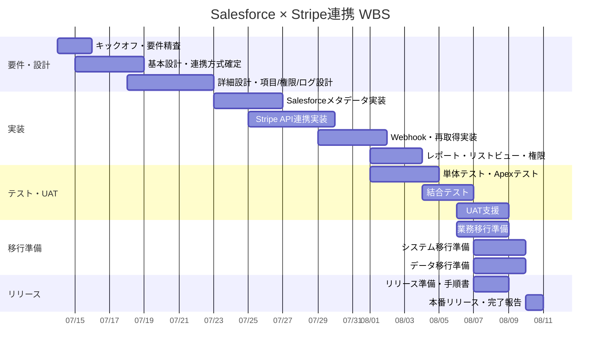

# Salesforce × Stripe連携 WBS

## 1. 前提

| 項目 | 内容 |
|---|---|
| 対象期間 | 2026/07/14(火) 〜 2026/08/10(月) |
| 川波稼働可能時間 | 平日3時間、土日10時間 |
| 週次稼働目安 | 35時間 |
| 期間内総稼働可能時間 | 140時間 |
| 期間内計画工数 | 140時間 |
| 予備・調整枠 | 8時間を内包 |
| 対象要件 | Salesforce × Stripe連携 要件一覧 |
| 基本方針 | Salesforceを契約・請求・売上予定の正、Stripeを決済実行・決済結果の正とする |
| 移行準備範囲 | 業務移行、システム移行、データ移行を含む |

## 2. 稼働枠

| 期間 | 日数 | 稼働可能時間 | 備考 |
|---|---:|---:|---|
| 2026/07/14(火)〜2026/07/19(日) | 6日 | 32時間 | 初週のため火曜開始 |
| 2026/07/20(月)〜2026/07/26(日) | 7日 | 35時間 | 設計確定・主要実装 |
| 2026/07/27(月)〜2026/08/02(日) | 7日 | 35時間 | 実装・結合テスト |
| 2026/08/03(月)〜2026/08/09(日) | 7日 | 35時間 | UAT・リリース準備 |
| 2026/08/10(月) | 1日 | 3時間 | 最終確認・完了報告 |
| 合計 | 28日 | 140時間 |  |

## 3. クライアント体制

| メンバー | 役割 | WBS上の主な関与 |
|---|---|---|
| 横溝（CTO） | Stripe等の決済や自社サービスのシステム構築全体 | アーキテクチャ確認、Stripe方針確認、技術判断 |
| 小室 | アプリケーションエンジニア、自社サービス実装担当 | Stripe API仕様確認、Webhook仕様確認、技術レビュー |
| 中山（総務） | 経理担当、freee仕様・請求・解約手続き担当 | 決済ステータス、未入金、返金・取消、経理UAT確認 |
| 玉木 | CS担当、商談管理・見積・契約情報入力、CSダッシュボード利用 | 契約・請求フロー、CS観点のUAT、ダッシュボード確認 |
| 高山 | CSO、全社システム構成・ストラクチャ把握 | 全体方針確認、業務影響確認、リリース判断 |
| 加藤 | 代表、商談管理・予実管理・収益チェック利用 | 収益管理観点、経営ダッシュボード観点、最終承認 |
| 畝山 | 受託PM、受託案件の商談管理・見積・契約手続き | 受託案件フローのUAT、例外パターン確認 |
| 古川・桐谷 | 営業インターン、リード管理・商談化・初回商談担当 | 必要に応じて営業入力フロー確認 |

## 4. 全体スケジュール

## 5. WBS詳細

| WBS | フェーズ | タスク | 開始 | 終了 | 工数 | 主担当 | クライアント確認者 | 成果物 |
|---|---|---|---|---|---:|---|---|---|
| 1.1 | 要件定義 | 要件一覧レビュー、対象範囲・対象外整理 | 7/14 | 7/14 | 3h | 川波 | 高山、横溝 | 要件確認メモ |
| 1.2 | 要件定義 | 業務フロー確認、営業・経理・CS利用範囲整理 | 7/14 | 7/15 | 4h | 川波 | 中山、玉木、畝山 | 業務フロー確認表 |
| 1.3 | 要件定義 | Stripe決済方式確認、Checkout/Billing/Payment Intentの採用範囲整理 | 7/15 | 7/16 | 4h | 川波 | 横溝、小室 | 決済方式整理 |
| 1.4 | 要件定義 | 顧客名寄せルール確定 | 7/16 | 7/17 | 4h | 川波 | 横溝、小室、中山 | 名寄せルール表 |
| 1.5 | 要件定義 | ステータス対応、返金・取消・失敗時運用整理 | 7/17 | 7/18 | 4h | 川波 | 中山、横溝 | ステータスマッピング |
| 1.6 | 要件定義 | 要件確定レビュー | 7/19 | 7/19 | 3h | 川波 | 高山、加藤、横溝 | 要件確定版 |
| 2.1 | 基本設計 | Salesforce/Stripe責務分担設計 | 7/19 | 7/20 | 4h | 川波 | 横溝、高山 | 基本設計 |
| 2.2 | 基本設計 | オブジェクト・項目追加設計 | 7/20 | 7/20 | 4h | 川波 | 小室 | 項目設計表 |
| 2.3 | 基本設計 | Stripe Customer紐づけ・候補確認設計 | 7/21 | 7/21 | 4h | 川波 | 横溝、小室 | 名寄せ詳細設計 |
| 2.4 | 基本設計 | Checkout Session作成設計 | 7/21 | 7/22 | 4h | 川波 | 小室 | API設計 |
| 2.5 | 基本設計 | Webhook受信・署名検証・冪等性設計 | 7/22 | 7/22 | 4h | 川波 | 小室、横溝 | Webhook設計 |
| 2.6 | 基本設計 | 権限・レポート・リストビュー設計 | 7/23 | 7/23 | 3h | 川波 | 玉木、中山 | 権限・画面設計 |
| 3.1 | 実装 | Account/Invoice/ログ系項目追加 | 7/23 | 7/24 | 5h | 川波 | 小室 | Salesforceメタデータ |
| 3.2 | 実装 | Stripeイベントログ、連携ログオブジェクト作成 | 7/24 | 7/24 | 4h | 川波 | 小室 | ログオブジェクト |
| 3.3 | 実装 | Stripe設定管理、Named Credential/認証設定 | 7/25 | 7/25 | 4h | 川波 | 横溝、小室 | 接続設定 |
| 3.4 | 実装 | Stripe Customer検索・作成サービス実装 | 7/25 | 7/26 | 8h | 川波 | 小室 | Apexサービス |
| 3.5 | 実装 | Checkout Session作成サービス実装 | 7/26 | 7/27 | 8h | 川波 | 小室 | Apexサービス |
| 3.6 | 実装 | 請求画面ボタン・手動実行導線実装 | 7/27 | 7/27 | 4h | 川波 | 玉木、中山 | ボタン/画面 |
| 3.7 | 実装 | Webhook受信Apex REST実装 | 7/28 | 7/29 | 7h | 川波 | 小室 | Apex REST |
| 3.8 | 実装 | Webhookイベント冪等性・ログ処理実装 | 7/29 | 7/29 | 4h | 川波 | 小室 | イベント処理 |
| 3.9 | 実装 | 決済成功・失敗・期限切れ・返金結果反映処理 | 7/30 | 7/31 | 7h | 川波 | 中山、小室 | ステータス更新処理 |
| 3.10 | 実装 | 決済状態再取得バッチ/手動再取得処理 | 7/31 | 8/1 | 6h | 川波 | 中山、小室 | バッチ/Queueable |
| 3.11 | 実装 | リストビュー・レポート・ダッシュボード作成 | 8/1 | 8/2 | 6h | 川波 | 中山、玉木、加藤 | 経理/CS/経営確認用画面 |
| 3.12 | 実装 | 権限セット・アプリ表示・タブ調整 | 8/2 | 8/2 | 4h | 川波 | 高山 | 権限セット |
| 4.1 | テスト | Apex単体テスト作成 | 8/3 | 8/3 | 6h | 川波 | 小室 | テストクラス |
| 4.2 | テスト | Checkout作成シナリオテスト | 8/3 | 8/4 | 5h | 川波 | 玉木、畝山 | テスト結果 |
| 4.3 | テスト | Webhook決済成功・失敗・期限切れテスト | 8/4 | 8/4 | 5h | 川波 | 小室、中山 | テスト結果 |
| 4.4 | テスト | 返金・取消結果同期テスト | 8/5 | 8/5 | 4h | 川波 | 中山 | テスト結果 |
| 4.5 | テスト | 名寄せ正常系・複数候補・未解決テスト | 8/5 | 8/5 | 4h | 川波 | 横溝、小室 | テスト結果 |
| 4.6 | テスト | 権限別テスト | 8/6 | 8/6 | 4h | 川波 | 玉木、中山 | 権限テスト結果 |
| 4.7 | テスト | ガバナ制限・API制限観点レビュー | 8/6 | 8/6 | 3h | 川波 | 小室 | 技術レビュー結果 |
| 5.1 | UAT | 営業シナリオUAT支援 | 8/6 | 8/7 | 4h | 川波 | 玉木、畝山 | UAT結果 |
| 5.2 | UAT | 経理シナリオUAT支援 | 8/7 | 8/7 | 4h | 川波 | 中山 | UAT結果 |
| 5.3 | UAT | CS/経営確認シナリオUAT支援 | 8/8 | 8/8 | 4h | 川波 | 玉木、高山、加藤 | UAT結果 |
| 5.4 | UAT | UAT指摘修正 | 8/8 | 8/9 | 6h | 川波 | 各担当 | 修正版 |
| 6.1 | 移行準備 | 業務移行方針整理、現行freee/Stripe/Salesforce運用との差分整理 | 8/6 | 8/7 | 4h | 川波 | 中山、玉木、高山 | 業務移行方針 |
| 6.2 | 移行準備 | 業務マニュアル、運用手順、問い合わせ・障害時一次対応整理 | 8/7 | 8/8 | 5h | 川波 | 中山、玉木 | 業務移行手順 |
| 6.3 | 移行準備 | システム移行手順、環境設定、Named Credential、Webhook、権限、スケジュール確認 | 8/7 | 8/9 | 6h | 川波 | 横溝、小室 | システム移行手順 |
| 6.4 | 移行準備 | データ移行対象整理、Stripe Customer ID取込方針、既存請求・決済状態の扱い確認 | 8/7 | 8/8 | 5h | 川波 | 横溝、小室、中山 | データ移行方針 |
| 6.5 | 移行準備 | 移行リハーサル、移行後照合観点、リリース判定表更新 | 8/9 | 8/9 | 4h | 川波 | 高山、加藤、横溝 | 移行リハ結果 |
| 7.1 | リリース | リリースマニフェスト・dry-run準備 | 8/9 | 8/9 | 4h | 川波 | 小室 | リリース資材 |
| 7.2 | リリース | 本番リリース手順書・切り戻し方針作成 | 8/9 | 8/9 | 3h | 川波 | 横溝、高山 | 手順書 |
| 7.3 | リリース | 本番リリース・リリース後確認 | 8/10 | 8/10 | 2h | 川波 | 横溝、小室 | リリース結果 |
| 7.4 | リリース | 完了報告・残課題整理 | 8/10 | 8/10 | 1h | 川波 | 高山、加藤 | 完了報告 |
| 8.1 | 予備 | 要件調整・障害対応・追加確認バッファ | 7/14 | 8/10 | 8h | 川波 | 必要に応じて | 調整対応 |

## 6. フェーズ別工数

| フェーズ | 工数 |
|---|---:|
| 要件定義 | 22h |
| 基本設計 | 23h |
| 実装 | 67h |
| テスト | 31h |
| UAT | 18h |
| 移行準備 | 24h |
| リリース | 10h |
| 予備 | 8h |
| 合計 | 203h |

上記のフェーズ別工数はWBS詳細を積み上げたフルスコープ見積であり、期間内の川波稼働可能時間140時間を超過する。

そのため、2026/08/10までに完了させる場合は、以下のスコープ調整を前提とする。

| 調整対象 | 調整方針 | 削減目安 |
|---|---|---:|
| 名寄せ候補確認画面 | 初期は画面作成せず、Account上の項目とリストビューで手動確認 | -8h |
| 返金・取消 | 初期はStripe側手動、Salesforceは結果同期のみ | -5h |
| レポート/ダッシュボード | 初期は最低限のリストビュー・レポートに限定 | -5h |
| UAT対象 | 営業・経理の主要シナリオ優先。CS/経営確認は確認会ベース | -7h |
| 詳細ドキュメント | 初期は運用メモ・リリース手順優先 | -4h |
| 業務移行 | 初期は営業・経理の最小運用手順と問い合わせ導線に限定 | -6h |
| システム移行 | 初期は本番設定チェックと1回の移行リハーサルに限定 | -5h |
| データ移行 | 初期はStripe Customer ID取込・照合観点の整理を優先 | -8h |
| 追加余裕 | 仕様変更を次フェーズ送り | -15h |
| 合計削減 |  | -63h |

## 7. 期間内実行スコープ

2026/08/10までの期間内で現実的に完了させるスコープは以下とする。

| 区分 | 対応 |
|---|---|
| 対応する | Stripe Customer ID管理 |
| 対応する | Checkout Session作成 |
| 対応する | 請求明細からStripe Line Item作成 |
| 対応する | Stripe決済URL保存 |
| 対応する | Webhook受信 |
| 対応する | Webhook署名検証 |
| 対応する | Stripe Event IDによる冪等性制御 |
| 対応する | 決済成功・失敗・期限切れのSalesforce反映 |
| 対応する | 連携ログ |
| 対応する | 最低限のリストビュー・レポート |
| 対応する | 営業・経理・管理者向け権限セット |
| 対応する | 業務移行手順の作成 |
| 対応する | システム移行手順・設定チェックリストの作成 |
| 対応する | Stripe Customer IDのデータ移行方針・照合観点整理 |
| 対応する | 移行リハーサルとリリース判定表更新 |
| 条件付き | 決済状態再取得バッチ |
| 条件付き | 返金結果同期 |
| 次フェーズ候補 | 名寄せ候補確認LWC |
| 次フェーズ候補 | メール自動送付 |
| 次フェーズ候補 | Stripe Billing Subscription本格連携 |
| 次フェーズ候補 | 返金実行自動化 |

## 8. 期間内計画工数

| フェーズ | 期間内計画工数 | 内容 |
|---|---:|---|
| 要件確定 | 18h | 範囲・名寄せ・ステータス・Stripe方式の確定 |
| 設計 | 20h | オブジェクト、項目、API、Webhook、権限、移行設計 |
| 実装 | 50h | Salesforceメタデータ、Apex、Webhook、ログ、画面ボタン |
| テスト | 18h | Apexテスト、Webhook、Checkout、権限、主要業務シナリオ |
| 移行準備 | 18h | 業務移行、システム移行、データ移行、移行リハーサル |
| UAT支援 | 7h | 営業・経理中心 |
| リリース準備・本番反映 | 3h | dry-run、リリース、確認 |
| 予備 | 6h | 仕様調整・障害対応 |
| 合計 | 140h | 期間内上限 |

## 9. 週次マイルストーン

| 日付 | マイルストーン | 判定基準 | 主な確認者 |
|---|---|---|---|
| 2026/07/19 | 要件・方式確定 | スコープ、対象外、名寄せ、決済方式が確定している | 横溝、高山、中山 |
| 2026/07/23 | 設計確定 | オブジェクト、項目、API、Webhook、権限設計が確定している | 横溝、小室 |
| 2026/08/02 | 主要実装完了 | Checkout作成、Webhook受信、ログ、権限の実装が完了している | 小室 |
| 2026/08/06 | 結合テスト完了 | 決済成功・失敗・期限切れの主要シナリオが通っている | 小室、中山 |
| 2026/08/08 | 移行準備完了 | 業務移行、システム移行、データ移行の手順と照合観点が揃っている | 中山、玉木、横溝 |
| 2026/08/09 | UAT・移行リハ・リリース判定 | 営業・経理の主要UATと移行リハが完了し、重大障害がない | 高山、加藤、横溝 |
| 2026/08/10 | リリース完了 | 本番反映、権限確認、疎通確認、完了報告が完了している | 高山、加藤 |

## 10. クライアント確認依頼事項

| No | 確認事項 | 確認者 | 希望期限 | 未確定時の影響 |
|---:|---|---|---|---|
| 1 | Stripe Checkoutを初期方式として採用してよいか | 横溝、小室 | 7/16 | API設計が確定しない |
| 2 | Stripe Customer名寄せの自動化範囲 | 横溝、小室 | 7/17 | 誤紐づけ防止設計が確定しない |
| 3 | 決済URLを誰が顧客へ案内するか | 中山、玉木 | 7/18 | 運用フロー・権限が確定しない |
| 4 | 返金・取消は初期はStripe画面手動でよいか | 中山、横溝 | 7/18 | 返金機能の実装範囲が変わる |
| 5 | 経理が最低限見たい一覧・レポート | 中山 | 7/23 | レポート作成範囲が確定しない |
| 6 | CS/経営向けダッシュボードの初期範囲 | 玉木、高山、加藤 | 7/24 | ダッシュボード範囲が膨らむ可能性 |
| 7 | Stripeテスト環境・APIキー・Webhook設定権限 | 横溝、小室 | 7/23 | 実装・テストが止まる |
| 8 | 業務移行時の切替日と周知対象 | 高山、中山、玉木 | 7/26 | 運用開始手順が確定しない |
| 9 | 既存Stripe Customer IDの取得可否とデータ形式 | 横溝、小室 | 7/26 | データ移行方針が確定しない |
| 10 | 本番Stripe Webhook設定を誰が実施するか | 横溝、小室 | 7/30 | システム移行手順が確定しない |
| 11 | 移行後の照合基準 | 中山、高山 | 8/02 | リリース判定基準が曖昧になる |

## 11. 移行準備詳細

| 区分 | 実施内容 | 主担当 | 確認者 | 完了条件 |
|---|---|---|---|---|
| 業務移行 | 現行業務と新業務の差分整理 | 川波 | 中山、玉木、高山 | Stripe決済URL作成、顧客案内、入金確認、返金確認の担当が明確になっている |
| 業務移行 | 営業・経理向け運用手順作成 | 川波 | 中山、玉木 | 誰が、いつ、どの画面で、どのステータスを確認するかが明記されている |
| 業務移行 | 切替日、周知対象、問い合わせ窓口整理 | 川波 | 高山 | 運用開始日、旧運用停止範囲、問い合わせ先が決まっている |
| システム移行 | 本番反映対象メタデータ整理 | 川波 | 小室 | オブジェクト、項目、Apex、権限、タブ、リストビュー、レポートがマニフェスト化されている |
| システム移行 | Stripe接続設定確認 | 川波 | 横溝、小室 | Named Credential、APIキー、Webhook URL、Webhook署名シークレットの設定手順が確定している |
| システム移行 | リリース前dry-runと移行リハーサル | 川波 | 小室 | dry-run成功、主要シナリオ疎通、ロールバック方針確認が完了している |
| データ移行 | 既存Stripe Customer ID取得方針整理 | 川波 | 横溝、小室 | Stripe Customer IDをSalesforce取引先へ紐づける方法が決まっている |
| データ移行 | 名寄せ・照合ルール確定 | 川波 | 横溝、中山 | 完全一致、自動候補、手動確認の基準が決まっている |
| データ移行 | 移行後照合 | 川波 | 中山、高山 | 件数、未紐づけ、重複候補、決済状態反映の確認観点が揃っている |

## 12. リスクと対策

| No | リスク | 影響 | 対策 |
|---:|---|---|---|
| 1 | Stripe Customerの名寄せ誤り | 別顧客への決済紐づけ | 完全一致以外は手動確認にする |
| 2 | Webhook未着・重複 | 決済状態不整合 | Event ID冪等性、再取得バッチを用意 |
| 3 | Stripe API仕様・認証設定の確認遅延 | 実装遅延 | 横溝・小室に早期確認依頼 |
| 4 | 経理運用がfreeeとStripeで混在 | 入金確認漏れ | freee請求管理とStripe決済管理の役割を明文化 |
| 5 | 期間内にフルスコープが収まらない | リリース遅延 | 初期スコープをCheckout/決済結果反映に絞る |
| 6 | 返金・取消要件が膨らむ | 工数超過 | 初期はStripe画面手動、Salesforceは結果同期に限定 |
| 7 | 業務移行の周知不足 | 現場が旧運用を継続して二重管理になる | 業務移行手順と切替日を明文化し、営業・経理へ周知する |
| 8 | システム移行の設定漏れ | Webhook未着、決済URL作成不可 | 本番設定チェックリストと移行リハーサルを実施する |
| 9 | データ移行の名寄せ不備 | Stripe Customerの誤紐づけ | 完全一致のみ自動反映し、曖昧一致は手動確認にする |

## 13. 推奨進め方

2026/08/10までにリリースする前提では、以下の順序で進める。

1. 7/19までにStripe方式、名寄せ、決済ステータス対応を確定する。
2. 7/23までに設計を確定し、Stripeテスト環境とWebhook設定を用意する。
3. 8/02までにCheckout作成、Webhook受信、決済結果反映を実装する。
4. 8/06までに決済成功・失敗・期限切れ・権限の結合テストを完了する。
5. 8/08までに業務移行、システム移行、データ移行の手順と照合観点を確定する。
6. 8/09までに営業・経理UATと移行リハーサルを完了し、リリース判定を行う。
7. 8/10に本番リリース、移行後確認、完了報告を行う。
