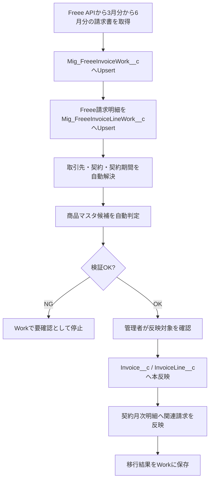

# Freee請求データ移行 最終設計

## 1. 目的

Freee側に存在する既存請求書・請求明細をSalesforceへ移行し、契約請求管理の参照関係とレポートに利用できる状態にする。

本設計は移行専用であり、通常運用の請求作成・Freee連携処理には使用しない。

## 2. 対象範囲

| 区分 | 方針 |
|---|---|
| 対象データ | Freee請求書、Freee請求明細 |
| 対象期間 | 3月分から6月分 |
| 取得方法 | Freee API |
| Salesforce反映方法 | 直接作成せず、移行Workオブジェクトに取込後、本反映 |
| 本反映先 | 請求 `Invoice__c`、請求明細 `InvoiceLine__c` |
| 商品マスタ | Salesforceの `ProductMaster__c` を正とする |
| 通常運用利用 | しない |

対象年は実行時パラメータとして指定できる設計にする。固定値でApex内に埋め込まない。

## 3. 設計方針

### 3.1 Workオブジェクトを経由する

Freee APIから取得した請求データは、直接 `Invoice__c` / `InvoiceLine__c` に作成しない。

一度 `Mig_` 接頭辞の移行Workオブジェクトへ保存し、参照解決・商品マスタ割当・重複チェック・検証結果を確認したうえで本反映する。

理由:

- Freee側の既存請求明細にはSalesforceの商品マスタ情報がない
- 契約、契約期間、契約月次明細への紐づけに判定が必要
- 誤投入時に本番データを汚さず、Work上で止められる
- 冪等性を担保し、再実行できる
- 移行結果の監査証跡を残せる

### 3.2 `Mig_` 接頭辞を使用する

移行専用のオブジェクト、Apex、権限セット、リストビューなどはAPI名の先頭に `Mig_` を付ける。

例:

- `Mig_FreeeInvoiceWork__c`
- `Mig_FreeeInvoiceLineWork__c`
- `Mig_FreeeInvoiceLineProductMap__c`
- `Mig_FreeeInvoiceFetchBatch`
- `Mig_FreeeInvoiceFinalizeService`

### 3.3 Salesforce商品マスタを正とする

Freee側にはSalesforceの商品マスタIDが存在しないため、Freee請求明細の名称・金額・契約情報をもとに、Salesforceの `ProductMaster__c` を割り当てる。

自動判定できない明細はWork上で `要確認` とし、手動で商品マスタを確定してから本反映する。

### 3.4 取得はAPI、本反映は検証済みのみ

Freee APIで対象期間の請求書・請求明細を取得し、Workへ保存する。

本反映は以下を満たすデータのみ実行する。

- 取引先が解決済み
- 契約管理が解決済み
- 契約期間が解決済み
- 商品マスタが確定済み
- 重複していない
- 必須項目が揃っている
- 検証ステータスが `反映可能`

## 4. 全体フロー

## 5. 追加オブジェクト

### 5.1 `Mig_FreeeInvoiceWork__c`

Freee請求書ヘッダの移行Work。

| 項目API名 | 型 | 用途 |
|---|---|---|
| `Name` | 自動採番またはテキスト | Workレコード名 |
| `FreeeInvoiceId__c` | テキスト | Freee請求書ID |
| `ExternalKey__c` | テキスト 外部ID 一意 | 冪等Upsertキー。例 `freee_invoice:{company_id}:{invoice_id}` |
| `FreeeInvoiceNumber__c` | テキスト | Freee請求書番号 |
| `FreeePartnerId__c` | テキスト | Freee取引先ID |
| `PartnerName__c` | テキスト | Freee取引先名 |
| `BillingDate__c` | 日付 | 請求日 |
| `PaymentDate__c` | 日付 | 支払期日 |
| `Subject__c` | テキスト | 請求書件名 |
| `InvoiceAmount__c` | 通貨 | 請求金額 |
| `TaxAmount__c` | 通貨 | 税額 |
| `PaidAmount__c` | 通貨 | 入金額 |
| `UnpaidAmount__c` | 通貨 | 未入金額 |
| `SendStatus__c` | 選択リスト | 送付待ち、送付済み |
| `PaymentStatus__c` | 選択リスト | 決済待ち、決済済み |
| `TargetPeriodStartDate__c` | 日付 | 請求対象期間開始日 |
| `TargetPeriodEndDate__c` | 日付 | 請求対象期間終了日 |
| `RawJson__c` | ロングテキスト | Freee APIレスポンス原文 |
| `ResolvedAccount__c` | 参照 Account | 解決済み取引先 |
| `ResolvedContract__c` | 参照 Contract__c | 解決済み契約管理 |
| `ResolvedContractPeriod__c` | 参照 ContractPeriod__c | 解決済み契約期間 |
| `CreatedInvoice__c` | 参照 Invoice__c | 本反映後の請求 |
| `ImportStatus__c` | 選択リスト | 取得済み、要確認、反映可能、反映済み、対象外、エラー |
| `ValidationMessage__c` | ロングテキスト | 検証メッセージ |

### 5.2 `Mig_FreeeInvoiceLineWork__c`

Freee請求明細の移行Work。

| 項目API名 | 型 | 用途 |
|---|---|---|
| `Name` | 自動採番またはテキスト | Work明細名 |
| `InvoiceWork__c` | 主従または参照 | `Mig_FreeeInvoiceWork__c` |
| `FreeeLineId__c` | テキスト | Freee明細ID |
| `ExternalKey__c` | テキスト 外部ID 一意 | 冪等Upsertキー。例 `freee_invoice_line:{company_id}:{invoice_id}:{line_id}` |
| `Description__c` | テキスト | Freee明細名 |
| `Quantity__c` | 数値 | 数量 |
| `UnitPrice__c` | 通貨 | 単価 |
| `LineAmount__c` | 通貨 | 明細金額 |
| `TaxRate__c` | 数値 | 税率 |
| `TaxAmount__c` | 通貨 | 税額 |
| `RawJson__c` | ロングテキスト | Freee APIレスポンス原文 |
| `SuggestedProductMaster__c` | 参照 ProductMaster__c | 自動判定された商品候補 |
| `ConfirmedProductMaster__c` | 参照 ProductMaster__c | 確定商品マスタ |
| `ResolvedContractLineItem__c` | 参照 ContractLineItem__c | 解決済み契約月次明細 |
| `CreatedInvoiceLine__c` | 参照 InvoiceLine__c | 本反映後の請求明細 |
| `ProductResolveStatus__c` | 選択リスト | 候補あり、確定済み、要確認、対象外 |
| `ResolveConfidence__c` | 数値 | 自動判定の信頼度 |
| `ResolveMessage__c` | ロングテキスト | 商品判定理由 |
| `ImportStatus__c` | 選択リスト | 取得済み、要確認、反映可能、反映済み、対象外、エラー |

### 5.3 `Mig_FreeeInvoiceLineProductMap__c`

Freee明細名からSalesforce商品マスタへ割り当てるための移行専用辞書。

| 項目API名 | 型 | 用途 |
|---|---|---|
| `Name` | テキスト | マッピング名 |
| `Keyword__c` | テキスト | Freee明細名に含まれるキーワード |
| `ProductMaster__c` | 参照 ProductMaster__c | 割当先商品マスタ |
| `Priority__c` | 数値 | 優先度 |
| `IsActive__c` | チェックボックス | 有効/無効 |
| `MatchType__c` | 選択リスト | 完全一致、部分一致、正規化一致、金額一致 |
| `Memo__c` | ロングテキスト | 補足 |

## 6. 既存オブジェクトへの追加推奨項目

### 6.1 `Invoice__c`

| 項目API名 | 型 | 用途 |
|---|---|---|
| `Freee_External_Key__c` | テキスト 外部ID 一意 | Freee由来請求の冪等Upsertキー |
| `MigrationSourceWork__c` | 参照 `Mig_FreeeInvoiceWork__c` | 移行元Work |
| `MigrationImportedAt__c` | 日時 | 移行反映日時 |

既存の `Freee_Invoice_Id__c` が一意制約を持てるなら、`Freee_External_Key__c` は必須ではない。ただし、company_idを含めた一意性を担保するため、移行用途では `Freee_External_Key__c` を推奨する。

### 6.2 `InvoiceLine__c`

| 項目API名 | 型 | 用途 |
|---|---|---|
| `Freee_External_Key__c` | テキスト 外部ID 一意 | Freee由来明細の冪等Upsertキー |
| `Freee_Line_Id__c` | テキスト | Freee明細ID |
| `MigrationSourceLineWork__c` | 参照 `Mig_FreeeInvoiceLineWork__c` | 移行元Work明細 |

## 7. 参照解決ルール

### 7.1 取引先解決

優先順位:

1. `Mig_FreeeInvoiceWork__c.FreeePartnerId__c` と `Account.Freee_Partner_Id__c` の一致
2. Freee取引先名と `Account.Name` の完全一致
3. 正規化名称一致
4. 未解決として `要確認`

取引先が解決できない場合、本反映しない。

### 7.2 契約管理解決

優先順位:

1. 解決済み取引先配下で、請求対象期間と契約期間が重なる契約
2. 請求件名・明細名と契約名の一致/部分一致
3. 請求金額と契約月額/年額の近似一致
4. 未解決として `要確認`

契約管理が複数候補になる場合、自動確定しない。

### 7.3 契約期間解決

請求対象期間が `ContractPeriod__c.PeriodStartDate__c` から `PeriodEndDate__c` の範囲に含まれる契約期間を割り当てる。

契約期間が存在しない場合は、本反映前に契約期間を作成するか、Workを `要確認` にする。

### 7.4 契約月次明細解決

契約期間、対象年月、商品マスタ、金額をもとに `ContractLineItem__c` を解決する。

請求・請求明細は作成できても契約月次明細が解決できない場合は、レポートで請求ステータスが追えないため原則 `要確認` とする。

## 8. 商品マスタ割当ルール

Salesforceの `ProductMaster__c` を正とする。

優先順位:

1. Freee明細名と `ProductMaster__c.Name` の完全一致
2. 表記揺れを正規化した一致
3. `Mig_FreeeInvoiceLineProductMap__c` のキーワード一致
4. 契約管理・契約期間配下の商品候補との一致
5. 金額一致
6. 手動確定

自動判定の信頼度が低い場合は `SuggestedProductMaster__c` のみ設定し、`ConfirmedProductMaster__c` は空にする。

本反映時は `ConfirmedProductMaster__c` を必須とする。

## 9. ステータス設計

### 9.1 Workヘッダ `ImportStatus__c`

| 値 | 意味 |
|---|---|
| 取得済み | Freee APIからWorkへ保存済み |
| 要確認 | 参照解決・商品割当・必須項目に未解決あり |
| 反映可能 | 本反映可能 |
| 反映済み | `Invoice__c` 作成/更新済み |
| 対象外 | 移行対象外として除外 |
| エラー | 取得または反映でエラー |

### 9.2 Work明細 `ProductResolveStatus__c`

| 値 | 意味 |
|---|---|
| 候補あり | 自動候補はあるが未確定 |
| 確定済み | 本反映に利用する商品マスタが確定済み |
| 要確認 | 候補なし、または複数候補 |
| 対象外 | 移行しない明細 |

## 10. 本反映ルール

### 10.1 請求 `Invoice__c`

`Mig_FreeeInvoiceWork__c` から `Invoice__c` をUpsertする。

| Invoice__c項目 | 設定元 |
|---|---|
| 取引先 | `ResolvedAccount__c` |
| 契約管理 | `ResolvedContract__c` |
| 契約期間 | `ResolvedContractPeriod__c` |
| 請求日 | `BillingDate__c` |
| 支払期日 | `PaymentDate__c` |
| 件名/請求名 | `Subject__c` またはFreee請求書番号 |
| 請求金額 | `InvoiceAmount__c` |
| 税額 | `TaxAmount__c` |
| 入金額 | `PaidAmount__c` |
| 未入金額 | `UnpaidAmount__c` |
| Freee請求書ID | `FreeeInvoiceId__c` |
| Freee請求書番号 | `FreeeInvoiceNumber__c` |
| Freee請求書送付ステータス | `SendStatus__c` |
| 決済ステータス | `PaymentStatus__c` |
| Freee同期ステータス | `Success` |
| Freee送信済み | `true` |

移行により作成した請求は、Freee側にすでに存在するため `Sent_To_Freee__c = true` とする。

### 10.2 請求明細 `InvoiceLine__c`

`Mig_FreeeInvoiceLineWork__c` から `InvoiceLine__c` をUpsertする。

| InvoiceLine__c項目 | 設定元 |
|---|---|
| 請求 | 作成/更新された `Invoice__c` |
| 商品マスタ | `ConfirmedProductMaster__c` |
| 明細名 | `Description__c` |
| 数量 | `Quantity__c` |
| 単価 | `UnitPrice__c` |
| 金額 | `LineAmount__c` |
| 税率 | `TaxRate__c` |
| Freee明細ID | `FreeeLineId__c` |

### 10.3 契約月次明細 `ContractLineItem__c`

本反映後、解決済みの `ContractLineItem__c` に関連請求を設定する。

| ContractLineItem__c項目 | 設定値 |
|---|---|
| 関連請求 | 作成/更新された `Invoice__c` |

請求の送付ステータス・決済ステータス・入金額は請求側を正とし、契約月次明細レポートでは関連請求から参照する。

## 11. Apex設計

| クラス名 | 役割 |
|---|---|
| `Mig_FreeeInvoiceFetchBatch` | Freee APIから対象期間の請求書を取得しWorkへUpsert |
| `Mig_FreeeInvoiceWorkService` | Work作成/更新、RawJson保存、冪等キー生成 |
| `Mig_FreeeInvoiceReferenceResolver` | 取引先、契約管理、契約期間、契約月次明細の解決 |
| `Mig_FreeeInvoiceProductResolver` | 商品マスタ候補判定 |
| `Mig_FreeeInvoiceValidator` | 本反映前チェック |
| `Mig_FreeeInvoiceFinalizeService` | Workから請求・請求明細へ本反映 |
| `Mig_FreeeInvoiceMigrationController` | 画面/ボタンから検証・本反映を実行する場合の入口 |

## 12. 権限設計

移行機能はシステム管理者のみ実行可能にする。

推奨権限セット:

- `Mig_FreeeInvoiceMigrationAdmin`

付与対象:

- システム管理者

付与しない対象:

- SAMURAI 営業
- SAMURAI 経理

理由:

- 移行専用機能であり、通常業務に不要
- 本番請求データを作成/更新するため影響が大きい
- 商品割当・参照解決の誤りがレポートや入金管理に影響する

## 13. 画面・リストビュー

### 13.1 Workヘッダ

リストビュー:

- `要確認 Freee請求移行`
- `反映可能 Freee請求移行`
- `反映済み Freee請求移行`
- `エラー Freee請求移行`

主要表示項目:

- Freee請求書番号
- Freee取引先名
- 請求日
- 支払期日
- 請求金額
- 送付ステータス
- 決済ステータス
- 解決済み取引先
- 解決済み契約管理
- 解決済み契約期間
- 移行ステータス
- 検証メッセージ

### 13.2 Work明細

リストビュー:

- `商品未確定 Freee請求明細移行`
- `商品確定済み Freee請求明細移行`
- `反映済み Freee請求明細移行`

主要表示項目:

- Freee明細名
- 数量
- 単価
- 金額
- 候補商品マスタ
- 確定商品マスタ
- 商品判定ステータス
- 判定メッセージ

## 14. 実行手順

本番実施時の詳細な担当者、実行コマンド、確認SOQL、判定基準、ロールバック方針は `docs/freee-invoice-migration-production-runbook.md` を参照する。

1. 本番で事前バックアップを取得する
2. Freee連携設定、Named Credential、Company IDを確認する
3. 対象年と対象期間3月から6月を指定して `Mig_FreeeInvoiceFetchBatch` を実行する
4. Workヘッダ・Work明細の件数を確認する
5. 取引先、契約管理、契約期間、商品マスタの解決結果を確認する
6. `要確認` レコードを補正する
7. 検証処理を再実行し、`反映可能` にする
8. 少数件で本反映を実行する
9. 請求、請求明細、契約月次明細の紐づきを確認する
10. 全件本反映を実行する
11. 結果件数とエラー件数を記録する
12. 移行完了後、移行機能の利用を停止する

## 15. バリデーション

本反映前に以下をチェックする。

| チェック | エラー時の扱い |
|---|---|
| Freee請求書IDが空でない | 要確認 |
| 外部キーが一意 | エラー |
| 取引先が解決済み | 要確認 |
| 契約管理が解決済み | 要確認 |
| 契約期間が解決済み | 要確認 |
| 明細が1件以上存在 | 要確認 |
| 全明細の商品マスタが確定済み | 要確認 |
| 請求金額と明細合計が一致 | 要確認 |
| 同一Freee請求書が既に本反映済みでない | 既存更新またはスキップ |
| 取消済み請求の扱いが明確 | 要確認 |

## 16. 冪等性・再実行設計

API取得と本反映は再実行可能にする。

冪等キー:

- 請求Work: `freee_invoice:{company_id}:{invoice_id}`
- 請求明細Work: `freee_invoice_line:{company_id}:{invoice_id}:{line_id}`
- 請求: `Invoice__c.Freee_External_Key__c`
- 請求明細: `InvoiceLine__c.Freee_External_Key__c`

同じFreee請求書を再取得した場合はWorkを更新する。

同じFreee請求書を本反映した場合は、重複作成せず既存請求を更新またはスキップする。

## 17. エラー処理

| エラー | 対応 |
|---|---|
| Freee API認証エラー | 取得処理を停止し、設定を確認 |
| Freee APIレート制限 | リトライまたは分割実行 |
| 取引先未解決 | Workを `要確認` |
| 契約未解決 | Workを `要確認` |
| 商品未確定 | 明細Workを `要確認` |
| 金額不一致 | Workを `要確認` |
| DMLエラー | Workを `エラー` にし、メッセージ保存 |

## 18. テスト観点

| No | テスト観点 | 期待結果 |
|---|---|---|
| 1 | 3月から6月の請求のみ取得 | 対象期間外は取得されない |
| 2 | 同一請求を2回取得 | Workが重複作成されない |
| 3 | Freee取引先IDからAccount解決 | `ResolvedAccount__c` が設定される |
| 4 | 契約期間内の請求 | `ResolvedContractPeriod__c` が設定される |
| 5 | 商品名完全一致 | `ConfirmedProductMaster__c` まで自動設定される |
| 6 | 商品候補が複数 | `要確認` になる |
| 7 | 商品未確定のまま本反映 | 反映されずエラーになる |
| 8 | 検証済み請求の本反映 | `Invoice__c` と `InvoiceLine__c` が作成される |
| 9 | 再本反映 | 重複作成されない |
| 10 | 契約月次明細の関連請求反映 | `ContractLineItem__c` から請求状態を参照できる |
| 11 | Freee送付/決済ステータス反映 | 請求に送付待ち/送付済み、決済待ち/決済済みが設定される |
| 12 | APIエラー | Workまたはログにエラーが残り、処理全体が不正終了しない |

## 19. 通常運用との関係

通常運用では、Freee側の毎月自動生成を正にしない。

今後の請求はSalesforceの更新請求バッチを正とし、Salesforceで作成された請求・請求明細をFreeeに連携する。

本移行機能は、既にFreeeに存在する過去請求をSalesforceへ取り込むための一時的な機能である。

## 20. 最終結論

最適案は以下とする。

- 対象期間は3月分から6月分
- Freee APIで請求書・請求明細を取得する
- 直接 `Invoice__c` / `InvoiceLine__c` を作らず、必ず `Mig_` Workオブジェクトに保存する
- Salesforceの商品マスタを正とし、Freee明細に商品マスタを割り当てる
- 参照解決・商品確定・金額検証が完了したものだけ本反映する
- 移行後の通常運用はSalesforce更新請求バッチを正とする
- 移行機能はシステム管理者のみ利用し、通常運用では使わない
