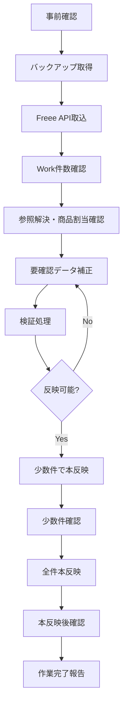

# Freee請求データ移行 本番実施手順書

## 1. 目的

Freeeに存在する既存請求書・請求明細のうち、対象期間のデータをSalesforceへ安全に移行する。

本手順書は、`Mig_` 接頭辞の移行専用メタデータ実装後に、本番環境で作業者が実行するためのRunbookである。

## 2. 前提

| 項目 | 内容 |
|---|---|
| 対象期間 | 3月分から6月分 |
| 対象データ | Freee請求書、Freee請求明細 |
| 取得方法 | Freee API |
| Salesforce反映方式 | `Mig_` Workオブジェクトへ取込後、検証済みデータのみ本反映 |
| 本反映先 | `Invoice__c`、`InvoiceLine__c`、`ContractLineItem__c` |
| 実行環境 | 本番Salesforce |
| Salesforce org alias | `<production-org>` に置換する |
| 実行権限 | システム管理者 |
| 通常運用利用 | しない |

## 3. 役割分担

| 役割 | 担当 | 作業 |
|---|---|---|
| 作業責任者 | システム管理者 | 実行判断、開始/終了宣言、ロールバック判断 |
| Salesforce作業者 | システム管理者 | Apex実行、SOQL確認、Work補正、本反映 |
| 経理確認者 | SAMURAI 経理 | Freee側件数、請求金額、送付/決済ステータスの業務確認 |
| 業務確認者 | SAMURAI 営業 / 経理 | 契約、契約期間、商品マスタ割当の妥当性確認 |

## 4. 作業概要



## 5. 作業前チェックリスト

| No | チェック | 判定 |
|---:|---|---|
| 1 | `Mig_` 移行メタデータが本番へリリース済み |  |
| 2 | `Mig_FreeeInvoiceMigrationAdmin` 権限セットが作業者へ付与済み |  |
| 3 | Freee Named Credential / External Credential が有効 |  |
| 4 | Freee Company ID が本番用である |  |
| 5 | 対象期間が3月分から6月分で確定している |  |
| 6 | Freee側の請求書件数・金額の確認元を経理が用意済み |  |
| 7 | Salesforceの契約、契約期間、契約月次明細、商品マスタ投入が完了済み |  |
| 8 | 本番バックアップ取得方針が決まっている |  |
| 9 | 作業中に通常ユーザーが移行Workを編集しない運用になっている |  |
| 10 | 失敗時の停止判断者が決まっている |  |

## 6. 事前確認コマンド

### 6.1 org接続確認

```powershell
sf org display --target-org <production-org>
```

判定基準:

- 本番orgであること
- ログインユーザーがシステム管理者であること

### 6.2 移行メタデータ存在確認

```powershell
sf data query --target-org <production-org> --query "SELECT QualifiedApiName FROM EntityDefinition WHERE QualifiedApiName IN ('Mig_FreeeInvoiceWork__c','Mig_FreeeInvoiceLineWork__c','Mig_FreeeInvoiceLineProductMap__c')" --result-format table
```

期待結果:

- 3オブジェクトがすべて返る

### 6.3 移行Apex存在確認

```powershell
sf data query --target-org <production-org> --query "SELECT Name, Status FROM ApexClass WHERE Name IN ('Mig_FreeeInvoiceFetchBatch','Mig_FreeeInvoiceWorkService','Mig_FreeeInvoiceReferenceResolver','Mig_FreeeInvoiceProductResolver','Mig_FreeeInvoiceValidator','Mig_FreeeInvoiceFinalizeService','Mig_FreeeInvoiceMigrationController')" --result-format table
```

期待結果:

- 対象クラスがすべて `Active`

### 6.4 既存移行Work残存確認

```powershell
sf data query --target-org <production-org> --query "SELECT COUNT() FROM Mig_FreeeInvoiceWork__c" --result-format table
sf data query --target-org <production-org> --query "SELECT COUNT() FROM Mig_FreeeInvoiceLineWork__c" --result-format table
```

判定基準:

- 初回実行なら0件が望ましい
- 既に件数がある場合は、前回作業の途中データかどうか確認する
- 不明なWorkデータがある場合は作業を開始しない

## 7. バックアップ取得

### 7.1 移行影響オブジェクトのバックアップ

移行前に以下をCSVで取得する。

```powershell
sf data query --target-org <production-org> --query "SELECT Id, Name, Freee_Invoice_Id__c, Freee_Invoice_Number__c, Account__c, Contract__c, ContractPeriod__c, BillingDate__c, PaymentDueDate__c, Amount__c, TaxAmount__c, PaymentStatus__c, Freee_Invoice_Status__c, Sent_To_Freee__c, Freee_Sync_Status__c FROM Invoice__c" --result-format csv > backup_invoice_before_freee_migration.csv
```

```powershell
sf data query --target-org <production-org> --query "SELECT Id, Name, Invoice__c, ProductMaster__c, Description__c, Quantity__c, Unit_Price__c, Amount__c, Tax_Rate__c, Freee_Line_Id__c FROM InvoiceLine__c" --result-format csv > backup_invoiceline_before_freee_migration.csv
```

```powershell
sf data query --target-org <production-org> --query "SELECT Id, Name, MasterContract__c, ContractPeriod__c, ProductMaster__c, ContractYearMonth__c, RelatedInvoice__c FROM ContractLineItem__c" --result-format csv > backup_contractlineitem_before_freee_migration.csv
```

注意:

- 実際の項目API名が環境と異なる場合は、実行前に `sf sobject describe` または設定画面で確認する
- バックアップCSVは作業日フォルダに保存する

## 8. Freee API取込

### 8.1 取込パラメータ

| パラメータ | 値 |
|---|---|
| 対象年 | 作業時に指定 |
| 対象開始月 | 3 |
| 対象終了月 | 6 |
| 実行モード | Fetch |
| 本反映 | しない |

### 8.2 取込Apex実行

`scripts/apex/mig-freee-invoice-fetch.apex` を作成して実行する想定。

```apex
Integer targetYear = 2026;
Integer startMonth = 3;
Integer endMonth = 6;
Database.executeBatch(new Mig_FreeeInvoiceFetchBatch(targetYear, startMonth, endMonth), 20);
```

実行コマンド:

```powershell
sf apex run --target-org <production-org> --file scripts/apex/mig-freee-invoice-fetch.apex
```

### 8.3 ジョブ確認

```powershell
sf data query --target-org <production-org> --query "SELECT Id, ApexClass.Name, Status, JobItemsProcessed, TotalJobItems, NumberOfErrors, CreatedDate, CompletedDate, ExtendedStatus FROM AsyncApexJob WHERE ApexClass.Name = 'Mig_FreeeInvoiceFetchBatch' ORDER BY CreatedDate DESC LIMIT 5" --result-format table
```

判定基準:

- `Status = Completed`
- `NumberOfErrors = 0`

## 9. Work件数確認

### 9.1 ヘッダ件数

```powershell
sf data query --target-org <production-org> --query "SELECT ImportStatus__c, COUNT(Id) cnt, SUM(InvoiceAmount__c) amount FROM Mig_FreeeInvoiceWork__c GROUP BY ImportStatus__c" --result-format table
```

確認観点:

- 取得件数がFreee側の対象期間請求書件数と一致する
- 取得金額合計がFreee側の対象期間合計と大きく乖離しない
- `エラー` が0件である

### 9.2 明細件数

```powershell
sf data query --target-org <production-org> --query "SELECT ImportStatus__c, COUNT(Id) cnt, SUM(LineAmount__c) amount FROM Mig_FreeeInvoiceLineWork__c GROUP BY ImportStatus__c" --result-format table
```

確認観点:

- 明細件数が0ではない
- ヘッダ件数に対して明細が存在する
- `エラー` が0件である

### 9.3 対象期間外データ確認

```powershell
sf data query --target-org <production-org> --query "SELECT Id, FreeeInvoiceNumber__c, BillingDate__c FROM Mig_FreeeInvoiceWork__c WHERE CALENDAR_MONTH(BillingDate__c) NOT IN (3,4,5,6)" --result-format table
```

判定基準:

- 0件

0件でない場合:

- 取込パラメータまたはFreee APIの期間条件を確認する
- 本反映しない

## 10. 参照解決・商品割当確認

### 10.1 未解決取引先

```powershell
sf data query --target-org <production-org> --query "SELECT Id, FreeeInvoiceNumber__c, FreeePartnerId__c, PartnerName__c, ValidationMessage__c FROM Mig_FreeeInvoiceWork__c WHERE ResolvedAccount__c = null" --result-format table
```

判定基準:

- 本反映前に0件

### 10.2 未解決契約

```powershell
sf data query --target-org <production-org> --query "SELECT Id, FreeeInvoiceNumber__c, PartnerName__c, Subject__c, BillingDate__c, InvoiceAmount__c, ValidationMessage__c FROM Mig_FreeeInvoiceWork__c WHERE ResolvedContract__c = null" --result-format table
```

判定基準:

- 本反映前に0件

### 10.3 未解決契約期間

```powershell
sf data query --target-org <production-org> --query "SELECT Id, FreeeInvoiceNumber__c, ResolvedContract__c, BillingDate__c, TargetPeriodStartDate__c, TargetPeriodEndDate__c, ValidationMessage__c FROM Mig_FreeeInvoiceWork__c WHERE ResolvedContractPeriod__c = null" --result-format table
```

判定基準:

- 本反映前に0件

### 10.4 商品未確定明細

```powershell
sf data query --target-org <production-org> --query "SELECT Id, InvoiceWork__r.FreeeInvoiceNumber__c, Description__c, LineAmount__c, SuggestedProductMaster__c, ConfirmedProductMaster__c, ResolveMessage__c FROM Mig_FreeeInvoiceLineWork__c WHERE ConfirmedProductMaster__c = null AND ImportStatus__c != '対象外'" --result-format table
```

判定基準:

- 本反映前に0件

商品が未確定の場合:

- `SuggestedProductMaster__c` が妥当なら `ConfirmedProductMaster__c` に設定する
- 候補がない場合は `Mig_FreeeInvoiceLineProductMap__c` を追加し、商品判定を再実行する
- 移行対象外明細なら `ImportStatus__c = '対象外'` にする

## 11. 検証処理

### 11.1 検証Apex実行

`scripts/apex/mig-freee-invoice-validate.apex` を作成して実行する想定。

```apex
Mig_FreeeInvoiceValidator.validateAll();
```

実行コマンド:

```powershell
sf apex run --target-org <production-org> --file scripts/apex/mig-freee-invoice-validate.apex
```

### 11.2 検証結果確認

```powershell
sf data query --target-org <production-org> --query "SELECT ImportStatus__c, COUNT(Id) cnt, SUM(InvoiceAmount__c) amount FROM Mig_FreeeInvoiceWork__c GROUP BY ImportStatus__c" --result-format table
```

判定基準:

- 本反映対象が `反映可能`
- `要確認`、`エラー` が0件、または業務的に移行対象外と判断済み

## 12. 少数件本反映

### 12.1 少数件対象抽出

```powershell
sf data query --target-org <production-org> --query "SELECT Id, FreeeInvoiceNumber__c, PartnerName__c, InvoiceAmount__c FROM Mig_FreeeInvoiceWork__c WHERE ImportStatus__c = '反映可能' ORDER BY BillingDate__c ASC LIMIT 5" --result-format table
```

### 12.2 少数件本反映Apex実行

`scripts/apex/mig-freee-invoice-finalize-sample.apex` を作成して実行する想定。

```apex
List<Id> workIds = new List<Id>{
    'REPLACE_WITH_WORK_ID_1',
    'REPLACE_WITH_WORK_ID_2'
};
Mig_FreeeInvoiceFinalizeService.finalizeByWorkIds(workIds);
```

実行コマンド:

```powershell
sf apex run --target-org <production-org> --file scripts/apex/mig-freee-invoice-finalize-sample.apex
```

### 12.3 少数件確認SOQL

```powershell
sf data query --target-org <production-org> --query "SELECT Id, FreeeInvoiceNumber__c, CreatedInvoice__c, ImportStatus__c, ValidationMessage__c FROM Mig_FreeeInvoiceWork__c WHERE CreatedInvoice__c != null ORDER BY LastModifiedDate DESC LIMIT 10" --result-format table
```

```powershell
sf data query --target-org <production-org> --query "SELECT Id, Name, Freee_Invoice_Id__c, Freee_Invoice_Number__c, Sent_To_Freee__c, Freee_Sync_Status__c, PaymentStatus__c, Freee_Invoice_Status__c FROM Invoice__c ORDER BY CreatedDate DESC LIMIT 10" --result-format table
```

```powershell
sf data query --target-org <production-org> --query "SELECT Id, Name, Invoice__c, ProductMaster__c, Description__c, Quantity__c, Unit_Price__c, Amount__c FROM InvoiceLine__c ORDER BY CreatedDate DESC LIMIT 20" --result-format table
```

判定基準:

- Workが `反映済み`
- `Invoice__c` が作成されている
- `InvoiceLine__c` が作成されている
- 請求にFreee請求書ID、送付ステータス、決済ステータスが入っている
- 請求明細に商品マスタが入っている
- 契約月次明細の関連請求が更新されている

## 13. 全件本反映

### 13.1 全件本反映前最終確認

```powershell
sf data query --target-org <production-org> --query "SELECT COUNT() FROM Mig_FreeeInvoiceWork__c WHERE ImportStatus__c = '反映可能'" --result-format table
```

```powershell
sf data query --target-org <production-org> --query "SELECT COUNT() FROM Mig_FreeeInvoiceWork__c WHERE ImportStatus__c IN ('要確認','エラー')" --result-format table
```

判定基準:

- `反映可能` が移行対象件数と一致
- `要確認`、`エラー` が0件、または明確に対象外判断済み

### 13.2 全件本反映Apex実行

`scripts/apex/mig-freee-invoice-finalize-all.apex` を作成して実行する想定。

```apex
Mig_FreeeInvoiceFinalizeService.finalizeAllReady();
```

実行コマンド:

```powershell
sf apex run --target-org <production-org> --file scripts/apex/mig-freee-invoice-finalize-all.apex
```

## 14. 本反映後確認

### 14.1 Work反映結果

```powershell
sf data query --target-org <production-org> --query "SELECT ImportStatus__c, COUNT(Id) cnt, SUM(InvoiceAmount__c) amount FROM Mig_FreeeInvoiceWork__c GROUP BY ImportStatus__c" --result-format table
```

期待結果:

- 本反映対象が `反映済み`
- `エラー` が0件

### 14.2 請求作成件数

```powershell
sf data query --target-org <production-org> --query "SELECT COUNT() FROM Invoice__c WHERE MigrationImportedAt__c != null" --result-format table
```

期待結果:

- Freee請求Workの反映済み件数と一致

### 14.3 請求明細作成件数

```powershell
sf data query --target-org <production-org> --query "SELECT COUNT() FROM InvoiceLine__c WHERE MigrationSourceLineWork__c != null" --result-format table
```

期待結果:

- 移行対象明細Workの反映済み件数と一致

### 14.4 契約月次明細関連請求

```powershell
sf data query --target-org <production-org> --query "SELECT COUNT() FROM ContractLineItem__c WHERE RelatedInvoice__c != null" --result-format table
```

確認観点:

- 移行前バックアップと比較し、想定分だけ関連請求が増えている

### 14.5 金額合計確認

```powershell
sf data query --target-org <production-org> --query "SELECT SUM(InvoiceAmount__c) amount FROM Mig_FreeeInvoiceWork__c WHERE ImportStatus__c = '反映済み'" --result-format table
```

```powershell
sf data query --target-org <production-org> --query "SELECT SUM(Amount__c) amount FROM Invoice__c WHERE MigrationImportedAt__c != null" --result-format table
```

判定基準:

- Work合計と請求合計が一致
- Freee側対象期間合計と一致、または差異理由が説明できる

## 15. 合否判定

| 判定 | 条件 |
|---|---|
| 合格 | Work取込件数がFreee件数と一致し、全本反映対象が反映済み。請求・請求明細・契約月次明細の参照が期待どおり。エラー0件 |
| 条件付き合格 | 一部 `対象外` または `要確認` が残るが、業務承認済みで通常運用に影響しない |
| 不合格 | 金額不一致、重複請求作成、参照未解決、Freee請求ID重複、想定外の期間データ混入、DMLエラーあり |

## 16. ロールバック方針

### 16.1 原則

移行で作成した請求・請求明細はFreeeへ新規送信しない。

Salesforce側に作成した移行由来データを取り消す場合は、移行元Work参照または移行日時をキーにして削除/無効化する。

### 16.2 少数件本反映で失敗した場合

対応:

1. 全件本反映は実施しない
2. 原因をWorkの `ValidationMessage__c`、Apexエラー、DMLエラーから特定する
3. 作成済みの少数件請求・請求明細を確認する
4. 必要に応じて移行由来データのみ削除する

削除対象確認:

```powershell
sf data query --target-org <production-org> --query "SELECT Id, Name FROM InvoiceLine__c WHERE MigrationSourceLineWork__c != null" --result-format csv > rollback_invoiceline_ids.csv
sf data query --target-org <production-org> --query "SELECT Id, Name FROM Invoice__c WHERE MigrationImportedAt__c != null" --result-format csv > rollback_invoice_ids.csv
```

削除は、必ず請求明細から実施する。

```powershell
sf data delete bulk --target-org <production-org> --sobject InvoiceLine__c --file rollback_invoiceline_ids.csv
sf data delete bulk --target-org <production-org> --sobject Invoice__c --file rollback_invoice_ids.csv
```

### 16.3 全件本反映後に重大問題が見つかった場合

対応:

1. 作業責任者がロールバック判断を行う
2. 移行由来請求明細を削除する
3. 移行由来請求を削除する
4. 契約月次明細の関連請求をバックアップCSVをもとに戻す
5. 原因を修正し、再取込または再本反映を検討する

注意:

- Freee側の請求書は削除/取消しない
- SalesforceからFreeeへ送信する処理は実行しない
- 通常運用の請求を誤って削除しないよう、`MigrationSourceWork__c` または `MigrationImportedAt__c` があるものだけ対象にする

## 17. 作業完了記録

| 項目 | 値 |
|---|---|
| 作業日 |  |
| 作業責任者 |  |
| Salesforce作業者 |  |
| 経理確認者 |  |
| 対象年 |  |
| 対象期間 | 3月分から6月分 |
| 取得請求件数 |  |
| 取得請求明細件数 |  |
| 本反映請求件数 |  |
| 本反映請求明細件数 |  |
| 対象外件数 |  |
| 要確認残件数 |  |
| エラー件数 |  |
| Freee側請求合計 |  |
| Salesforce請求合計 |  |
| 判定 | 合格 / 条件付き合格 / 不合格 |
| 備考 |  |

## 18. 作業後対応

1. 経理が請求レポートで送付ステータス・決済ステータスを確認する
2. 営業が契約月次明細レポートで将来売上・MRRへの影響を確認する
3. 移行Workの `要確認`、`エラー` が残っていないか確認する
4. 移行専用権限セットを作業者から外す
5. 移行機能を通常運用で使用しないことを関係者へ周知する
6. Freee側の毎月自動生成を使わず、今後はSalesforce更新請求バッチを正とする運用を再確認する

